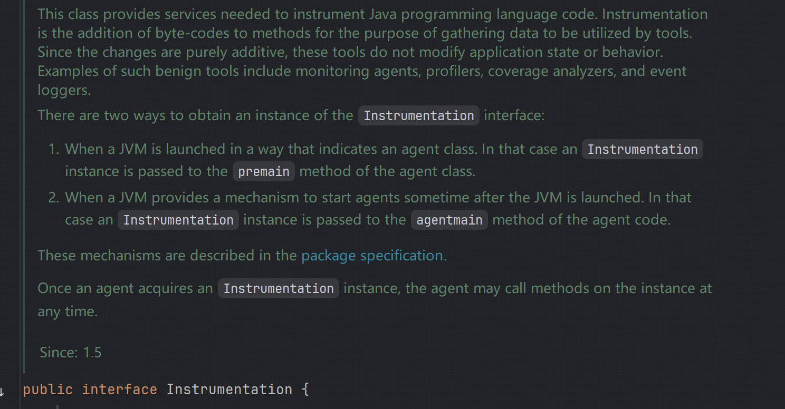
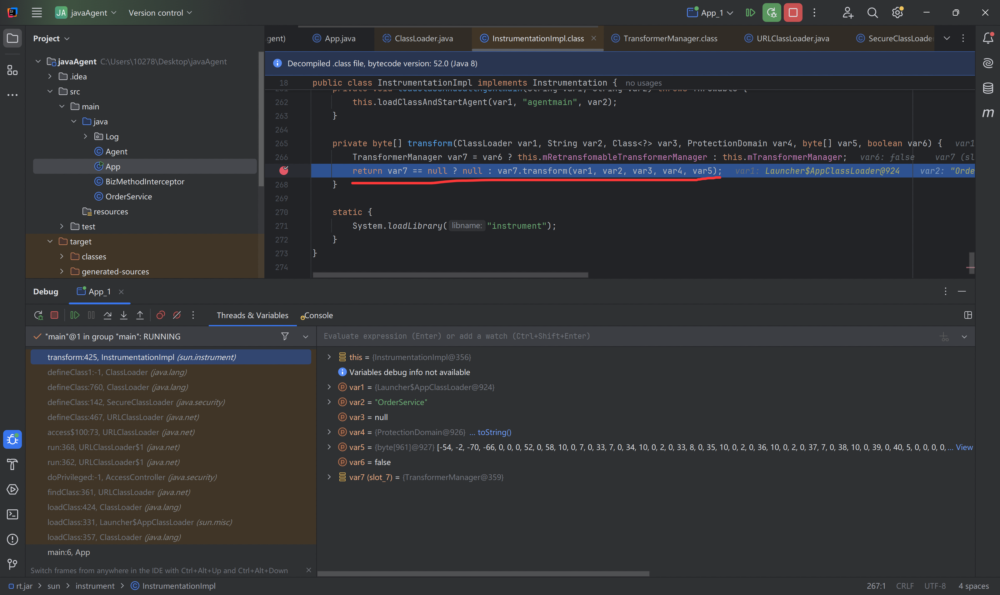
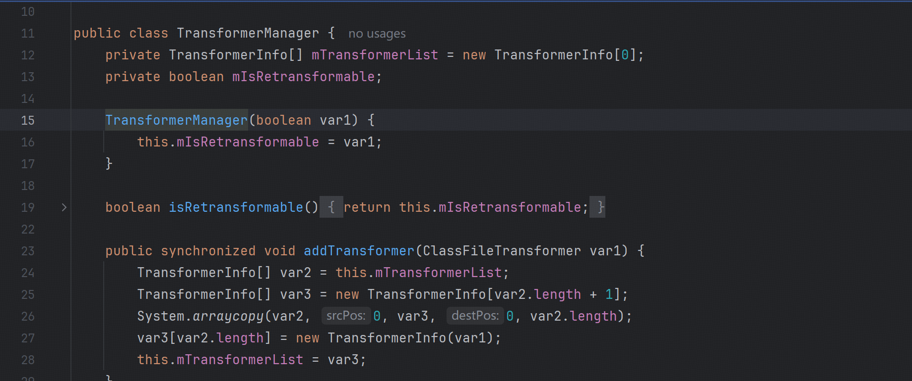
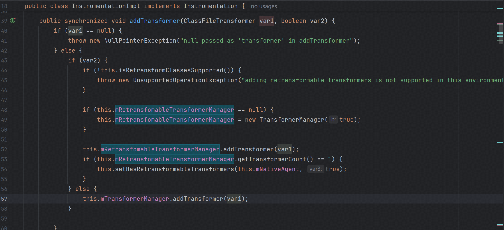
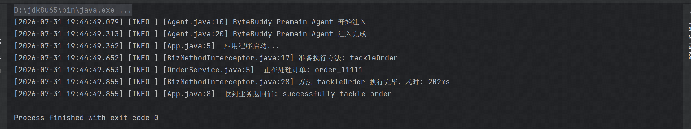

## 0x01



java agent 存在两种模式，premain  agentmain , 前者用于在类加载进 jvm 之前拦截并修改类的字节码，后者允许在目标 java 程序运行时将 agent 注入进去。

具体原理，可以打断点观察，在初始化 OrderService 类时会有这样的一个方法调用， var7.transform() ，如果 var7 == null 则返回 null ，在 java Agent 规范中，如果没有修改字节码则返回 null ，如果返回原始字节码， JVM 需要重新校验这个字节码判断有没有修改，造成无效解析和拷贝。



看上一行代码 ， var6 应该是表示这个是否是重加载吧，如果 false ，则 var7 = this.mTransformerManager ，继续往上查看 TransformerManager 类，可以存放多个 ClassFileTransformer ，也就是可以注册多个 transformer 进行链式处理。



Instrumention 接口的 addTransformer 方法就是调用 mTransformerManager 的 addTransformer 方法。



所以 var7.transform() 方法就是调用了我们注册的 ClassFileTransformer 类的 transform 方法。


打包配置：META-INF/MANIFEST.MF 指定 Premain-Class: 代理类全路径 

```yaml
Manifest-Version: 1.0
Premain-Class: Agent
Can-Redefine-Classes: true
Can-Retransform-Classes: true
```

执行： 通过命令行参数 -javaagent:agent.jar  

```
java -javaagent:agent.jar=agentArgs -jar app.jar
```

例如，统计某个方法的执行耗时。

```xml
<?xml version="1.0" encoding="UTF-8"?>
<project xmlns="http://maven.apache.org/POM/4.0.0"
         xmlns:xsi="http://www.w3.org/2001/XMLSchema-instance"
         xsi:schemaLocation="http://maven.apache.org/POM/4.0.0 http://maven.apache.org/xsd/maven-4.0.0.xsd">
    <modelVersion>4.0.0</modelVersion>

    <artifactId>javaAgent</artifactId>
    <version>1.0-SNAPSHOT</version>

    <properties>
        <maven.compiler.source>8</maven.compiler.source>
        <maven.compiler.target>8</maven.compiler.target>
        <project.build.sourceEncoding>UTF-8</project.build.sourceEncoding>
    </properties>

    <dependencies>
        <dependency>
            <groupId>net.bytebuddy</groupId>
            <artifactId>byte-buddy</artifactId>
            <version>1.14.12</version>
        </dependency>
    </dependencies>

    <build>
        <plugins>
            <plugin>
                <groupId>org.apache.maven.plugins</groupId>
                <artifactId>maven-jar-plugin</artifactId>
                <version>3.3.0</version>
                <configuration>
                    <archive>
                        <manifestEntries>
                            <Premain-Class>Agent</Premain-Class>
                            <Agent-Class>Agent</Agent-Class>
                            <Can-Redefine-Classes>true</Can-Redefine-Classes>
                            <Can-Retransform-Classes>true</Can-Retransform-Classes>
                        </manifestEntries>
                    </archive>
                </configuration>
            </plugin>
        </plugins>
    </build>
</project>
```

入口类 拦截器类

```java
import net.bytebuddy.agent.builder.AgentBuilder;
import net.bytebuddy.implementation.MethodDelegation;
import net.bytebuddy.matcher.ElementMatchers;
import java.lang.instrument.Instrumentation;
import Log.log;

public class Agent {

    public static void premain(String agentArgs, Instrumentation inst) {
        log.info("ByteBuddy Premain Agent 开始注入");

        new AgentBuilder.Default()
                .type(ElementMatchers.nameStartsWith("OrderService"))
                .transform((builder, typeDescription, classLoader, module, protectionDomain) 			  	-> builder.method(ElementMatchers.named("tackleOrder")
                                .and(ElementMatchers.isPublic()))
                        .intercept(MethodDelegation.to(BizMethodInterceptor.class))
                )
                .installOn(inst);

        log.info("ByteBuddy Premain Agent 注入完成 ");
        //.with(AgentBuilder.Listener.StreamWriting.toSystemOut())
    }
}


import net.bytebuddy.implementation.bind.annotation.Origin;
import net.bytebuddy.implementation.bind.annotation.RuntimeType;
import net.bytebuddy.implementation.bind.annotation.SuperCall;
import java.lang.reflect.Method;
import java.util.concurrent.Callable;
import Log.log;

public class BizMethodInterceptor {

    @RuntimeType
    public static Object intercept(
            @Origin Method method,
            @SuperCall Callable<?> callable
    ) throws Exception {

        long startTime = System.nanoTime();
        log.info("准备执行方法: " + method.getName());

        try {
            Object result = callable.call();
            return result;

        } catch (Exception e) {
            log.info("方法执行出错: " + e.getMessage());
            throw e;
        } finally {
            long endTime = System.nanoTime();
            log.info("方法 " + method.getName() + " 执行完毕，耗时: " + (endTime - startTime) / 1_000_000 + "ms");
        }
    }
}

```

被监控类

```java
import Log.log;
public class App {
    public static void main(String[] args) {
        log.info(" 应用程序启动...");
        OrderService service = new OrderService();
        String result = service.tackleOrder("order_11111");
        log.info(" 收到业务返回值: " + result);
    }
}


import Log.log;
public class OrderService {
    public String tackleOrder(String orderId) {
        log.info(" 正在处理订单: " + orderId);
        try {
            Thread.sleep(200);
        } catch (InterruptedException e) {
            e.printStackTrace();
        }
        return "successfully tackle order";
    }
}
```

mvn clean package 打包 Agent.jar 

打开 App 类，edit configurations ，add VM options : -javaagent:target/javaAgent-1.0-SNAPSHOT.jar



如果使用  ASM 修改字节码更清晰一些。buddy byte 有一定的封装。

类加载前可以修改字节码，因此 RASP （运行时自我阻断）可以通过添加检查字节码对输入参数和 sink 函数调用进行实时检测阻断。

## 0x02

对于生产环境下的 RASP ，需要 Hook 多个危险方法，例如 Runtime ProcessBuilder ObjectInputStream 等

分层：Transformer → Hook Handler/Protector → Rule/Taint Engine → Report/Block。

还是从入口类 Agent 开始，实现如下

```java
import java.io.IOException;
import java.lang.instrument.Instrumentation;
import java.lang.instrument.UnmodifiableClassException;
import java.util.ArrayList;
import java.util.List;
import java.util.jar.JarFile;

import Log.log;

public class Agent {
    public static void premain(String agentArgs, Instrumentation inst, String mode) {
        init(agentArgs, inst, "premain");
    }

    public static void agentmain(String agentArgs, Instrumentation inst, String mode) throws UnmodifiableClassException {
        init(agentArgs, inst, "agentmain");

        //attach and transform loaded classes
        List<Class<?>> targetClasses = new ArrayList<Class<?>>();
        for (Class<?> targetClass : inst.getAllLoadedClasses()) {
            String className = targetClass.getName();
            if (!inst.isModifiableClass(targetClass)) {
                continue;
            }

            if ("java.lang.Thread".equals(className)
                    || "java.lang.Runtime".equals(className)
                    || "java.lang.ProcessBuilder".equals(className)
                    || "java.io.ObjectInputStream".equals(className)
                    || "java.lang.Class".equals(className)) {
                targetClasses.add(targetClass);
            }
        }
        if (!targetClasses.isEmpty()) {
            Class<?>[] targets = targetClasses.toArray(new Class<?>[0]);
            inst.retransformClasses(targets);
            log.info("rasp agent successfully retransform " + targets.length + " classes");
        }

    }

    private static void init(String agentArgs, Instrumentation inst, String mode) {
        appendSelfToBootstrap(inst);
        inst.addTransformer(new RaspTransformer(),true);
        log.info("rasp current mode: ", mode);
    }

    public static void appendSelfToBootstrap(Instrumentation inst) {
        try {
            String jarPath = Agent.class.getProtectionDomain().getCodeSource().getLocation().getPath();
            inst.appendToBootstrapClassLoaderSearch(new JarFile(jarPath));
            log.info("success append self to bootstrap classpath");
        } catch (IOException e) {
            log.error("failed append self to bootstrap classpath", e);
            throw new RuntimeException(e);
        }
    }
}
```

然后实现我们注册的 RaspTransformer 类

```java
import java.lang.instrument.ClassFileTransformer;
import java.security.ProtectionDomain;
import Log.log;
import Transformer.*;

public class RaspTransformer implements ClassFileTransformer {
    @Override
    public byte[] transform(ClassLoader loader, String className, Class<?> clazz, ProtectionDomain protectionDomain, byte[] classFileBuffer) {
        if (className == null || classFileBuffer == null) {
            return null;
        }

        switch (className) {
            case "java/lang/Runtime":
                log.info("rasp agent successfully block Runtime,classLodaer = " + loader);
                return RuntimeTransformer.transform(classFileBuffer);
            case "java/lang/ProcessBuilder":
                log.info("rasp agent successfully block ProcessBuilder,classLodaer = " + loader);
                return ProcessBuilderTransformer.transform(classFileBuffer);
            case "java/io/ObjectInputStream":
                log.info("rasp agent successfully block ObjectInputStream,classLodaer = " + loader);
                return ObjectInputStreamTransformer.transform(classFileBuffer);
            case "java/lang/Class":
                log.info("rasp agent successfully block Class,classLodaer = " + loader);
                return ClassTransformer.transform(classFileBuffer);
            case "java/lang/Thread":
                log.info("rasp agent successfully block Thread,classLodaer = " + loader);
                return ThreadTransformer.transform(classFileBuffer);
        }

        return null;
    }
}

```

对于不同的可能导致危险的类，我们使用不同的 xxxxTransformer 类来实现 transform 方法，做不同的处理，这里举例 java/lang/Runtime ，

```java
package Transformer;

import Log.log;
import org.objectweb.asm.*;
import org.objectweb.asm.commons.AdviceAdapter;

/**
 * 针对 java.lang.Runtime 
 */
public class RuntimeTransformer {

    public static byte[] transform(byte[] classfileBuffer) {
        try {
            ClassReader cr = new ClassReader(classfileBuffer);
            ClassWriter cw = new SafeClassWriter(cr, ClassWriter.COMPUTE_MAXS);
            ClassVisitor cv = new RuntimeClassVisitor(Opcodes.ASM9, cw);
            cr.accept(cv, ClassReader.EXPAND_FRAMES);
            return cw.toByteArray();
        } catch (Exception e) {
            log.error("RuntimeTransformer ASM 转换失败: " + e.getMessage(), e);
            return null;
        }
    }

    private static class RuntimeClassVisitor extends ClassVisitor {
        public RuntimeClassVisitor(int api, ClassVisitor classVisitor) {
            super(api, classVisitor);
        }

        @Override
        public MethodVisitor visitMethod(int access, String name, String descriptor, String signature, String[] exceptions) {
            MethodVisitor mv = super.visitMethod(access, name, descriptor, signature, exceptions);
            if ("exec".equals(name)) {
                boolean isStringArray = descriptor.startsWith("([Ljava/lang/String;");
                return new ExecMethodAdvice(api, mv, access, name, descriptor, isStringArray);
            }
            return mv;
        }
    }

    private static class ExecMethodAdvice extends AdviceAdapter {
        private final boolean isStringArray;

        protected ExecMethodAdvice(int api, MethodVisitor methodVisitor, int access, String name, String descriptor, boolean isStringArray) {
            super(api, methodVisitor, access, name, descriptor);
            this.isStringArray = isStringArray;
        }

        @Override
        protected void onMethodEnter() {
            if (isStringArray) {
                mv.visitLdcInsn(" ");
                mv.visitVarInsn(Opcodes.ALOAD, 1);
                mv.visitMethodInsn(Opcodes.INVOKESTATIC,
                        "java/lang/String", "join",
                        "(Ljava/lang/CharSequence;[Ljava/lang/CharSequence;)Ljava/lang/String;",
                        false);
            } else {
                mv.visitVarInsn(Opcodes.ALOAD, 1);
            }
            mv.visitMethodInsn(Opcodes.INVOKESTATIC,
                    "Transformer/HookHandler", "onRuntimeExec",
                    "(Ljava/lang/String;)V", false);
        }
    }
}

```

这里的 ClassReader  类似一个字节码读取流，调用 cr.accept() 方法，逐字节扫描，这个过程中，每次读到一个结构，比如 className field Method 会调用 ClassVisitor 去处理


