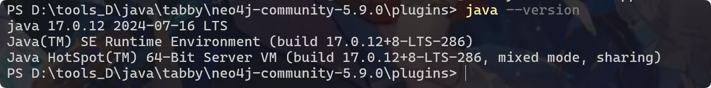
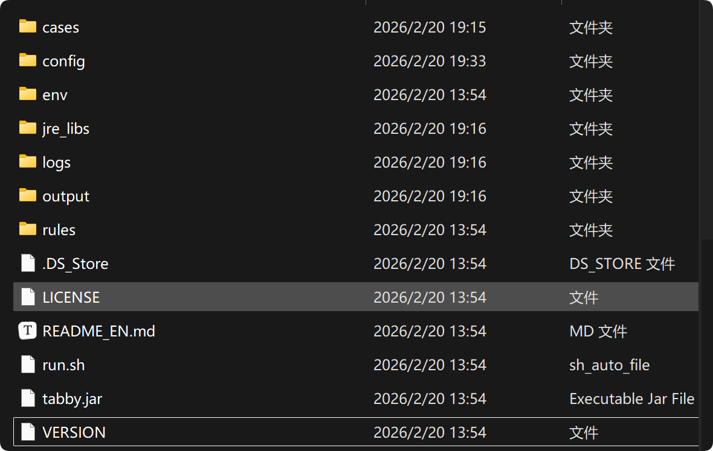
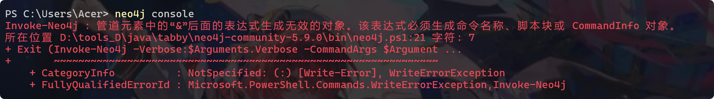
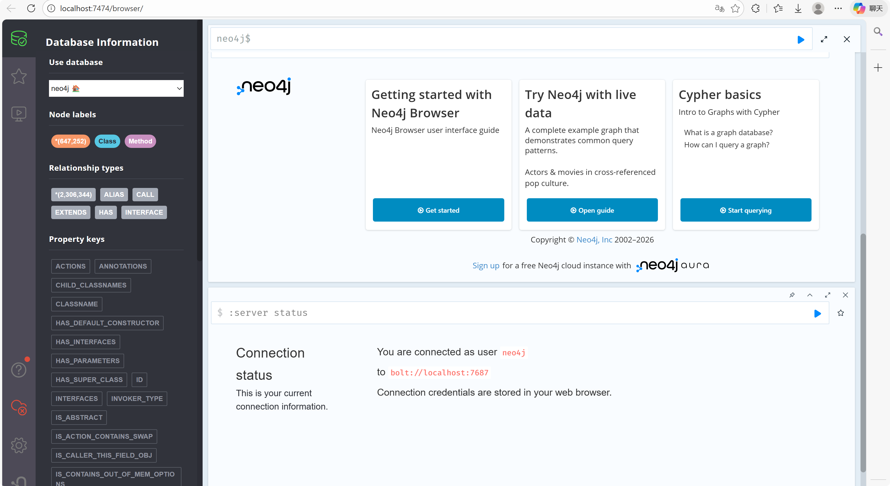
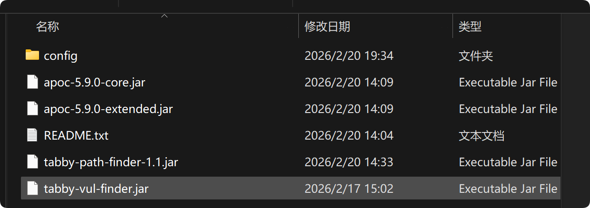
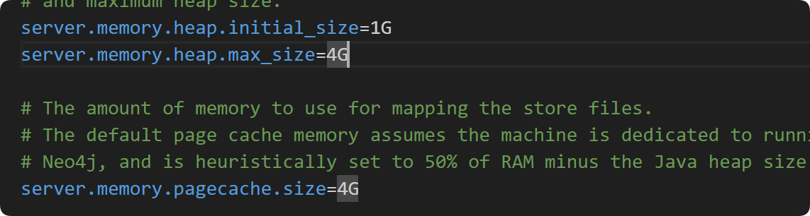
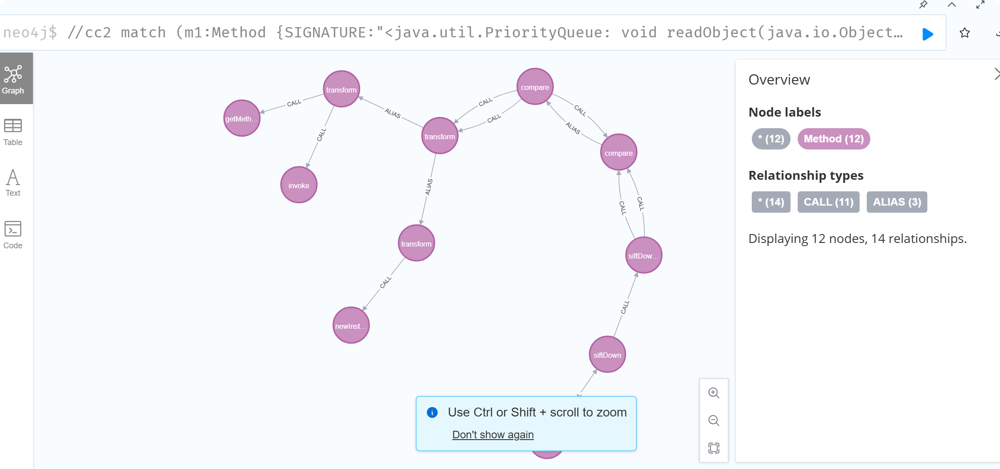

 

写 java 题的时候，在 25 年的 L3HCTF 的 wp 中， 一位师傅使用了 tabby 寻找链子，当时用了一次，后来文件太乱找不到了，重新配个环境使用。

tabby 需要 jdk17 版本

我使用的是 1.3.2 版本的 tabby

[tabby-sec/tabby: A CAT called tabby ( Code Analysis Tool )](https://github.com/tabby-sec/tabby) 

目录结构大概如下



config 是一些配置， cases 是我自己创建的文件夹，放入待分析的 jar ，output 是分析结果，一些 csv 文件。


neo4j 配置

在该站点下载 https://we-yun.com/doc/neo4j/ 5.9.0 版本，然后配置环境变量。

运行 `neo4j console` ，powershell 可能有些问题，不知道是什么情况（）



换成 cmd 使用没这个问题。运行完之后，访问



然后需要下载两个插件，放在 neo4j 的 plugins 目录下



需要相应版本对应上 例如，neo4j 是 5.x 版本，相应插件就需要 apoc 5.x 版本。还需要一个 tabby-path-finder-1.1.jar 和 config 目录，其中是 db.properties 配置文件。

```properties
# db.properties
tabby.cache.isDockerImportPath            = false

# db settings
tabby.neo4j.username                      = neo4j
tabby.neo4j.password                      = 20060513+C
tabby.neo4j.url                           = bolt://127.0.0.1:7687
```

在 conf 的 neo4j.conf 配置如下,并调整内存分配字段

```conf
server.directories.import=import
dbms.security.procedures.unrestricted=jwt.security.*,apoc.*
```



在 conf 目录下创建新的配置文件 apoc.conf

```
apoc.import.file.enabled=true
apoc.import.file.use_neo4j_config=false
```


启动之后查询,回显正常则是配置生效

```
CALL apoc.help('all')
CALL tabby.help('tabby')
```

之后参考官方文档对数据库做一些处理

```
CREATE CONSTRAINT c1 IF NOT EXISTS FOR (c:Class) REQUIRE c.ID IS UNIQUE;
CREATE CONSTRAINT c2 IF NOT EXISTS FOR (c:Class) REQUIRE c.NAME IS UNIQUE;
CREATE CONSTRAINT c3 IF NOT EXISTS FOR (m:Method) REQUIRE m.ID IS UNIQUE;
CREATE CONSTRAINT c4 IF NOT EXISTS FOR (m:Method) REQUIRE m.SIGNATURE IS UNIQUE;
CREATE INDEX index1 IF NOT EXISTS FOR (m:Method) ON (m.NAME);
CREATE INDEX index2 IF NOT EXISTS FOR (m:Method) ON (m.CLASSNAME);
CREATE INDEX index3 IF NOT EXISTS FOR (m:Method) ON (m.NAME, m.CLASSNAME);
CREATE INDEX index4 IF NOT EXISTS FOR (m:Method) ON (m.NAME, m.NAME0);
CREATE INDEX index5 IF NOT EXISTS FOR (m:Method) ON (m.SIGNATURE);
CREATE INDEX index6 IF NOT EXISTS FOR (m:Method) ON (m.NAME0);
CREATE INDEX index7 IF NOT EXISTS FOR (m:Method) ON (m.NAME0, m.CLASSNAME);
:schema //查看表库
:sysinfo //查看数据库信息
```


删除操作

```
DROP CONSTRAINT c1;
DROP CONSTRAINT c2;
DROP CONSTRAINT c3;
DROP CONSTRAINT c4;
DROP INDEX index1;
DROP INDEX index2;
DROP INDEX index3;
DROP INDEX index4;
DROP INDEX index5;
DROP INDEX index6;
DROP INDEX index7;
```


开始分析

```
java -jar -Xms8G tabby.jar
```

分析完成后需要另一款工具将扫描结果上传 tabby-vul-finder.jar

```
java -jar tabby-vul-finder.jar --load csv相应位置
```

这里有一些现成的官方给出的 match 

[现有利用链覆盖 · tabby-sec/tabby Wiki](https://github.com/tabby-sec/tabby/wiki/现有利用链覆盖)



也可以配置 idea 的插件，方便找链子等等。

todo......