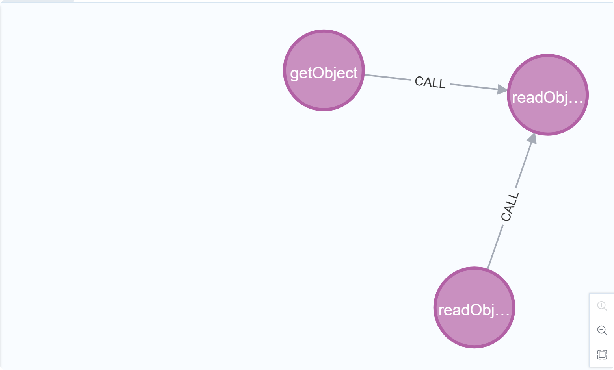
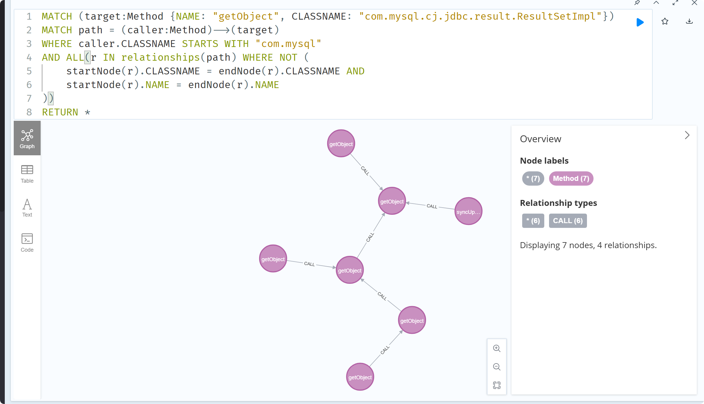
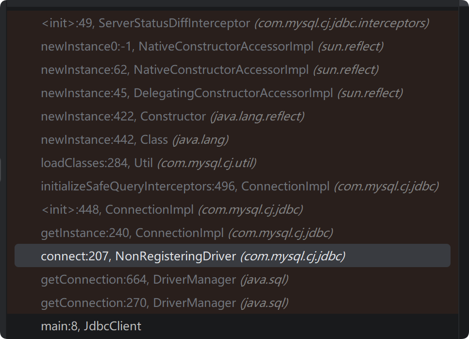
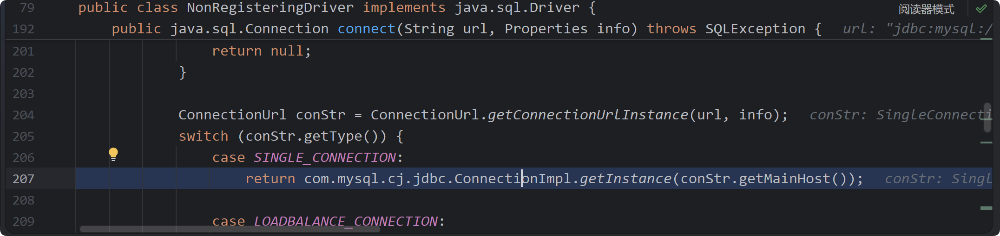
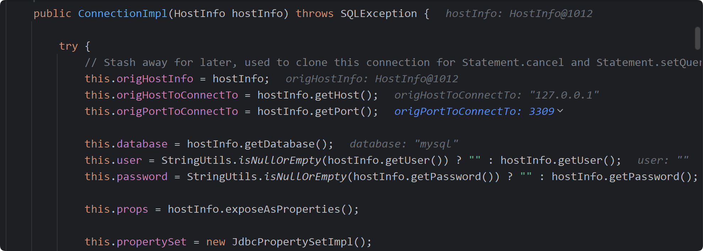
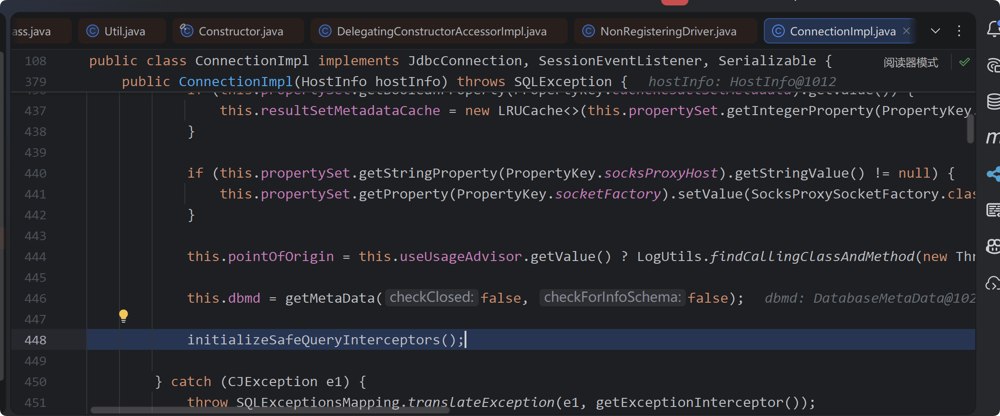
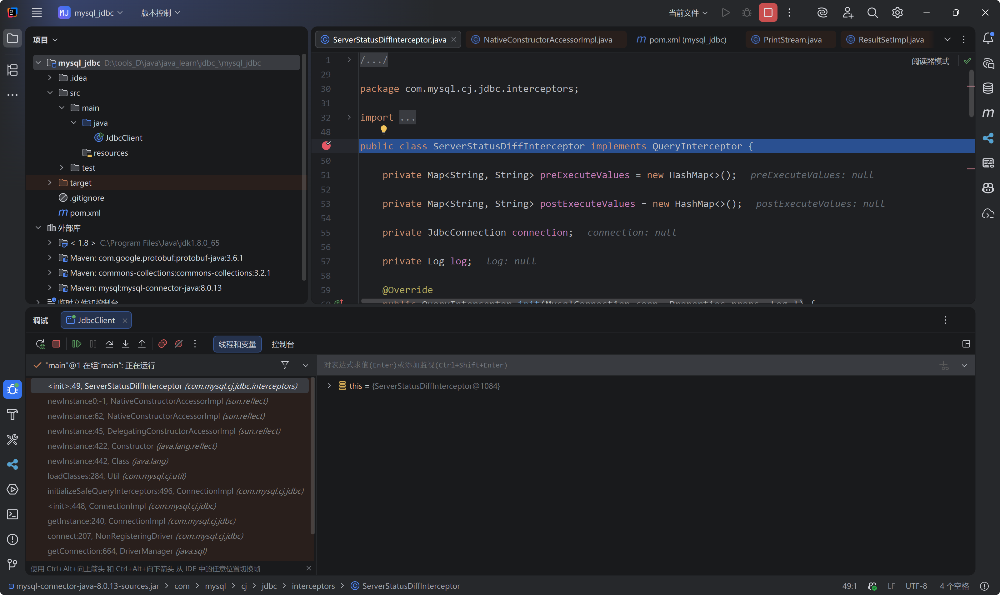
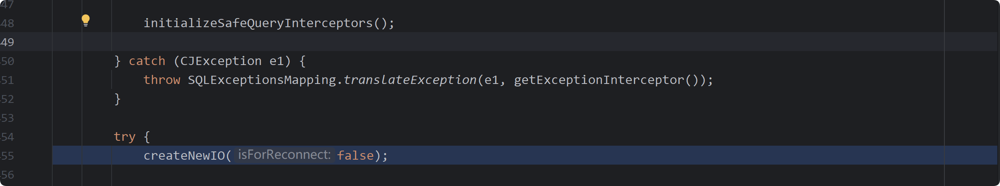
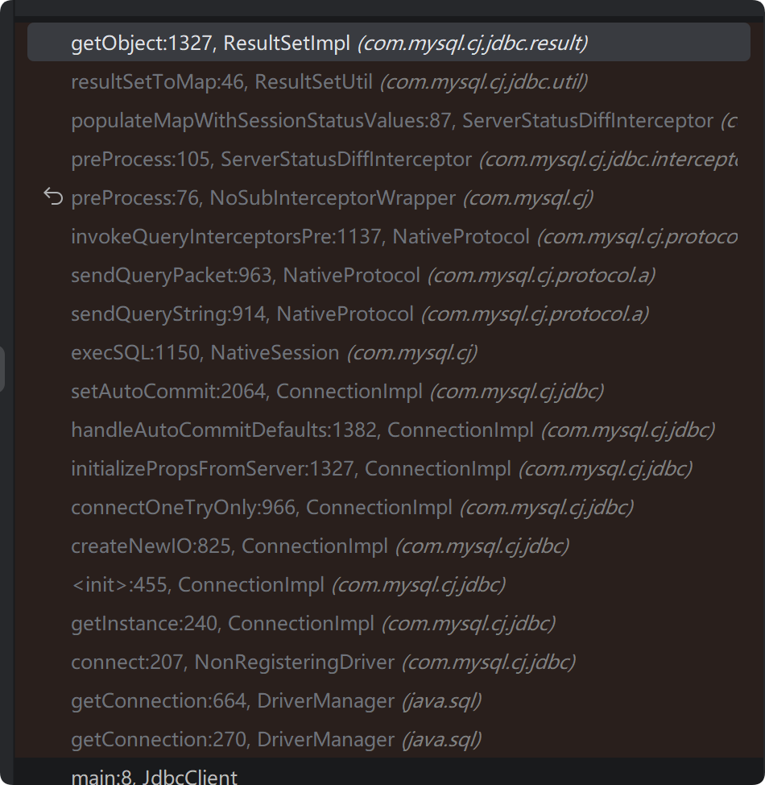
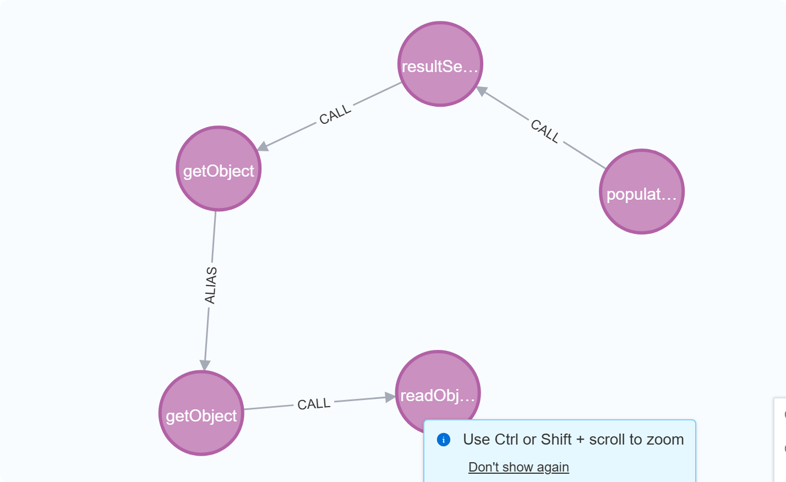

JDBC 是 java 与数据库交互的一组 api

```java
Class.forName("com.mysql.cj.jdbc.Driver"); 
String sql = "SELECT id, username FROM users WHERE status = ?";

try (Connection conn = DriverManager.getConnection(url, user, passwd);
     PreparedStatement pstmt = conn.prepareStatement(sql)) {    
    
    pstmt.setInt(1, 1);     
    try (ResultSet rs = pstmt.executeQuery()) {
        while (rs.next()) {
            int id = rs.getInt("id");
            String username = rs.getString("username");          
        }
    }     
} catch (SQLException e) {
    e.printStackTrace();
} 
```


配置了 `autoDeserialize=true` 时，JDBC 驱动在解析服务端返回的数据时，会去检查二进制数据的 Magic Bytes。如果发现返回的字节流是以 `AC ED 00 05`（Java 序列化数据的标准开头）开头的，会自动调用 `ObjectInputStream.readObject()` 方法将其还原为 Java 对象。

当 url 添加这一语句后**queryInterceptors=ServerStatusDiffInterceptor**，当建立连接或者执行 sql 之前，该拦截器 ServerStatusDiffInterceptor 会自动强制向 mysql 服务端发送一条查询语句 SHOW SESSION STATUS 或者 SHOW BARIABLES。url 含有这两个语句时，建立连接后发送 show session status ,然后恶意 mysql 端返回 evil payload ,在客户端被 readObject() 触发。


1. 伪造恶意服务端，必须能返回一个符合 msyql 协议的完整结果集,其中返回 evil payload 。 看到有师傅是直接手写的 python 脚本。这里用了现成的工具，


2. 在 mysql 驱动中查找一个能调用 readObject 的方法，反序列化 evil payload 

```ceylon
MATCH (sink:Method {NAME: "readObject", CLASSNAME: "java.io.ObjectInputStream"})
MATCH (caller:Method)-[r:CALL]->(sink)
WHERE caller.CLASSNAME STARTS WITH "com.mysql"
RETURN * 
```




这里找到了两个方法可以调用到  java.io.ObjectInputStream#readObject  ，分别是

```java
com.mysql.cj.jdbc.result.ResultSetImpl#getObject
    
com.mysql.cj.jdbc.util.ResultSetUtil#readObject
```

继续逆向寻找调用了 com.mysql.cj.jdbc.result.ResultSetImpl#getObject 的方法（找到一个我们可以控制的入口类为止）。

```ceylon
MATCH (target:Method {NAME: "getObject", CLASSNAME: "com.mysql.cj.jdbc.result.ResultSetImpl"})
MATCH path = (caller:Method)-[:CALL|ALIAS*1..5]->(target)
WHERE caller.CLASSNAME STARTS WITH "com.mysql"
RETURN *
```


无效查找了，并且有很多自身调用自身，缩小一下范围，剔除一些方法重载。比如那些 a(int num1) 调用了内部的 a(int num1,str str1) 这样的。


```ceylon
MATCH (target:Method {NAME: "getObject", CLASSNAME: "com.mysql.cj.jdbc.result.ResultSetImpl"})
MATCH path = (caller:Method)-->(target)
WHERE caller.CLASSNAME STARTS WITH "com.mysql"
AND ALL(r IN relationships(path) WHERE NOT (
    startNode(r).CLASSNAME = endNode(r).CLASSNAME AND 
    startNode(r).NAME = endNode(r).NAME
))
RETURN *
```



把链子剔没了，这里往后就是看网上的链子然后打断点



connect  中为该连接创建了一个实例，其中封装 socket 和一些数据处理....逻辑认证等工作，负责把 Java 的 SQL 字符串序列化成 MySQL 协议的字节流，再把服务器返回的字节流反序列化成 Java 对象




初始化了一堆数据，键值对，originhost port password  user 等



最后调用 initializeSafeQueryInterceptors(); 方法。



```
queryInterceptors=com.mysql.cj.jdbc.interceptors.ServerStatusDiffInterceptor
```

跟进发现,提取 PropertyKey.queryInterceptors 的 value 然后加载该类 `com.mysql.cj.jdbc.interceptors.ServerStatusDiffInterceptor`

```java
Util.<QueryInterceptor>loadClasses(
    this.propertySet.getStringProperty(PropertyKey.queryInterceptors).getStringValue(), 
    "MysqlIo.BadQueryInterceptor", 
    getExceptionInterceptor() 
).stream().map(o -> new NoSubInterceptorWrapper(o.init(this, this.props, this.session.getLog()))).collect(Collectors.toList());}
```


```java
public static <T>
Collector<T, ?, List<T>> toList() {
    return new CollectorImpl<>((Supplier<List<T>>) ArrayList::new, List::add,
                               (left, right) -> { left.addAll(right); return left; },
                               CH_ID);
}

### Collector 的作用：Collector 是 Java Stream API 中的一个接口，用于定义如何将流中的元素收集到某种结果容器中。toList() 返回的 Collector ### 定义了以下几个关键部分：
### Supplier：提供一个空的 ArrayList，作为收集结果的容器。
### BiConsumer（累积器）：定义了如何将流中的每个元素添加到容器中（通过 List::add）。
### BinaryOperator（合并器）：定义了如何在并行流中合并多个部分结果（通过 left.addAll(right)）。
### 特性：指定了 IDENTITY_FINISH，表示不需要额外的转换，直接返回 List。
### Stream 的 collect 方法：Stream 的 collect 方法接受一个 Collector，并根据 Collector 的定义执行收集操作。toList() 返回的 Collector 定### 义了如何将流中的元素逐个添加到一个 List 中，并最终返回这个 List。
```




加载 ServerStatusDiffInterceptor 类,



完之后创建 connect ,后续经过一系列调用栈，会触发 preProcess 方法，接着 populateMapWithSessionStatusValues ,resyltSetToMap getObject readObject,触发反序列化。

调用栈如下：




自从学 java 后很多都是看看网上的链子，然后自己调调，突然发现有些漏洞，调用栈很多，但是基本上只讲最上面的几层，不知道这是什么原因......，期待有师傅解答这个问题.


```ceylon
MATCH (source:Method {NAME:"populateMapWithSessionStatusValues", CLASSNAME:"com.mysql.cj.jdbc.interceptors.ServerStatusDiffInterceptor"})
MATCH (sink:Method {NAME:"readObject", CLASSNAME:"java.io.ObjectInputStream"})
MATCH path = (source)-[:CALL|ALIAS*1..5]->(sink)
RETURN path LIMIT 5
```




