### kubernetes

一个容器编排系统，能够把很多台服务器资源当作一个资源池，用统一的方式实现部署，扩容缩容，滚动升级，故障自愈，网络暴露。我们可以声明要几个副本，暴露什么服务，滚动升级的策略是什么。然后 k8s 通过不断对比期望状态 spec 和实际状态，自动执行操作将实际状态拉回期望状态。

1. 可以把 Pod 放在合适的服务器（worker 节点）通过 cpu / 内存状态，亲和状态等
2. 容器或者节点挂了可以自动重启，并且方便迁移
3. 方便大量服务滚动升级或者回滚

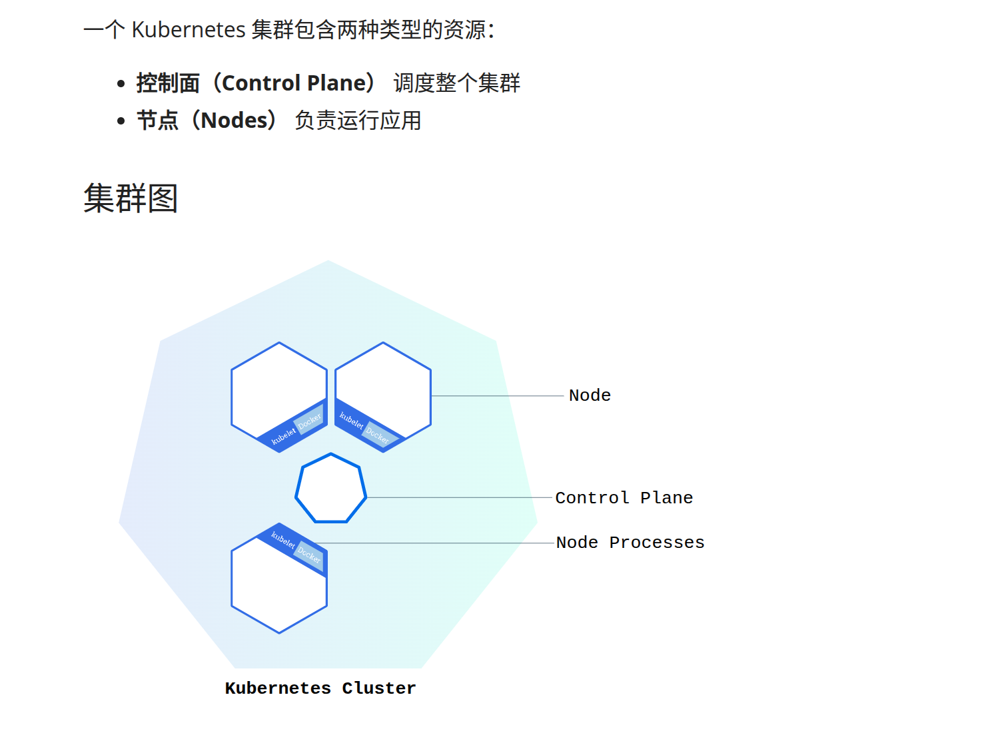

节点是一个虚拟机或者物理机，它在 Kubernetes 集群中充当工作机器。


#### 部署应用

##### 1. 安装 minikube 


minikube 是一种轻量级的 kubernetes 实现，可在本地计算机上创建 虚拟机 或者 docker 并部署仅包含一个节点的简单集群（面向本机开发/学习/测试）生产环境可以使用 kubeadm，提供用于引导集群工作的多种操作， 包括启动、停止、查看状态和删除。

```bash
curl -LO https://storage.googleapis.com/minikube/releases/latest/minikube-linux-amd64
sudo install minikube-linux-amd64 /usr/local/bin/minikube

minikube version
```

下面是一些集群管理的命令

```bash
minikube pause # 暂停 k8s 控制面，不能扩缩 pod 自愈，但是不影响已经部署好的应用。

minikube stop # 停止集群

minikube config set memory xxxx # 更改 minikube 节点默认内存限制，需要重启

minikube addons list # 可安装的 kubernetes 服务

minikube start -p k8s1 --driver=docker # 创建第二个 k8s 集群,命名为 k8s1

minikube profile list # 查看 profiles

# 切换 kubectl 管理哪个集群
kubectl config use-context minikube 
kubectl config use-context k8s1 

minikube delete --all # 删除所有 k8s 集群
```


##### 2. 安装 kubctl

 kubctl 负责通过 kubeconfig 连接到某个 k8s 集群的 API Server，对集群资源执行增删改查（Pod/Deployment/Service/Namespace 等）。

```bash
minikube kubectl -- get po -A

### alternatively

### 下载 kubctl 二进制文件
curl -LO "https://dl.k8s.io/release/$(curl -L -s https://dl.k8s.io/release/stable.txt)/bin/linux/amd64/kubectl"
### 下载校验和文件
curl -LO "https://dl.k8s.io/release/$(curl -L -s https://dl.k8s.io/release/stable.txt)/bin/linux/amd64/kubectl.sha256"
### 校验
echo "$(cat kubectl.sha256)  kubectl" | sha256sum --check
### 正常情况下输出 Kubctl: OK
### 安装 kubctl
sudo install -o root -g root -m 0755 kubectl /usr/local/bin/kubectl
```

kubctl 与集群交互

```

```


##### 3. 开始部署

`minikube start ` 启动 k8s 集群


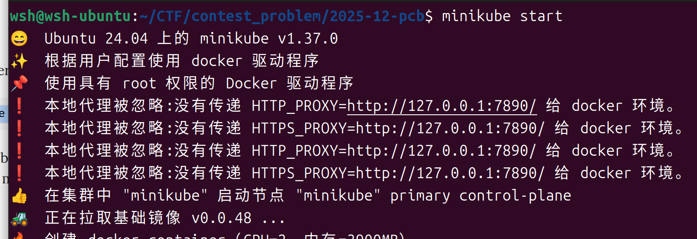


如果无法正常启动，可以使用 docker 驱动启动集群

```bash
minikube start --driver=docker
### 配置默认驱动
minikube config set driver docker
```

`kubctl get po -A`  查看集群所有 Pod

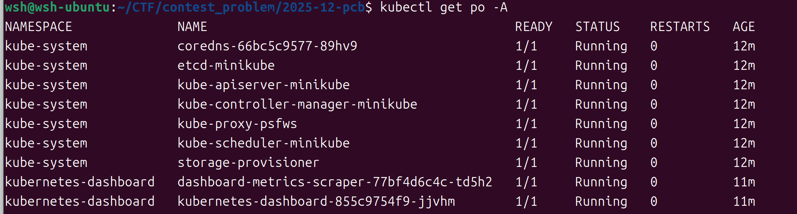


本地镜像部署,需要先去导入到 minikube ，如果 driver = docker 


```
minikube image load nginx:1.27-alpine
```

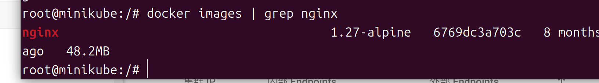


然后写一个 yaml ,deployment , service

```
apiVersion: apps/v1
kind: Deployment
metadata:
name: nginx
spec:
replicas: 2
selector:
  matchLabels:
    app: nginx
template:
  metadata:
    labels:
      app: nginx
  spec:
    containers:
      - name: nginx
        image: nginx:1.27-alpine
        ports:
          - containerPort: 80
---
apiVersion: v1
kind: Service
metadata:
name: nginx
spec:
selector:
  app: nginx
ports:
  - port: 80
    targetPort: 80

```

运行良好

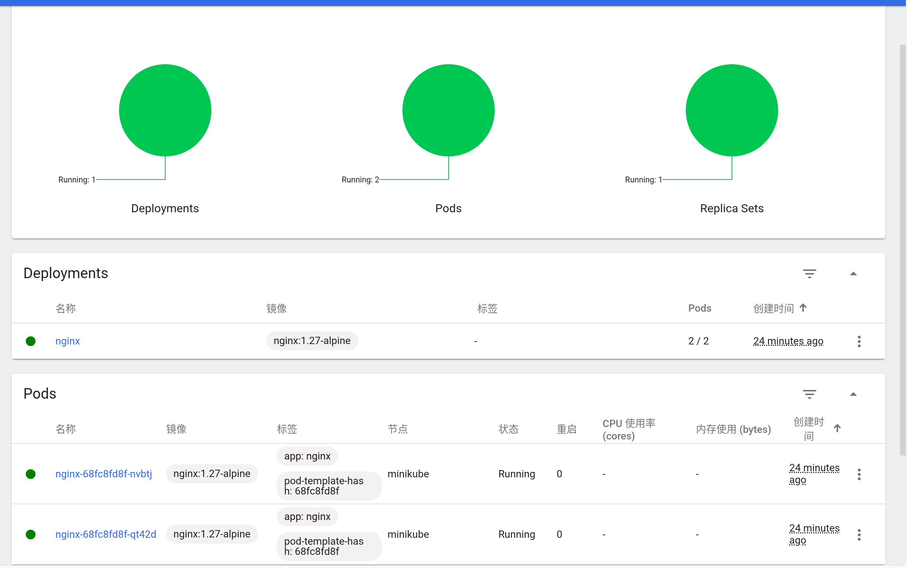

Pod 的 IP 是不稳定的，Pod 重建后 IP 会变；扩缩容时 Pod 会增加/减少。所以提供 Service 来当稳定入口。

Cluster IP  ,集群内部可访问的虚拟 ip。

集群内（Pod/Node）访问：`http://10.108.8.122:80` 或 `http://nginx:80`（走 kube-dns）

集群外（本机浏览器/外网）不能直接访问这个 IP。

内部 Endpoints = 这个 Service 实际会把流量转发到哪些后端（通常是 Pod IP:Port）。

外部 Endpoints =  集群外部如何访问到这个 Service，只在把 Service 暴露到集群外时才会出现。


service ip 类型

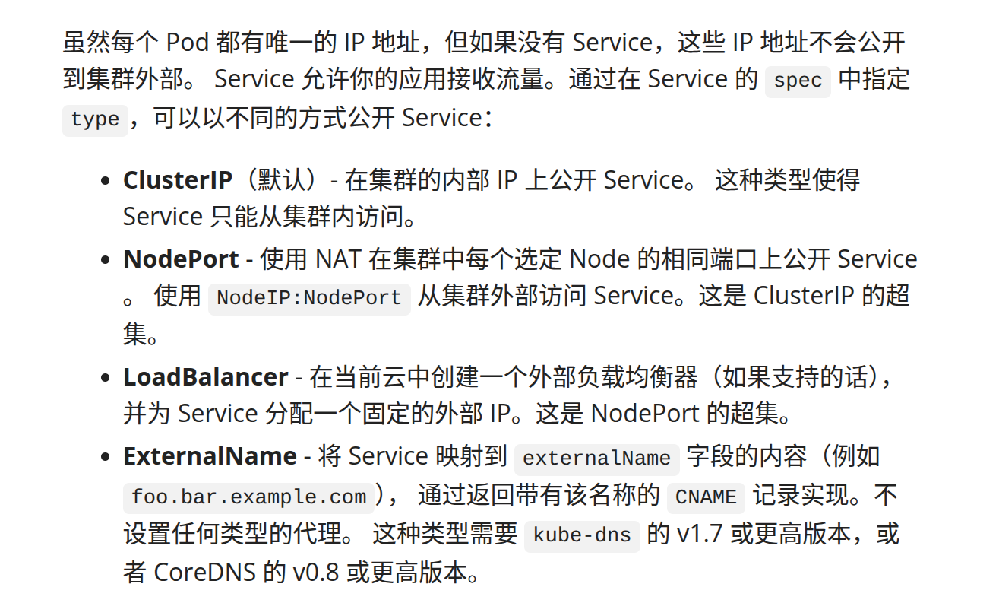

现在只能在集群内部访问 nginx 服务，类似下面这样，想要公开到宿主机或者公网，需要 NodePort / Ingress / LoadBalancer ，也可以 port-forward 转发

```
Service ClusterIP:port（10.108.8.122:80）
  |
  v
kube-proxy 规则（iptables/IPVS）
  |
  v
Pod IP:targetPort（10.244.0.8:80 或 10.244.0.9:80）
```

这里可以通过 docker exec -it minikube集群容器id /bin/bash 进入 node 所在的计算机。

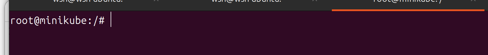


本地，使用 port-forward，8080 是宿主机端口 80 是 service 监听的端口。流量访问 8080,转到 servcie 的 80 ，再到 pod 中的服务

```
kubectl port-forward svc/nginx 8080:80
```

感觉是宿主机套 k8s 集群 套 pod (其中有不同的服务监听不同的端口，这些服务共享一个网络栈和存储卷，但是pid 主机命名空间不一样。)

目前是单节点模式，有一些不太理解的地方，所以又加了一个节点

```
minikube node add --worker
```


每个节点都有一个 internal ip ，可以被主机访问到。

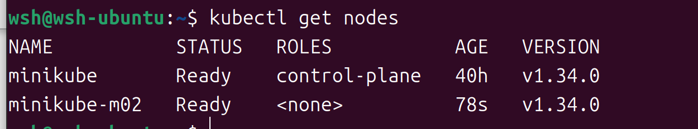


在节点计算机上可以去访问 service 的 cluster ip 。

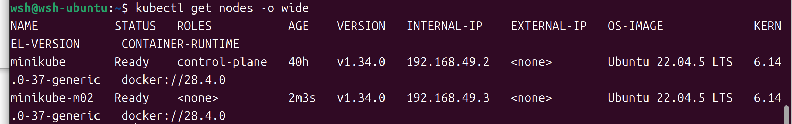


也可以使用 node-port 模式，删除现有的 svc 

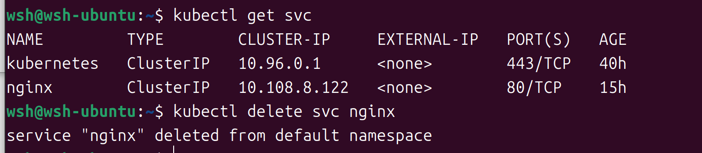

然后 kubectl expose 一个 deployment ，

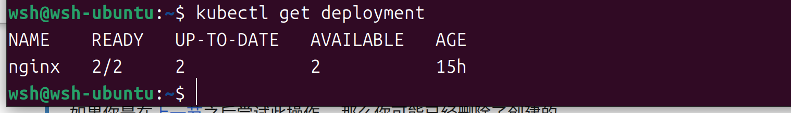

```bash
kubectl expose deployment/nginx --type="NodePort" --port 80
# port 为 pod 内服务监听端口
# 这里感觉一个 pod 只能有一个对外开发端口？（初学不懂这块）
#输出 service/nginx exposed
```

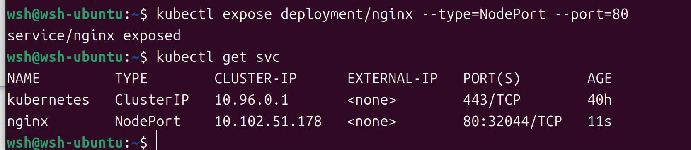

在主机上访问

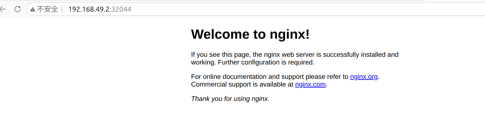


也可以扩容 pod 数量

```
kubectl scale deployments/nginx --replicas=4
```

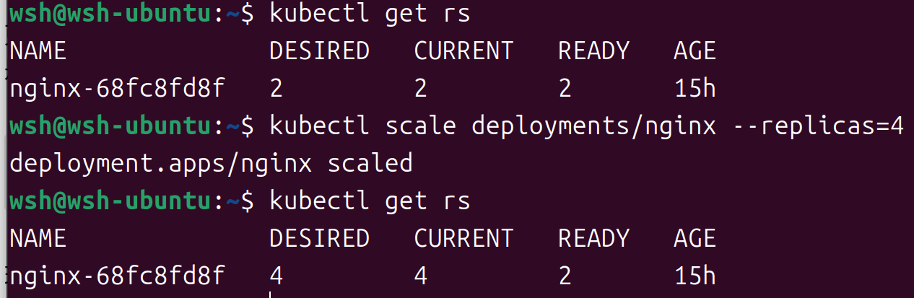

查看 pod 状态

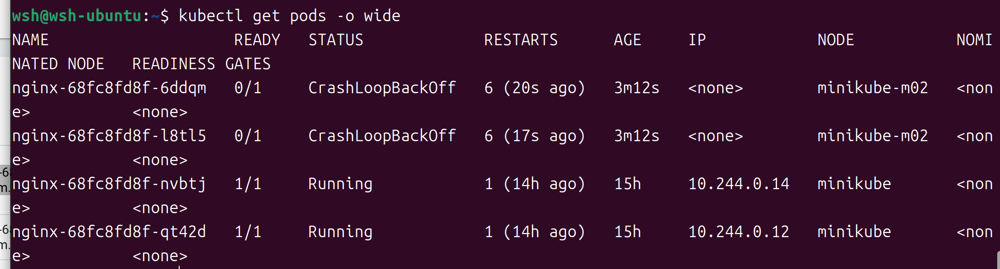

发现新加的两个 pod  被分配到了新的节点上 ，但是没有 ip 并且启动失败。

进入新节点，发现 `/etc/cni/net.d` 缺少给 Pod 分配网卡/ip 的 `.conf/.conflist`

```bash
# 把 pod 从 m02 node 清除
kubectl drain minikube-m02 --ignore-daemonsets --delete-emptydir-data

# 重建
minikube node delete minikube-m02
minikube node add --worker
```


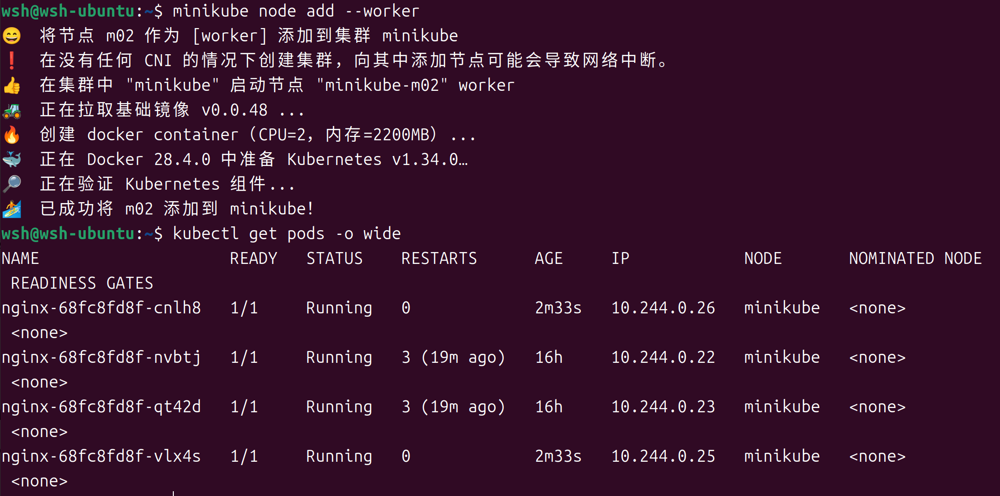

现在所有 pod 都在 node minikube 中，新建完 minikubem02 。删除完，新建的时候会自动分配到合适的 node。

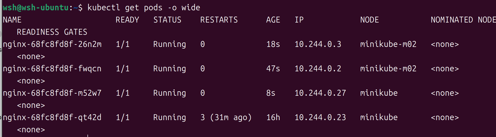


#### Pod 

```yaml
apiVersion: v1
kind: Pod
metadata:
  name: nginx-service
spec:
  containers:
  - name: nginx-service
    image: nginx
    ports:
    - containerPort: 80
```

当如果创建了很多 pod ,怎么去统一管理，需要用到 Label 标签

```yaml
apiVersion: v1
kind: Pod
metadata:
  name: nginx-service
  label:
    app:nginx-service
spec:
  containers:
  - name: nginx-service
    image: nginx
    ports:
    - containerPort: 80
```

列出标签为  app=nginx_service  的 pod

```bash
kubectl get pods -l app=nginx-service
```

当我们创建了很多的 pod ，其中运行一特定的服务，并且赋予了其标签 app=service_t ,那么如果有一些 pod 挂了，或者我们发现现有的 pod 不足以完美解决当前的请求量。这里可以使用 deployment 去管理和维护这些运行中的 pod 

#### Deployment

```yaml
apiVersion: v1
kind: Deployment
metadata: 
  name: service-spl-deployment
spec:
  replicas: 10 # run 2 pods matching the template
  selector:               # ① 选择器：我要管哪些 Pod
    matchLabels:
      app: service-spl-app
  template:
    metadata:
    # 无 name 字段，因为每个 pod 的名字要不一样
    labels:
      app: service-spl-app # 跟 matchLabels 对应
    spec:
      containers:
      - name: service-spl
        image: service-spl
        ports:
        - containerPort: 80
```

列出所有 deployment

```bash
kubectl get deployment
```

