### 1. java--------------------------RMI

#### 1----------创建远程服务 （无漏洞存在）

这一步，先去看 `remoteObj` 是如何被注册到 `locateRegistry`  的。

```java
public class RemoteObjImpl extends UnicastRemoteObject implements RemoteObj{
    public RemoteObjImpl() throws RemoteException {
        super();
    }
        @Override
    public String sayHello(String keywords){
        String upKeywords = keywords.toUpperCase();
        System.out.println(upKeywords);
        return upKeywords;
    }
}
```

```java
public class RMIServer {
    public static  void main(String[] args) throws RemoteException, AlreadyBoundException {
        RemoteObj remoteObj = new RemoteObjImpl(); // 下断点
        Registry registry = LocateRegistry.createRegistry(10777);
        registry.bind("remoteObj",remoteObj);
    }
}
```

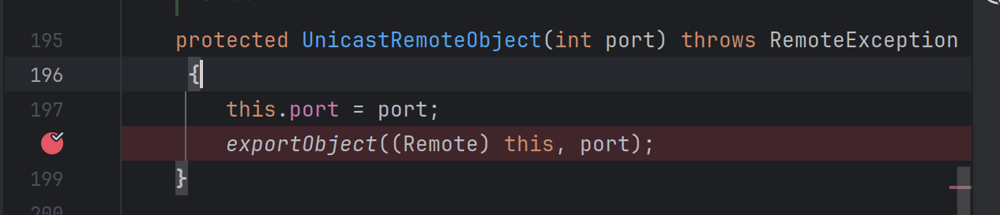

```java
/*
调试进入 `exportObject` 方法，（下文有跟进 exportObject 的发布逻辑）该方法指定发布的 IP 与 port， 其中 TCPEndpoint 拿到一个 TCPTransport 对象，并在里面启动一个监听线程监听该地址，并建立远程对象的唯一  ObjID(rmi协议通信会携带 objid 一个端口会绑定很多远程对象)，和 ObjID → Target（impl）的映射表 ObjectTable。
*/
/*
当客户端拿到 stub 之后，调用某个远程方法，是通过 stub 中记录的 该远程方法所处的地址去连接，此时远程服务端读出其中的RMI序列化数据，ObjId，找到target，继而找到相应的实现类impl，最后执行方法。
*/
```

有两个参数，第一个为 obj 对象，第二个为 port 参数

```java
public static Remote exportObject(Remote obj, int port)
    throws RemoteException
{
    return exportObject(obj, new UnicastServerRef(port));
}
```

 对第二个参数进行 `new UnicastServerRef(port)` 

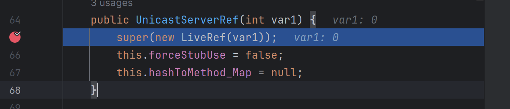

对 `port`  参数进行 `new LiveRef(port)`，跟进发现是一个构造函数

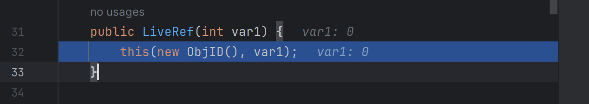

跟进 `this`

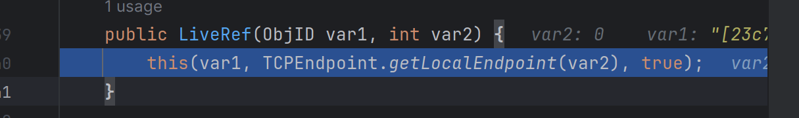

先看这个 `this`

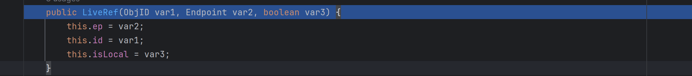

赋值操作

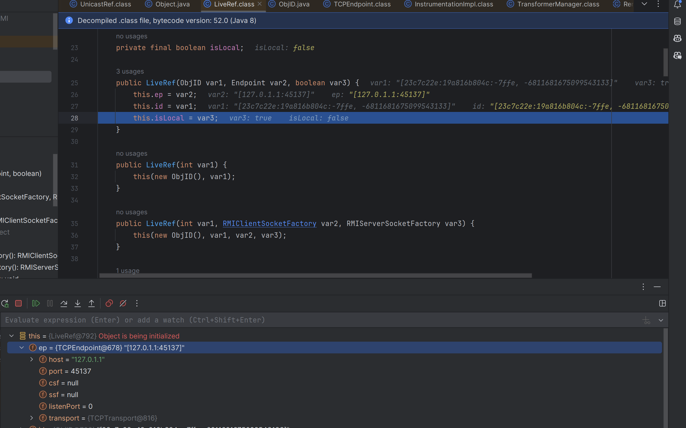

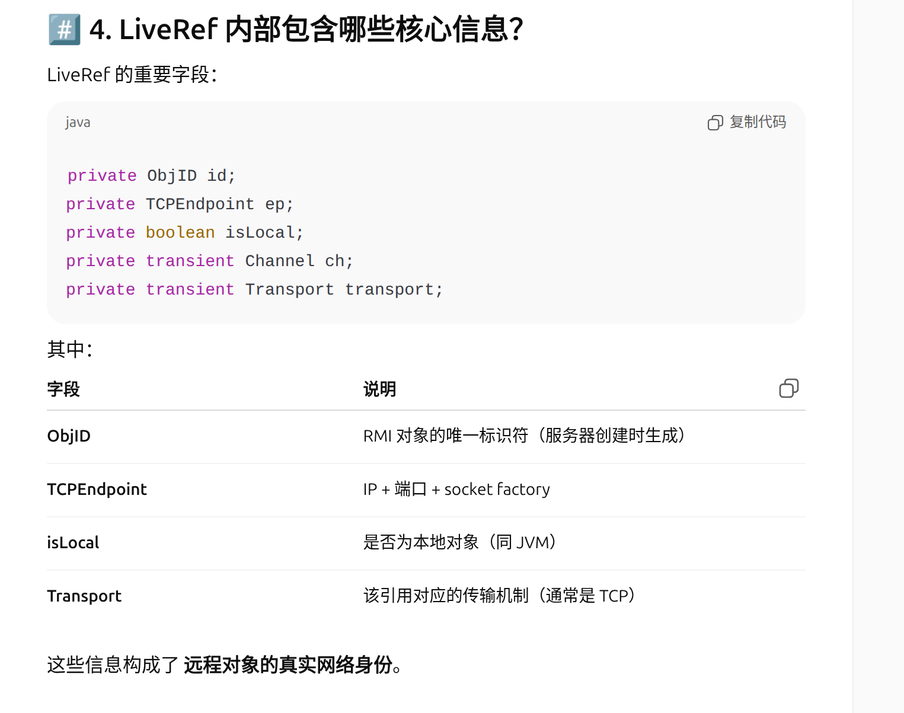

这里成功构建了 LiveRef ，其中包含远程对象的信息。

回到上面，也就是对第二个参数 port 进行 `TCPEndpoint.getLocalEndpoint(var2)` 的地方，跟进


突然发现多出来一个 45537 端口，由于不知道是什么地方产生的，就一步步回退，直到一开始调用 `LiveRef()`  的地方。 solve (传 0 代表随机端口)

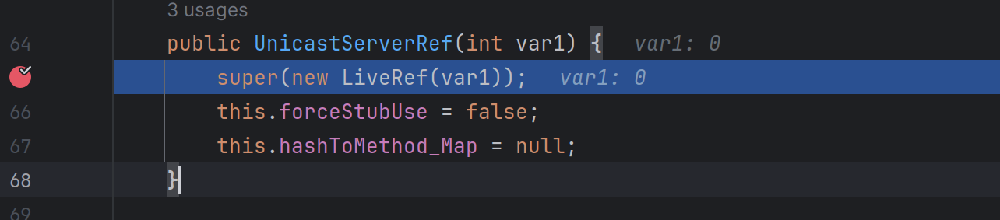

进入 super()

`UnicastServerRef` 继承 `UnicastRef` ,其中 `UnicastRef` 类负责 RMI 远程调用的实现，

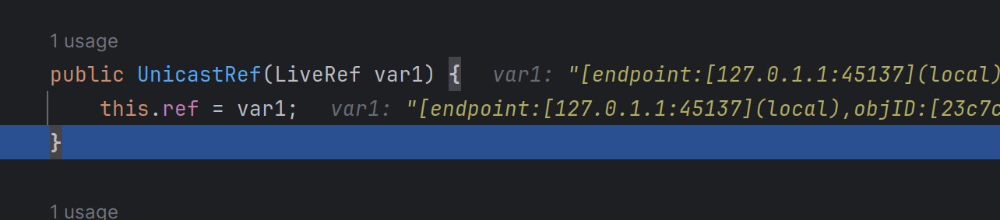

将上文的 `LiveRef` 赋值给 `ref`

#### 2----------创建 stub 

服务端创建一个 Stub，然后将 Stub 传到 RMI Registry ，最后让 RMI Client 去获取 Stub。

跟进 stub 产生的过程

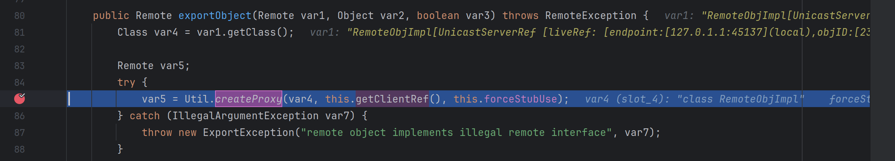

进入 `createProxy`

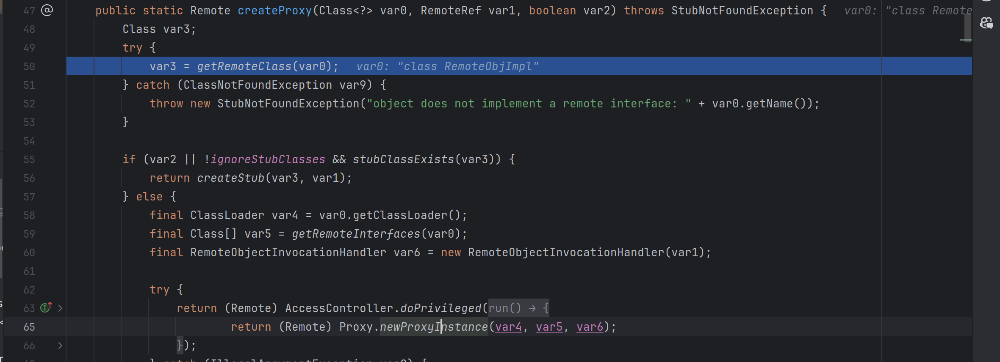

`getRemoteClass()` 就是用来从实现类中提取这些远程接口

```java
if (var2 || !ignoreStubClasses && stubClassExists(var3)) {
    return createStub(var3, var1);
// 进入了下面的 else 分支
```

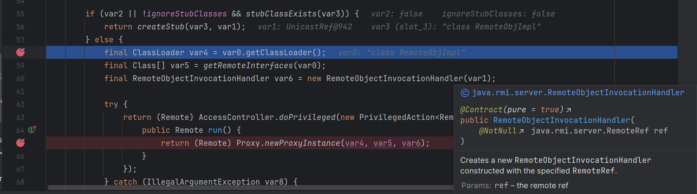

有一个类加载的地方

`Proxy.newProxyInstance` ，`Stub` 动态代理类的创建，客户端在 registry 获取 stub 后，可以通过stub 这个本地代理去调用远程对象方法。

在往下面走，发现 `exportObject(var6)` `exportObject` 将远程服务发布到网络上，于是去看 var6 是什么

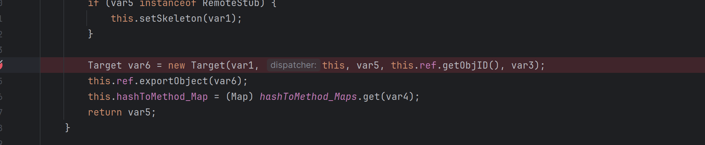

跟进 `Target()`   RMI 服务端导出的 Remote 对象，包含该对象在服务器端被调用所需要的全部信息。

```java
public Target(Remote var1, Dispatcher var2, Remote var3, ObjID var4, boolean var5) {
    this.weakImpl = new WeakRef(var1, ObjectTable.reapQueue);
    this.disp = var2;
    this.stub = var3;
    this.id = var4;
    this.acc = AccessController.getContext();
    ClassLoader var6 = Thread.currentThread().getContextClassLoader();
    ClassLoader var7 = var1.getClass().getClassLoader();
    if (checkLoaderAncestry(var6, var7)) {
        this.ccl = var6;
    } else {
        this.ccl = var7;
    }

    this.permanent = var5;
    if (var5) {
        this.pinImpl();
    }

}
```

其中 Target 持有 impl 的 **弱引用**（WeakRef） 其实这里是 远程对象的实现类

```java
this.weakImpl = new WeakRef(var1, ObjectTable.reapQueue);
```

接下来跟进 `exportObject()`  看看发布逻辑是什么

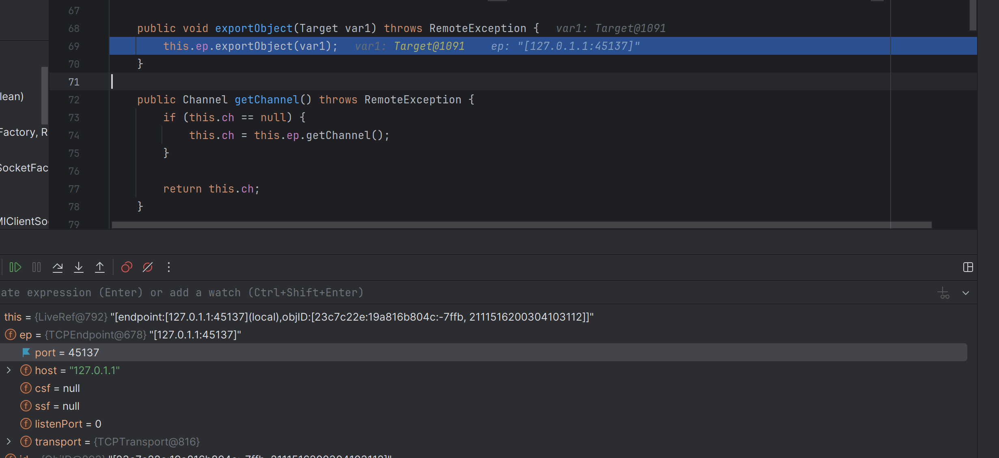

`ep` 包含 `host ip port` 等重要信息，

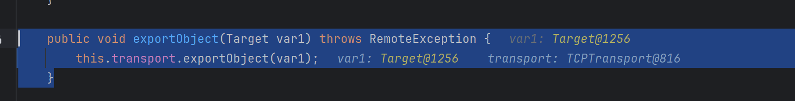

跟进 `transport.exportObject`  `var1`就是要发布的对象

```java
public void exportObject(Target var1) throws RemoteException {
    synchronized(this) {
        this.listen(); //下断点跟进
        ++this.exportCount;
    }

    boolean var2 = false;
    boolean var12 = false;

    try {
        var12 = true;
        super.exportObject(var1);
        var2 = true;
        var12 = false;
    } finally {
        if (var12) {
            if (!var2) {
                synchronized(this) {
                    this.decrementExportCount();
                }
            }

        }
    }

    if (!var2) {
        synchronized(this) {
            this.decrementExportCount();
        }
    }

}
```

跟进 listen

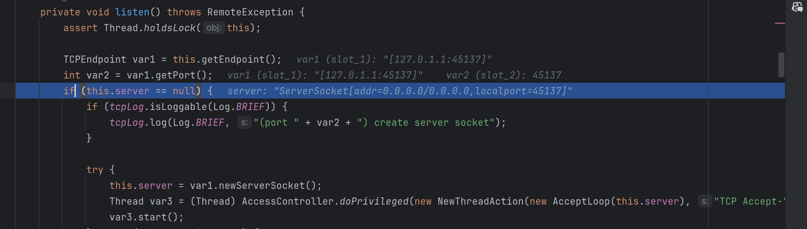

先是

所以，`exportObject(var6)` 就是把 `target` 这个封装好了的对象发布到本地,把这个 `Target` 放进 ObjId --> Target（impl）的映射表。

客户端通过调用从 `registry` 获取的`stub`的方法，将 `ObjID` + 方法号 + 参数发送到服务端 → 服务端根据 `ObjID` 找到 `Target → Dispatcher` 调用 `impl`的真实方法 → 将结果返回客户端。


#### 3----------创建注册中心

调用链：

```
LocateRegistry.createRegistry(port) --> RegistryImpl(port) 
-->
```

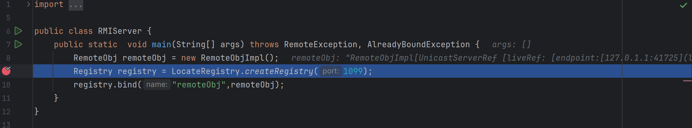


...... 

#### 4----------客户端请求注册中心

##### 查找远程对象

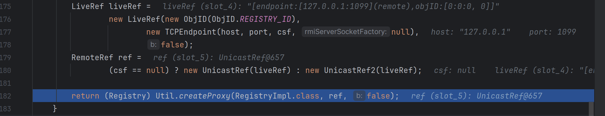

用 `LiveRef` ，**构造一个真正可用的远程引用实现类**。

`getRegistry` 本质上是在造一个指向 Registry 的 stub， 即 RegistryImpl_stub ，其内部的 UnicastRef 记录了远程注册中心的 LiveRef 。

RegistryImpl_stub 可调用以下方法

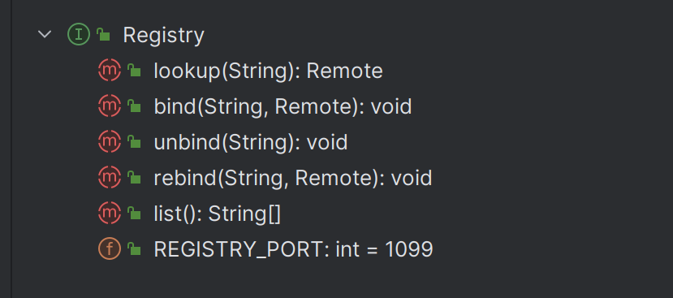

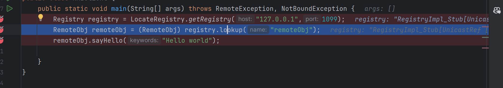

这里就是调用了其中的 lookup 方法。

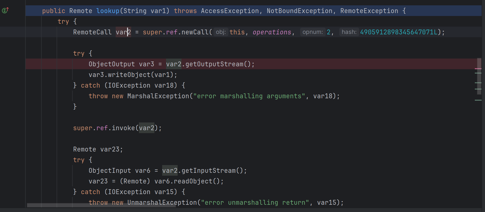


RegistryImpl_stub 的 super 为 RemoteStub ,RemoteStub.ref  为 UnicastRef 。

`invoke()` -->`call.executeCall()` --> `out.getDGCAckHandler() ` -->  `out.getDGCAckHandler()`

在处理异常的时候会反序列化注册中心返回的数据 (有利用的可能)

其中的 newcall


调用 UnicastRef.invoker(var2) 其中 var2 是 创建 socket 连接；创建一个 `StreamRemoteCall`，写入 RMI 协议头（魔数、版本、ObjID、opnum/hash 等）；把这个 call 返回，给 stub 用来写参数,

最后整个 lookup 返回的是一些服务器 `RegistryImpl.lookup` 从内部表里取出的当年 `bind` 进去的 **stub 对象**；

把这个 stub 通过 RMI 再序列化给客户端，客户端在 `readObject()` 这里反序列化，得到一个 **本地的 stub 副本**：`Proxy[RemoteObj,RemoteObjectInvocationHandler[UnicastRef [liveRef: [endpoint:[127.0.1.1:42463](remote),objID:[-28a1eac6:19abebdf695:-7fff, 6347128007969007382]]]]]`

#### 5----------客户端请求服务端

```java
remoteObj.sayHello("Hello world");
```

打断点进去

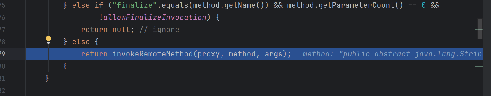

突然觉得动态代理不是很熟悉，下面暂时转到 InvocationHandler 接口,只写了一个 invoke 方法

```java
public interface InvocationHandler {
    public Object invoke(Object proxy, Method method, Object[] args)
        throws Throwable;
}
```

回归上文，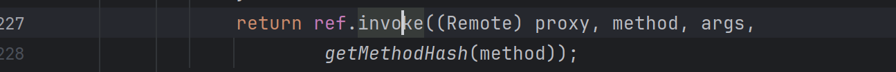

走到这里，调用 ref 的 invoke 方法，也就是 unicastref 的 invoke,通过本地的远程对象代理 stub 调用远程对象的方法。这里跟进 invoke 方法。

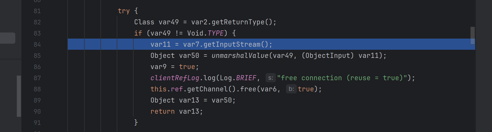

会找到一个 unmarshalValue 的反序列化操作，并且上面有 marshalValue 序列化操作

```java
for(int var12 = 0; var12 < ((Object[])var11).length; ++var12) {
    marshalValue((Class)((Object[])var11)[var12], var3[var12], var10);
}
```

这里的 var 11,3,10 ，在上文

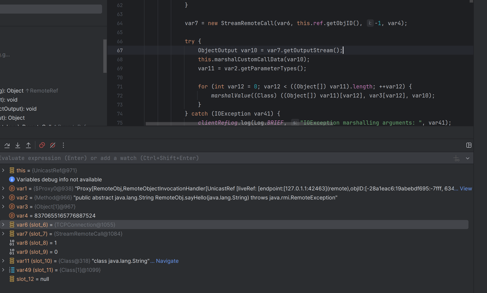

7 是一个流式远程调用对象，两个方法`ObjectOutputStream`（写请求）`ObjectInputStream`（等会读响应）

6 是一个 tcp 连接对象（？？？）

2 是传入的要调用的参数和方法

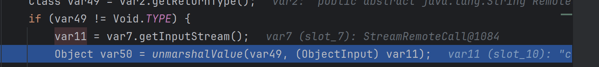

11 是读到的响应

50 是去反序列化这个11得到的返回值 return var1.readObject();

这里存在风险点。

#### 6----------客户端调用注册中心，注册中心如何回复

存在客户端打注册中心，list不行。注册中心处理 Target，进行 Skel 的生成与处理。

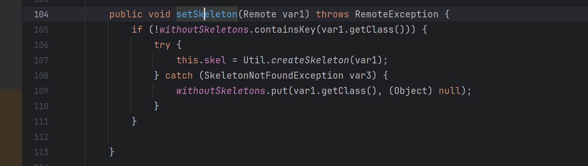

（后续没继续看了）

漏洞点是在 下面的 dispatch里，存在反序列化的入口类。这里可以结合 CC 链子打的。


#### 7----------客户端发起请求，服务端的回复

TODO


#### n----------期间遇到的问题

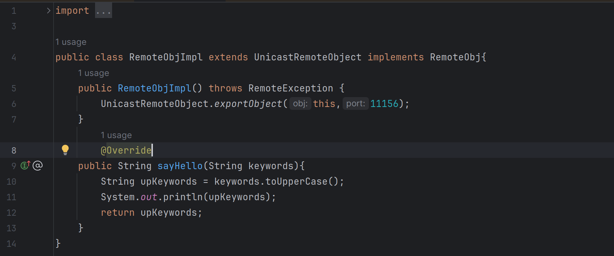

报错：`Exception in thread "main" java.rmi.server.ExportException: object already exported`

`java` 在构造方法里，**第一条语句**要么是：

- `this(...)` 调用本类另一个构造器
- `super(...)` 调用父类构造器
- 如果两者都不写，编译器自动加上：`super();`

修复：

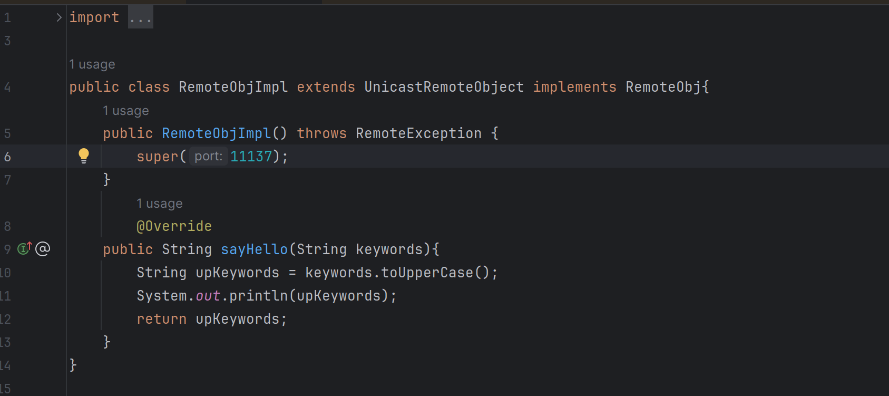

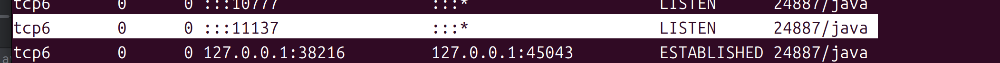

#### n+1----------Ref 类 和 TcpTransport 类的一些不清楚的内容

##### 1.LiveRef

1. 在 **服务端**：
   - 被 `UnicastServerRef` 使用，告诉它“这个对象监听在哪个 host:port，ObjID 是多少”
2. 在 **客户端 stub 里**：
   - `UnicastRef`（实现 `RemoteRef` 的那个类）内部也持有一个 `LiveRef`
   - stub 调用远程方法时，会从 `LiveRef` 里拿 host、port、ObjID → 建立连接、发请求


##### 2.UnicastRef 客户端

通常在 stub（代理）里面有一个 `RemoteRef ref` 字段，真实运行时就是 `UnicastRef` 实例

包含一个 LiveRef ref 实例

知道“这个远程对象在哪儿”（通过内部 `LiveRef`）

通过 `ref.getChannel().newConnection()` **找到对应的 Transport，并拿一个 Connection（底层 socket）**

把方法、参数序列化成 RMI 协议数据写出去

等服务端返回结果，再反序列化出来


##### 3.UnicastServerRef 服务端

**服务端 Reference：**

- 它是“这个远程对象在服务端这边的引用”，包含：
  - 那个 `LiveRef`（host:port + ObjID）
  - 知道用哪个 Transport（`TCPTransport`）处理调用

**负责 export/unexport：**

- 方法：`exportObject(impl, stub)`
  - 把实现类 `impl` 封装进 `Target`
  - 调用 `TCPTransport.exportObject(target)`
    - 在指定端口上监听
    - 把 `ObjID -> Target` 放进 `ObjectTable`

**负责 dispatch 调用：**

- 实现 `Dispatcher` 接口，比如 `dispatch(Remote obj, RemoteCall call)`
- 当 `TCPTransport` 收到调用（包含 ObjID、方法号、参数）后，会：
  - 找到 `Target`
  - 调 `target.disp.dispatch(...)`
  - `UnicastServerRef` 在里面：
    - 反序列化参数
    - 反射调用 `impl` 上对应的远程方法
    - 把返回值/异常写回网络

##### 4.stub 

stub → `UnicastRef` → `LiveRef` → `TCPEndpoint(host, port)` + `ObjID` + Channel(→TCPTransport)

##### 5. Transport

##### 6. TCPConnection

对 Socket 的封装，实现一些读取和写入数据的方法，便于操作不同的 socket 

##### 7. TCPChannel

包含一个 `Endpoint`

若干条指向该 Endpoint 的 `Connection`（连接池 / 可复用）

##### 8. endpoint

`host`：对端主机（或本机）

`port`：端口

`clientSocketFactory` / `serverSocketFactory`：用什么方式 new Socket / ServerSocket（普通 TCP、SSL、自定义超时等）这样想调用一个 加密连接可以直接创建一个 sslsocket 


#### n+2----------Skel 在什么阶段生成的

 Skel实例是在“服务器导出远程对象（exportObject）时创建的，挂到这个对象的 `UnicastServerRef`

```java
@Deprecated
public interface Skeleton {
    @Deprecated
    void dispatch(Remote obj, RemoteCall theCall, int opnum, long hash)
        throws Exception;

    @Deprecated
    Operation[] getOperations();
}
```


### 2.RMI---------------------------总结

```java
RemoteObj remoteObj = new RemoteObjImpl();
```

远程新建对象时，如果对象继承自 UnicastRemoteObject , 会封装一个 target 和 weakref 分别放进 objTable 和 implTable ，key 为 unique ObjID

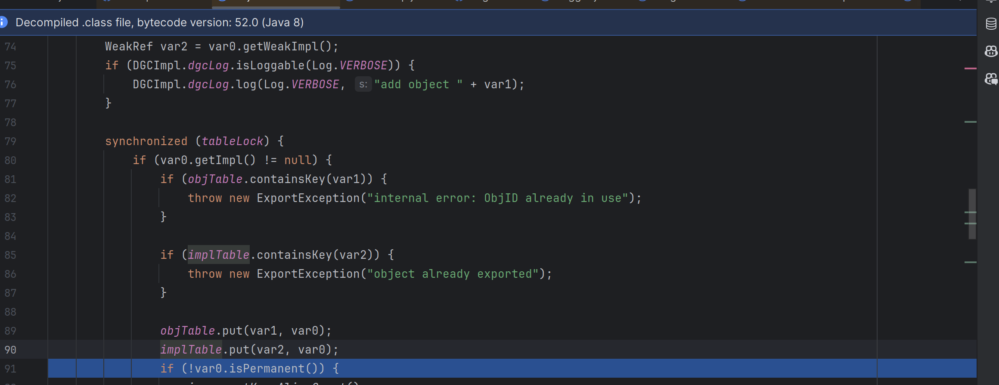


```java
Registry registry = LocateRegistry.createRegistry(1099);
```

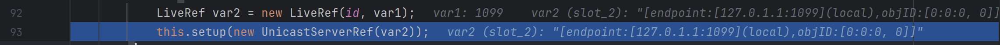

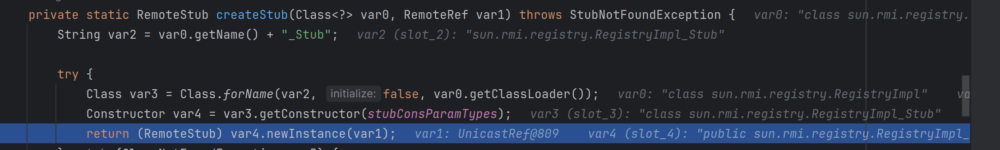

服务端创建 Registry 返回客户端的也是一个 stub   `RegistryImpl_Stub`

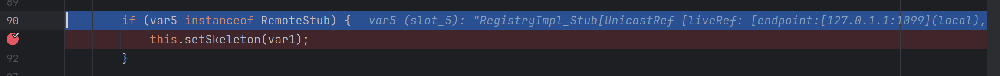

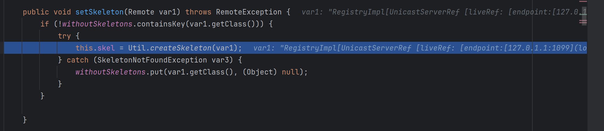

给 registryimpl create skel 可以与返回到 server 端的 registry_stub 通信。


```
registry.bind("remoteObj",remoteObj);
```

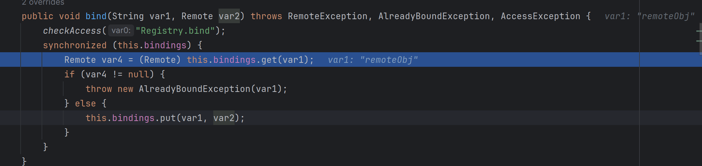

放进 `Hashtable<String, Remote> bindings` 表中


服务端做完了，接下来是客户端做了什么，（但是客户端法请求时，服务端怎么回复的，不会调试，就是客户端一句一句执行，服务端跳转到相关代码处）


貌似会了，先给想调试的地方打个断点，server 开 debug 然后 client 运行一下，回头看 server 会跳转到代码处。

`LiveRef.exportObject(target)` 里会调用到 `TCPTransport.exportObject(target)`，把这个 Target 加入表，并保证该端口上已经有 `TCPTransport` 在 accept 连接。

所以在客户端调用之前，服务端的状态是：

- 某个端口（如 1099 / 42365）已经由 `TCPTransport` 在监听；
- `ObjectTable` 里有一条记录：`ObjID → Target(impl, dispatcher=UnicastServerRef, stub, ...)`。

客户端 stub 调用远程方法时，会最终走到 `UnicastRef.invoke`，它会通过 `LiveRef` 建立到服务端的 TCP 连接，把调用信息写到输出流，然后阻塞等待返回。

服务端这一侧，网络连接被监听的线程收到了一个新连接，这个线程是 `TCPTransport` 内部的 accept 线程，接受连接后交给一个（或从池里取出）工作线程来处理：

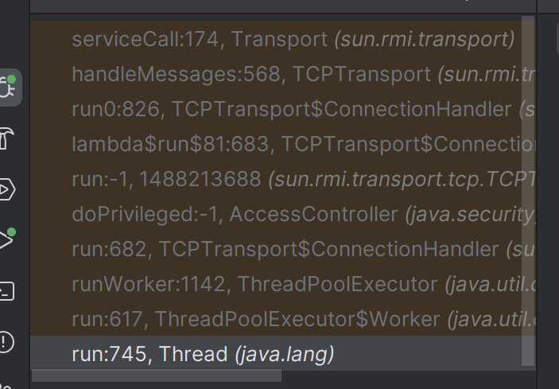

一开始是 Thread 。


TransportConstants.Call    = 0x50 = 80  // 普通远程调用
TransportConstants.Ping    = 0x52 = 82  // 心跳
TransportConstants.DgcAck  = 0x54 = 84  // DGC 的 ack


到这后面的代码跟不进去，不知道怎么调试进去，目前刚刚清楚整个 RMI 调用流程。

服务端绑定注册中心，发布 stub 上去，客户端请求后拿到 stub 然后和 服务端的 skel 通信拿到数据。


**参考资料**

https://drun1baby.top/2022/07/19/Java%E5%8F%8D%E5%BA%8F%E5%88%97%E5%8C%96%E4%B9%8BRMI%E4%B8%93%E9%A2%9801-RMI%E5%9F%BA%E7%A1%80/

https://drun1baby.github.io/2022/07/23/Java%E5%8F%8D%E5%BA%8F%E5%88%97%E5%8C%96%E4%B9%8BRMI%E4%B8%93%E9%A2%9802-RMI%E7%9A%84%E5%87%A0%E7%A7%8D%E6%94%BB%E5%87%BB%E6%96%B9%E5%BC%8F/