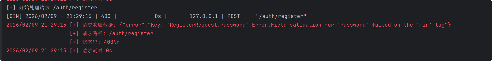
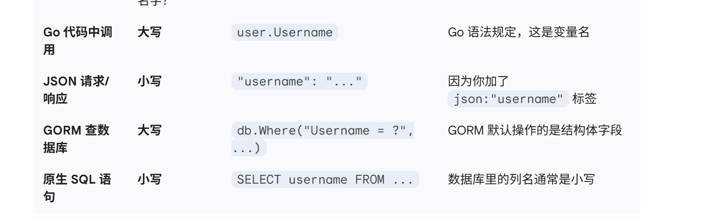

### go

#### 变量声明

使用 var 关键字

```go
var name string = "wsh"

var (
	name string
	isReady bool
	age int
)
```

短变量声明 := (在函数内部使用，可以自动推导变量类型）

```
playerName := "AlphaPlayer"
```

不可变变量使用 const 声明

```
const sercet string = "wsh"
```

#### 数据类型

基础类型

- int 
- float
- str // 不可变
- bool

聚合类型

- array //长度固定，值类型

通过 []Type 声明

```go
func main() {
    var v [1]int
    v[0] = 1
    fmt.Println(v)
    v1 := [2]string{"1","2"}
}
```

支持切片 ,通过 len() cap() 获取切片的长度和容量

```go
v[low:high]
```


- struct 

引用类型 

-  slice //  是动态数组，或者说和数组很相似，[]int，不指定长度

切片可以从现有数组中截取获得

```go
numbers := [5]int{10, 20, 30, 40, 50}
numslice = numbers[2:4]
```

或者可以创建一个切片，也是创建动态数组的方式，如果向其中添加元素超出了 cap ，会重新找一块内存，把原先的数据拷贝过去，至于原先的数据，如果没有其他切片指向，就会被回收，否则仍然留存

```go
s := make([]int, 5, 10)
arg1 _ 类型
arg2 _ 长度
arg3 _ 容量
```


- map // map[string]int 键值对

```go
// 使用 make 初始化
s := make([]int, 5)
```


- channel // chan int 协程间通信
- func // 函数
- interface{} 


#### 循环

只有 for 本身

```go
sum := 0
for i := 0; i < 5 ; i++ {
	sum += i
}
fmt.Println(sum)
```


#### if

不用带括号 () ，

```go
i := 0
if i < 5 {
	i+=1
}
fmt.Println(i)
```

可以在条件之前带一句初始化代码 ,switch 一样。

#### defer 

defer 修饰的语句会正常求值，但是在当前函数返回后才会执行，类似栈结构，先 defer 的后执行。

```go
func main() {
	defer fmt.println("1")
	defer fmt.Println("world")
	fmt.Println("hello")
}
```

#### 类型断言 

当把一个具体的值比如 int赋值给接口，这个值就类似被封装， 编译器只知道 data 是个接口，不知道它底层是 int 还是 string,就没办法进行 + 运算

```go
var data interface{}
data = 100
```

需要 

```go
value, ok := data.(int)
```

接口定义了一组方法，只要某个结构体实现了这些方法，它就是这个接口类型, 函数的参数是接口类型，那么实现这个接口定义方法的结构体都能传入

```go
type Animal interface {
    Speak() string
}

type Dog struct{}
func (d Dog) Speak() string { return "ww" }
type Cat struct{}
func (c Cat) Speak() string { return "mm" }
func MakeSound(animal Animal) {
    fmt.Println(animal.Speak())
}
```

interface{}  和 any 类型可以存储任意类型的数据.

当把一个具体的结构体赋值给一个接口变量时，go 编译器会屏蔽掉该结构体特有的字段和方法，只保留接口定义的方法，一个接口类型底层存储的是 (Type Value),Type 记录了盒子里面装的是什么类型,而 Value  指向那个具体结构体的内存地址。一般习惯把大对象传指针，避免拷贝造成的性能开销

#### 协程

go 可以进行多线程，最大化利用 cpu, 只需要在协程前加一个 go 关键字

```go
go task(1)
// 主进程
```

但是主进程执行过快，执行完之后会关闭暂且未执行完毕的协程，所以需要使用 sync.WaitGroup 等待协程执行

```go
// 声明
var wg sync.WaitGroup
// 在每一个协程中添加 wg.Add(1) defer wg.Done() ,主进程写 wg.Wait()
```

协程之间要传输数据，使用 channel 传输，而不去使用共享内存。

```go
// 初始化一个 channel 传递 t 类型数据
t_data := make(chan t)
// 传输数据
t_data <- "data"
//接受数据
value := <-ch
```

默认情况下，管道是非缓冲的。发送方发了数据，必须等接收方拿走，发送方才能继续往下走，主进程发送了数据没有被接收，会导致阻塞.如果 make 时设置了容量就是有缓存的，满了才阻塞发送

```go
t_data := make(chan t,10)
```


#### (TODO)Select 多路复用 


#### (TODO)Mutex


#### 运行前检查

```go
// 格式化代码
go fmt ./...

// 静态检查
go vet ./...

// 编译检查
go build

go run 1.go
```

go 的导入包是

```go
import "projectName/folderName"

folderName.FuncName
```


#### gin 框架

go mod init projectName

go mod tidy 

整理依赖，然后 go run name.go 运行，也可以 go build name.go 编译为 exe 文件。

```go
import "github.com/gin-gonic/gin" 
```

##### 读取请求数据

api参数通过Context的Param方法来获取

```go
r.GET("/string/:name",func(c *gin.Context){
	name := c.Param("name")
	fmt.Println("hello %s",name)
})
```

对于 get 请求，可以通过 DefaultQuery 或者 Query 去获取相应参数的值

```go
r.GET("/welcome", func(c *gin.Context) {
    firstname := c.DefaultQuery("firstname", "Guest")
    lastname := c.Query("lastname")
    c.String(http.StatusOK, "Hello %s %s", firstname, lastname)
})
```

对于 post 请求，获取其中的 json 数据，首先要先将其绑定到一个结构体上，使用 ShouldBindJSON 方法

```go
type Login struct {
	User string `json:"user" binding:"required"`
	Password string `json:"password" binding:"required"`
}

r.POST("/login", func(c *gin.Context) {
	var json Login
	if err := c.ShouldBindJSON(&json); err != nil {
        c.JSON(http.StatusBadRequest,gin.H{"error":err.Error()})
        return
	}
    if json.User == "admin" && json.password == "admin" {
        c.JSON{http.StatusOK.gin.H{"status":"success login"}}
    }
    else {
        c.JSON{http.StatusUnauthorzied,gin.H{"status":"unauthorized"}}
    }
})
```

表单参数获取通过 PostForm 方法

```go
r.POST("/form", func(c *gin.Context){
	type := c.DefaultPostForm("type","alert")
	msg := c.PostForm("msg")
})
```

获取请求头和客户端 ip

```go
c.ClientIP()
c.GetHeader("xxx")
```

##### 设置响应数据

有以下方法

```go
c.JSON(200,gin.H{"msg":"success"})
c.String(200,"Hello %s",name)
c.HTML(200,"index.html",data)
c.Data(200,"image/png",bytes)
c.Redirect(301,"/path")
c.Status(200)
c.ProtoBuf(200, data)
c.File("/path/to/file")
c.SetCookie()
```

##### 路由群组

```go
v1 := r.Group("/admin"){
	v1.GET("/profile",profileHandlerFunc)
}

v2 := r.Group("/user") {
    v2.GET("/login" ,loginHandlerFunc)
}
```

##### 中间件

-  请求进来时，可以鉴权，记录开始时间，限流
-  请求出去时，可以记录日志，计算耗时，统一错误处理，

有一些方法， c.Next() c.Abort() c.Set() c.Get()

c.Next()， 暂停当前中间件的执行，执行下一个中间件或者 Handler ，等它们执行完成后再执行 c.Next() 下面的代码，不调用会按顺序执行下一个中间件或者 Handler。return 也会导致程序以外当前中间件执行完了，直接去执行下一个中间件。

c.Abort() ，阻断调用链中的后续处理函数，（鉴权失败后调用）,调用 c.Abort() 之后，当前函数的代码会跑完，所以通常后面接 return 

c.Set() 存入数据，可以在其他中间件使用 c.Get() 取出。因为本质上是存储在 gin.Context 的一个 map[string]interface{} 中，Map 的 Value 是空接口 `interface{}`，能存入any类型的数据,但是取出来的时候不知道是什么类型的数据,需要使用  .(type)

```go
c.Set("userId", 10086)
value, exists := c.Get("userId")
phoneNum = value.(int)
```

使用中间件进行日志记录，没办法截取 c.Writer 响应的数据，因此使用一个中间件和一个嵌入 gin.ResponseWriter 和 buffer 的结构体，以及为这个结构体重写的 write 方法，记录响应数据，这里有一个嵌入，

```go
type ResponseWriter struct {
	gin.ResponseWriter
	Body *bytes.Buffer
}	
// 不对 gin.ResponserWriter 命名，这样可以继承这个接口的所有方法 Write Status 等
// 然后重写定义 ResponseWriter 的 Writer 方法，覆盖原有的方法

func (w *ResponseWriter) Write(bytes []byte) (int,error) {
    w.Body.Write(bytes)
    return w.ResponseWriter.Writer(bytes)
}

func (w *ResponseRecorder) WriteString(strings string) (int, error) {
	w.Body.WriteString(strings)
	return w.ResponseWriter.WriteString(strings)
}


// 中间件

func LoggerMiddleware() gin.HandlerFunc {
	return func(c *gin.Context) {
		blw := &ResponseWriter{
			Body:           bytes.NewBufferString(""),
			ResponseWriter: c.Writer,
		}
		c.Writer = blw // 这一步完成替换
		c.Next()
		// contentType := c.Writer.Header().Get("Content-Type")
		statusCode := c.Writer.Status()
		path := c.Request.URL.Path
		log.Printf(`[+] 请求响应数据: %s
        			[+] 请求路径: %s
        			[+] 状态码: %d\n`, blw.Body.String(), path, statusCode)

	}
}
```




##### 闭包

gin 框架的路由处理器的函数或者中间件的函数仅接受一个参数，`*gin.Context` ,如果需要传入额外的参数，会使用闭包。

编译器发现外层函数的一个变量在返回的函数中仍然要使用，将其从栈移到堆上，返回的内部函数拿着该变量的指针

```go
func createCounter() func() {
	i := 0
	return func() {
		i++
		fmt.Println("当前的 i 值：",i)
	}
}	

func main() {
	counterA := createCounter()
	
	counterB := createCounter()
	
	// 这是两个不一样的包，不会影响彼此
}
```


```go
func AuthMiddle(secret string) gin.HandlerFunc {
	
}
```

#### 数据库交互 ORM

go 中的结构体数据存储在数据库中通过 GORM 。GORM 提供了一个内置的结构体 gorm.model ,将其嵌入结构体中，数据库中的表会有四个通用列

```go
import "gorm.io/gorm"
import "gorm.io/driver/postgres"

type User struct {
	gorm.model
	Username string `json:"user"`
	Password string `json:"password"`
}
```

##### 初始化连接数据库

```go
import "fmt"
import "log"
import "time"
import "gorm.io/driver/postgres"
import "gorm.io/gorm"
import "gorm.io/gorm/logger"

var DB *gorm.DB

func InitDB() {
	host := "127.0.0.1"
	user := 
	password := 
	dbname :=
	port :=
	sslmode := disable
	TimeZone := "Asia/Shanghai"
	dsn := fmt.Sprintf("host=%s user=%s password=%s dbname=%s port=%s sslmode=%s TimeZone=%s",
		host, user, password, dbname, port, sslmode, TimeZone)
	
	
	//pgConfig := postgres.Config{DSN:dsn}
	gormConfig := &gorm.Config{
		Logger: logger.Default.LogMode(logger.Info)
	}
	
	var err error
	DB,err = gorm.Open(postgres.Open(dsn),gormConfig)
	if err != nil {
		panic("[-] 连接数据库失败:"+err.Error())
	}
	
	// 连接池配置
    sqlDB, _ := DB.DB()
	sqlDB.SetMaxIdleConns(10)
	sqlDB.SetMaxOpenConns(100)
	sqlDB.SetConnMaxLifetime(time.Hour)
	fmt.Println("[+] 数据库连接成功")
}
```

docker pull 一个 postgres 镜像，手动创建一个 ctf_test 数据库，或者也可以先连接默认的库 postgres

```bash
docker run --name postgres \
-e POSTGRES_PASSWORD=wsh123456 \
-p 5432:5432 \
-d postgres:15-alpine
```


```go
//db.go
package database

import (
    "log"
    
    "golearn/config"
    "gorm.io/driver/postgres"
    "gorm.io/gorm"
)

var DB *gorm.DB

func InitDB() *gorm.DB {
    cfg := config.GetDBConfig()
    dsn := cfg.ToDSN()
    
    var err error
    DB, err = gorm.Open(postgres.Open(dsn), &gorm.Config{})
	
    if err != nil {
        log.Fatal("数据库连接失败:", err)
    }
    
    log.Println("数据库连接成功")
    return DB
}

func CloseDB() {
	if DB != nil {
		sqlDB,err := DB.DB()
		if err != nil {
			log.Println("获取数据库连接失败:", err)
			return
		}
		sqlDB.Close()
		log.Println("数据库连接已关闭")
	}
}
```


```go
//dbconfig.go
package config

import "fmt"

type DatabaseConfig struct {
    Host     string
    Port     int
    User     string
    Password string
    DBName   string
    SSLMode  string
    TimeZone string
}

func GetDBConfig() DatabaseConfig {
    return DatabaseConfig{
        Host:     "localhost",
        Port:     5432,
        User:     "postgres",
        Password: "wsh123456",
        DBName:   "ctf_test",
        SSLMode:  "disable",
        TimeZone: "Asia/Shanghai",
    }
}

func (c DatabaseConfig) ToDSN() string {
    return fmt.Sprintf("host=%s user=%s password=%s dbname=%s port=%d sslmode=%s TimeZone=%s",
        c.Host, c.User, c.Password, c.DBName, c.Port, c.SSLMode, c.TimeZone)
}
```


##### curd(GORM Postgresql)

将 go 语言转换为 sql 语言，go 中的 Struct 映射为 db 中的 table,结构体的 field 映射为 column,

create table

```go
type User struct {
	gorm.Model
	Email `gorm:"uniqueIndex;not null"`
	Password `gorm:"not null"`
}

b.AutoMigrate(&User{})
```

insert data

```go
user := USer{Email:"1027822561@qq.com",Password:"aaawsh2026"}
db.Create(&user)
```

使用 gorm.Model 或者列中有 ID 字段会被认定为主键，或者显示指定其他字段为主键

```go
`gorm:"primaryKey"`
```

update data

```go
// 通过主键 （ID） 查找相应数据
var user User
db.Frist(&user,1)
user.Password = "wsh20260201"
db.Save(&user)

```

delete data

```go
db.Delete(&User{},1)
```

如果使用了 gorm.Model ，会打上已经删除的标签，当再次查找时，就是说数据还在库里。否则删除数据。

where 查询

```go
DB.Where("username = ? AND age >= ?", "jinzhu", 18).Find(&users)
DB.Where("username = ?", "jinzhu").Or("age > ?", 18).Find(&users)
```

注意使用 ? 作为占位符，不使用 fmt.Sprintf 拼接 sql字符串。

##### (TODO) 事务回滚


#### (TODO）JWT 鉴权


#### 一些问题

```go
func HashPassword(password string) string {
	bytes, err := bcrypt.GenerateFromPassword([]byte(password), 14)
	if err != nil {
		log.Printf("Error hashing password: %v", err)
		panic(err)
	}
	return string(bytes)
}
```

遇到 error 该怎么处理，现在只知道 panic 但是平台不稳定

**返回 error **


```go
func HashPassword(password string) (string,error) {
	bytes, err := bcrypt.GenerateFromPassword([]byte(password), 14)
	if err != nil {
		log.Printf("Error hashing password: %v", err)
		return "", err
	}
	return string(bytes),nil
}
```


```go
func RegisterUser(req model.RegisterRequest) (*model.User, error) {
    // 检查用户名是否存在
    var existUser model.User
    if err := database.DB.Where("username = ?", req.Username).First(&existUser).Error; err == nil {
        return nil, errors.New("用户名已存在")
    }

    // 检查邮箱是否存在
    if err := database.DB.Where("email = ?", req.Email).First(&existUser).Error; err == nil {
        return nil, errors.New("邮箱已被注册")
    }

    // 加密密码
    hashedPassword := HashPassword(req.Password)

    // 创建用户
    user := model.User{
        Username: req.Username,
        Email:    req.Email,
        Password: hashedPassword,
    }

    // 保存到数据库
    if err := database.DB.Create(&user).Error; err != nil {
        return nil, errors.New("用户创建失败")
    }

    return &user, nil
}
```

最后为什么返回 &user,nil ？ 注册成功为什么返回这个。

**数据库操作惯例返回指针**


```go
func HashPassword(password string) string {
	bytes, err := bcrypt.GenerateFromPassword([]byte(password), 14)
	if err != nil {
		log.Printf("Error hashing password: %v", err)
		panic(err)
	}
	return string(bytes)
}
func CheckPasswordHash(password, hash string) bool {
	err := bcrypt.CompareHashAndPassword([]byte(hash), []byte(password))
	return err == nil
}

```

这个 hash 加密为什么没有密钥

**内置盐值等**


```go
func LoginHandler(c *gin.Context) {
    var loginRequest model.LoginRequest

    if err := c.ShouldBindJSON(&loginRequest); err != nil {
        c.JSON(400, gin.H{"error": "请求参数错误: " + err.Error()})
        return
    }

    user, err := util.LoginUser(loginRequest)
    if err != nil {
        c.JSON(401, gin.H{"error": err.Error()})
        return
    }

    c.JSON(200, gin.H{
        "message": "登录成功",
        "user":    user,
    })
}
```

登录成功后返回 user 指针， *model.User 类型，这里能自动解析吗？为什么会自动解析？以及返回 user , user结构体中包含密码等敏感信息

**c.JSON 会自动解引用**

```

```

**使用 json:"-"  保证 json 序列化时隐藏该字段**

```go
type User struct {
	gorm.Model
	Username string `gorm:"uniqueIndex;not null"`
	Email    string `gorm:"uniqueIndex;not null;email"`
	Password string `gorm:"not null;size:255" json:"-"`
}
```

这里询问 ai 之后发现需要添加标签 json 比较规范

